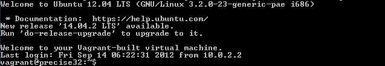

---
header-includes:
- \usepackage{xcolor}
- \definecolor{Light}{gray}{0.90}
- \let\OldTexttt\texttt
- \renewcommand{\texttt}[1]{\OldTexttt{\colorbox{Light}{#1}}}
---
Exercise 1: Vagrant Setup
==========================

This exercise will aid you in setting up and becoming familiar with Vagrant, VirtualBox, and SSH. You will use these tools throughout the course to learn networking and security concepts. 

Learning Objectives
--------------------------
By the end of this lesson, you will be able to:

1. Setup a Linux virtual machine on your computer
2. Connect to a local virtual machine using SSH
3. Suspend a virtual machine
4. Destroy a virtual machine

Conventions
--------------------------
In these exercises, commands run from a Windows command prompt will be prefixed with ">", such as "`> cd ~`". The ">" should not be typed. Commands run in a Linux shell will be prefixed with "\$", such as "`$ ls -al`". This notation will help you determine where to run the commands because you will frequently switch between your main computer and the virtual machines.

For the purposes of all of these labs, you are assumed to be running a recent version of Microsoft Windows. If that is not the case, you may need to adapt some of the instructions to your primary operating system. You are reponsible for figuring out how to complete the assignment on whatever operating system you use if it is not Windows.

<!---
/TODO: Is this what we want to say here ^^? It's what I've done in the past. If you choose to use a Mac or Linux, then you need to figure out what commands to run, etc., to make the labs work for you.
-->

Steps
--------------------------

### Step 1: Download and Install VirtualBox

Your computer has an operating system (OS), probably Windows, Mac OS, or a version of Linux. Software exists that allows you to run another OS while your main OS is still running. For example, with a Windows laptop, you could run Ubuntu Linux as if it were another application on your computer. Your Windows OS would be the "host," and the Ubuntu Linux OS would be the "guest." In this case, the guest is not connecting to your hardware directly, but virtually, and is therefore called a virtual machine. Virtual machines run on virtualization software that makes the system hardware and host platform agnostic.

There are several software platforms that allow you to run virtual machines. At the enterprise level, Microsoft's Hyper-V and VMWare ESX allow professionals to deploy virtual machines inside data centers. With these platforms, there is no host OS; the virtual machines run on the server hardware with on a thin virtualization layer between the operating system and the hardware. Virtualization is quickly become the de-facto option for deploying servers in an enterprise environment.

Virtualization options exist for desktop users who want to run guest operating systems. The guest operating systems can be used for software development, testing software exploits, or learning about different operating systems. By default, the guest operating system cannot affect the host operating system. Guest operating systems can be configured to interact with the host operating system by sharing write access to specific folders, but a guest operating system will never make configuration changes to the host operating system. Basically, you can run guest operating systems without worrying about messing up your computer.

VirtualBox is a an excellent open source tool for running virtual machines on your system. It has an added advantage in that it is free. We will use Virtualbox for all of the labs in this course to demonstrate and try out networking concepts. 

* Open https://www.virtualbox.org/wiki/Downloads
* Download the latest version of VirtualBox for Windows hosts (or your computer's primary operating system if it is not Windows)
* Install VirtualBox when the download completes

### Step 2: Download and Install Git

Git is a distributed source control application originally built to manage the Linux kernel. Git is now widely used for general software development and version tracking. The Git Windows installation package comes with many helpful command line tools, such as SSH.exe which is required for these exercises. Other SSH applications exist for Windows (such as Putty.exe), but they do not integrate easily with Vagrant. Follow the steps below to install Git for Windows.

* Open https://github.com/git-for-windows/git/releases/latest
* Click "Download" and install the application once the download completes.

### Step 3: (Windows) Configure your PATH environment variable

Older versions of Windows required users to run commands at a "command prompt." But most users of Windows XP and after likely never need to open a command prompt, and may not have ever seen it.

* Click Start and type `cmd.exe` [enter]
    * This will open a command prompt.
* Type "ping" [enter]
    * "ping" is a network utility that attempts to connect to a remote machine.
    * When you run "ping" without any parameters, ping will only output the usage instructions.
* Type "winword" [enter]
    * You probably have Microsoft Word on your computer. The Word executable is called "winword.exe." However, running the "winword" command did not start Microsoft Word. The reason that "ping" worked but "winword" did not is because "ping.exe" is in a folder specified in your path environment variable.
    * The path environment variable tells Windows what directories to look in for commands, such as executables. Ping.exe is in c:\\windows\\system32. Winword.exe is in one of your Program Files folders.
    
Use the following steps to view your PATH variable and add Git's executables to your path.

* Right-click on "Computer" and choose "Properties."
* Click "Advanced system settings"
* Click the "Environment Variables" button 
* Edit the PATH variable for your user account to add ";C:\\Program Files (x86)\\Git\\usr\\bin" at the end. The semi-colon separates entries, so make sure to add the semi-colon if your PATH variable was not empty. Make sure you don't delete everything that was there before.
* Click OK. If any command prompts are open, close them and re-open them. The PATH variable is read when the command prompt is first opened; it does not detect if any updates are made while it is running.

### Step 4: Download and install Vagrant

Vagrant is a software package that makes setting up new virtual machines extremely simple. Without Vagrant, if you were to install an operating system you would need to download the DVD or CD installation media, start a new virtual machine instance, follow the on-screen prompts, wait, follow more prompts, etc. Without Vagrant, it can easily take an hour to get a basic virtual machine running. Vagrant simplifies this process by creating "boxes" that come 99% ready for use. Instead of creating a new virtual machine from scratch, Vagrant provisions a box and finishes the last 1% of the configuration. This way, Vagrant can create a virtual machine in minutes instead of hours. Follow the steps below to download and install Vagrant.

* Open http://www.vagrantup.com/downloads.html
* Install the Windows universal version (or the version that matches your computer's operating system if not Windows)

### Step 5: Setup an Ubuntu Virtual Machine

In this section, you will use Vagrant to create and start an Ubuntu Linux virtual machine. If you have not yet rebooted after installing Virtual Box and Vagrant, please do so before starting this section. Ubuntu is one of the most popular versions of Linux, so it is often easy to find information and support for it online.

* Create a folder to store your Vagrant files (e.g. c:\\Users\\John\\Documents\\NetworkingClass\\Vagrant). 
* Open a command prompt and navigate to your Vagrant folder. (The folders that you use might be different based on the folder names on your computer.)
    * Click Start > cmd.exe [enter]
    * `> cd Documents\NetworkingClass\Vagrant`
        * Or you can open the directory in Windows Explorer: hold down the Shift key while right-clicking in an empty part of the folder, then click "Open command window here"
* Create a new folder called "Exercise1"
    * `> md Exercise1` [enter]
* Navigate to the Exercise1 folder
    * `> cd Exercise1` [enter]
* Create a new virtual machine with the following command:
    * `> vagrant init ubuntu/trusty64` [enter]
* Start the virtual machine with the following command:
    * `> vagrant up` [enter]
    * Note that "ubuntu/trusty64" refers to a Vagrant box (i.e. template computer). If you have not already used this box, the box will be downloaded automatically. Depending on your Internet connection speed, this download may take some time.

Your Ubuntu virtual machine is now running. You will not see a graphical user interface (GUI) because by default, Vagrant virtual machines are "headless." There are ways to turn on the GUI, but for now it is not needed.

### Step 6: Connect to the Ubuntu Virtual Machine with SSH

Secure Shell (SSH) is a secure protocol for connecting to a remote machine to run commands. A guest OS is treated much like a remote machine. SSH can be used to communicate and run commands within your virtual machine.

* In your command prompt, run the following command in the Exercise1 folder:

```
> vagrant ssh
```

* You should see a connection made to the virtual machine similar to the following image.

    

* If you see a message similar to the screenshot, congratulations! You have successfully installed Virtual Box and Vagrant. You now know how to create a virtual machine and connect to it.
* Take a screenshot of your own command prompt and copy it into your submission Word document.
* Connecting to a machine with SSH is commonly called an SSH session. You close your session when you close the window or log out of the machine.

### Step 7: Suspend, Resume, and Destroy

* Run "`$ exit`" or press Ctrl+D to leave the SSH session. You will be back at your regular command prompt.
* Run "`> vagrant suspend`" to suspend your machine. Suspending the machine saves its running state to your hard drive and allows you to bring it back up quickly.
* Run "`> vagrant ssh`". This should fail because the machine is not running.
* Run "`> vagrant up`" to bring the machine into a running state again.
* Run "`> vagrant ssh`". This should succeed.
* Run "`$ exit`".
* Run "`> vagrant destroy`" to turn off the machine and delete it completely from your system. Answer "`y`" to confirm deletion.
