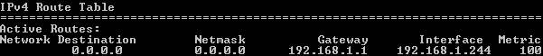
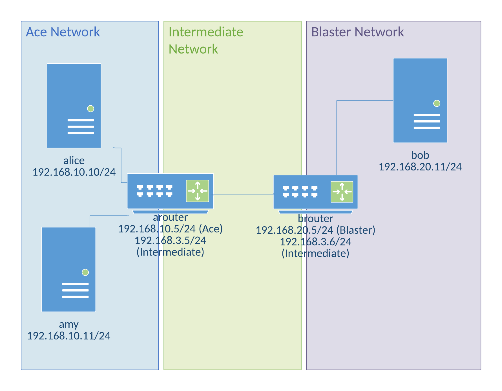

Exercise 4: Routing
==========================

In the days of the first computer networks, communication within a single network provided tremendous value. Networked computers could connect to printers, file servers, and each other. But the full power of networked communications could only be realized when computers could communicate across networks. To communicate across networks, data must be routed. In this lesson, you will learn several routing protocols, and you will configure a Linux server as a router. 

Learning Objectives
--------------------------
By the end of this lesson, you will be able to:

1. Explain the following routing methods:
    - [Static Routing](https://en.wikipedia.org/wiki/Static_routing)
    - [Routing Information Protocol (RIP)](https://en.wikipedia.org/wiki/Routing_Information_Protocol)
    - [Open Shortest Path First (OSPF)](https://en.wikipedia.org/wiki/Open_Shortest_Path_First)
    - [Hot Standby Router Protocol (HSRP)](https://en.wikipedia.org/wiki/Hot_Standby_Router_Protocol)
2. Configure a Linux server as a router

Routing
--------------------------

Routing can be explained by considering the post office analogy. Consider each city as an individual network. The Las Vegas post office knows where to deliver each piece of mail to every address within its city limits. However, if it receives a piece of mail destined for San Diego, the Las Vegas post office does not know where in San Diego that address resides, and it cannot deliver the mail itself. The Las Vegas post office *routes* the mail to the San Diego post office. The Las Vegas post office knows that Interstate 15 is the fastest way to get to San Diego, so it puts the letter in a van and sends it on its way. When the letter gets to San Diego, the people in the San Diego office know how to deliver the message to the local recipient.

The main purpose of routing is to get data where it's supposed to go as quickly and efficiently as possible. Routing is what occurs between networks. The technology underlying the current Internet and modern computer networking was created in a time when nuclear war was considered a likely possibility. Because an entire city might be destroyed, hardware and software were created to be fault tolerant. Sophisticated routing protocols were created that could adjust routing on the fly in case a node in the network failed. We will cover four basic routing protocols.

Routing Protocols
-------------------------------

[*Routing tables*](https://en.wikipedia.org/wiki/Routing_table) determine what path a router chooses to send data. At a high level, routing tables contain the destination, paths to get to that destination, and a rating for how fast and reliable that path is.

Suppose you were to construct a routing table for Chicago. The *Network Destination* would be the place you ultimately want to end up at. The *Gateway* is the next intermediate hop to get to your final destination. The *Interface* is the network adapter (or transportation method in this example) that can be used to reach the next hop. The *Metric* defines the cost of the route, basically how fast and reliable it is.

|Network Destination| Gateway      | Interface                | Metric |
|-------------------|--------------|--------------------------|--------|
|Minneapolis        | Milwaukee    | Bus Stop downtown        | 500    |
|Minneapolis        | Milwaukee    | Helicopter Pad           | 5      |

If you want to get to Minneapolis from Chicago, you must pass through Milwaukee. There are two possible routes defined in the routing table above--a bus and helicopter. The metric for the helicopter is much lower, so the router will choose this route. The router in Milwaukee will have its own routing table for the most efficient way to send data from Milwaukee to Minneapolis.

|Network Destination| Gateway       | Interface    | Metric |
|-------------------|---------------|--------------|--------|
|192.168.100.15/24  | 192.168.100.1 |192.168.0.100 | 10     |

The above routing table has a single entry. It says that if data needs to get to the 192.168.100.15/24 network, it should send it to 192.168.100.1 using the network card with the IP address 192.168.0.100.

Every workstation, server, and router has a routing table. In windows, type the command `> route print` to list the routing tables. There will be separate tables for IPv4 and IPv6. Take a minute to look at the list. 

The 0.0.0.0 network is the default network. If traffic is being routed to a network that is not listed in the routing table, it will be routed through the specified Gateway and Interface. In this example, my home router has the IP address 192.168.1.1. So if I try to access an IP address that my computer does not recognize as a local address, it sends it through my router and off to my internet service provider.

When I run `ipconfig` on my Windows workstation, I can see that my wireless network card has the IP address 192.168.1.244.

There may be entries in your routing table to the same Network Destination but through different interfaces. Each interface can have a different Metric, and the computer will use this metric when deciding which interface to use.

### [Static Routing](https://en.wikipedia.org/wiki/Static_routing)

Static routing is the simplest way to configure routing, though it is only useful for very simple networks. Static routing requires that every routing entry on every router be configured manually. A human being must type in each of the routes. If something changes in the network configuration, all of the routes must be updated manually.

Imagine a small satellite office where four employees work. The four employees connect to a local printer, but most of the resources they access are on the main campus. A simple static route could forward any non-local traffic to the main campus router. Essentially, there would be a single route.

Large organizations cannot use static routing exclusively. Administrators would have to ensure that dozens or hundreds of routers and thousands of routes were properly configured. It would be time consuming and prone to errors. There may be situations, however, where static routing makes sense, but on a limited scale.

### [Routing Information Protocol (RIP)](https://en.wikipedia.org/wiki/Routing_Information_Protocol)

The Routing Information Protocol (RIP) was one of the first routing protocols. It calculates the cost of sending data based on the number of hops required to reach the destination. This is similar to airline flights. A direct flight from Los Angeles to New York is a single hop. A flight from Los Angeles to New York that stops in Las Vegas and Denver would be three hops. So in theory, the direct flight should be fastest.

RIP is limited to 15 hops, so it is unsuitable for very large networks. However, it is simple to deploy and widely supported.

### [Open Shortest Path First (OSPF)](https://en.wikipedia.org/wiki/Open_Shortest_Path_First)

The Open Shortest Path First (OSPF) routing protocol is common in large organizations. The protocol discovers the network topology surrounding, creates routing tables based on distance, bandwidth, and reliability. OSPF can detect changes and adapt automatically. OSPF is very performant and scales to large networks.

[Click here to compare RIP versus OSPF](http://resources.intenseschool.com/rip-vs-ospf-which-is-better-for-your-network/).

### [Hot Standby Router Protocol (HSRP)](https://en.wikipedia.org/wiki/Hot_Standby_Router_Protocol)

Hot Standby Router Protocol (HSRP) is not a routing protocol, but a way to make the default gateway fault-tolerant. Routing is an essential part of network communication, and a routing going offline can have severe consequences.

Configuring a Router
----------------------

In this example, we will have three networks. The "Ace" network has "alice", "amy", and "arouter". The "Blaster" network has "bob", "billy", and "brouter". The "Intermediate" network connects the two routers. The following lists the IP addresses of the network devices.

Note that the diagram shows distinct cables connecting the devices. However, Vagrant essentially puts them all in the same physical space. The machines will have to be configured to appear like they are distinct physical networks.

### Step 1: Setup and Connect to a Linux Guest

* Copy the Vagrantfile for this exercise to a folder.
* Open a command prompt and navigate to the folder where you saved the Vagrantfile.
    * As a shortcut, you can open the folder in a Windows explorer folder, hold shift, right-click, and choose "Open command window here." Be sure to right-click on an empty part of the folder and not a specific file.
* Run `vagrant up` to bring up the machines.
    * Note that because six machines are defined in the Vagrantfile, any Vagrant command that does not target a specific machine will automatically target all machines. It will take several minutes for this to run.

Note that *six* virtual machines will be created. The machines are named alice, amy, arouter, bob, billy, and brouter. You might be surprised that arouter and brouter are just regular virtual machines, but routers are basically just computers. Most router hardware strips away uneeded operating system functionality (like graphical user interfaces), but the underlying networking capabilities are equivalent to what you would find in any modern operating system.

### Step 2: Discover the Guest Network Configuration

The default Vagrant box comes preconfigured with networking capability. In this section, you will issue commands to discover what networking is enabled by default.

<!---
TODO: Create network diagrams for each phase, so students can see what the network looks like as they work on things.
--->

* Run `> vagrant ssh alice`
* Run `alice $ ifconfig`
    * eth1 will have the interface used for this exercise. We will pretend that this is the only network interface on the machine.
    * eth0 exists so that your host machine can communicate with the guest. If you delete this interface, your SSH session will die.
* Run `alice $ tracepath 192.168.10.11`
    * `tracepath` comes with the default Ubuntu installation. It is similar to the `tracert` command in Windows, or the `traceroute` command in *nix systems. The `tracepath` command shows the different hops or routes through a network that are required to reach a remote host.
    * This will attempt to find the path to amy. This should be successful since they are on the same network.
    * Because alice and amy are on the same subnet, no routing is required.
* Run `alice $ tracepath 192.168.10.5`
    * This should also be successful, since the internally facing interface of the router is on the same network.
* Run `alice $ tracepath 192.168.3.5`
    * This command will fail. The externally facing interface of the router is not on the same network. The command will fail at 10.0.2.2--your host machine. Your host machine does not know how to route the traffic to the appropriate network. The traffic is not being routed properly.
    * Press `control+c` to stop the tracepath command.
* Run `alice $ netstat -rn` to show the routing table.
    * You should see output like the screenshot below.
    * 
    * There are three entries in the routing table.
        * The 0.0.0.0 network (the default network if no other networks apply)
        * The 10.0.2.0 network (your host machine)
        * The 192.168.10.0 network (the local network)
    * Because there is no routing entry for the 192.168.3.0 network, it is going to the interface defined for the 0.0.0.0 network--eth0 (your host machine). Since your host machine doesn't know how to access 192.168.3.5 either, the tracepath fails.

Two things must be done to fix the routing:
    1. Add a new entry in alice's routing table
    2. Properly configure arouter as a router. Currently it's just a computer with two network cards.

### Step 3: Modify Network Routing Configuration

* Run `alice $ sudo route add -net 192.168.3.0 netmask 255.255.255.0 gw 192.168.10.10`
    * This previous command adds a new static route. Any traffic from alice destined for the 192.168.3.0/24 network will be directed through the 192.168.10.10 network interface.
        * sudo: runs the command in privileged mode
        * route: accesses the routing table
        * add: inserts a new entry
        * -net: specifies the network destination to add
        * gw: the local network interface to route through
* Run `alice $ tracepath 192.168.3.5` again
    * The command should succeed.
* Run `alice $ tracepath 192.168.20.11`
    * The command will fail. Explain why this fails in your submission. Run `alice $ netstat -rn` and include a screenshot of the output in your answer.

### Step 4: Router Configuration

Currently, arouter and brouter are just computer with multiple network interfaces. Their settings need to be updated to enable routing functionality.

* Open a new command prompt and SSH into arouter with `> vagrant ssh arouter`.
* Run `arouter $ sudo nano /etc/sysctl.conf`
    * Uncomment "net.ipv4.ip_forward = 1" by deleting the "#" character at the beginning of the line.
    * Save the file and exit.
* Run `arouter $ sudo sysctl -p`
    * This command reloads the configuration changes made with the previous command.
    * You should see the output "net.ipv4.ip_forward = 1".
* Run `sudo /etc/init.d/networking restart`
    * This restarts the networking service to ensure that all configuration changes are running.
* Run `arouter $ sudo iptables -t nat -A POSTROUTING -o eth2 -j MASQUERADE`
    * This enables routing functionality.
* Complete the above steps again on brouter (you should open a new command prompt).

Now, some manual routes need to be added to arouter and brouter.

* Run `arouter $ sudo route add -net 192.168.20.0 netmask 255.255.255.0 gw 192.168.3.6`
        * This command tells the `a` router how to route traffic to the `b` network.
* Run `brouter $ sudo route add -net 192.168.20.0 netmask 255.255.255.0 gw 192.168.20.5`

http://imranasghar.blogspot.com/2009/09/how-to-make-ubuntudebian-as-router.html

### Step 5: Client Configuration

Currently, Alice still will not be able to route to 192.168.20.11. Her routing tables have not been updated.

* Run `alice $ sudo route del default`
    * This command deletes the default gateway.
* Run `alice $ sudo ip route add default via 192.168.10.5`
    * This tells the machine that traffic should be routed through eth1 by default if it cannot find the destination.
    * Essentially, we are pointing alice to the correct router.
* Run `alice $ tracepath 192.168.20.5`
    * The command should succeed.
* Run `alice $ netstat -rn` and examine the routing table.
    * Include a screenshot of the output in your submission.

<!---
TODO: Add something in the middle to show what happens when the route is only half set-up. Need to throw some ping -v in there to see the error messages that come back
* Also add some more to do after we've set up the routing table. They did all that work, there should be some reward other than being able to see the router
--->

### Step 6: Cleanup (Optional)

After submitting your work, you can destroy any boxes you used.

* Run "`$ exit`" to leave the SSH session. You will be back at your regular command prompt.
* Run "`> vagrant destroy -f`" to turn off the machines and delete them completely from your system. Note that the `-f` command is to force the command to run without prompting you to delete each machine.
