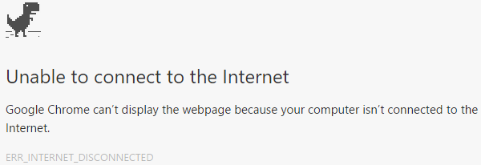
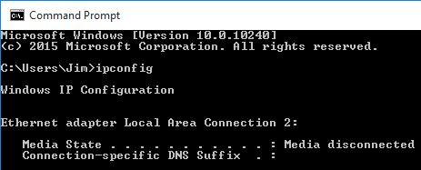
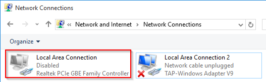
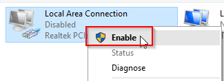
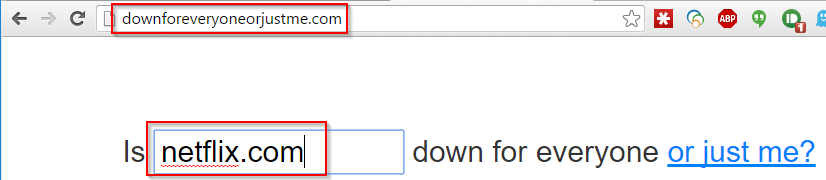
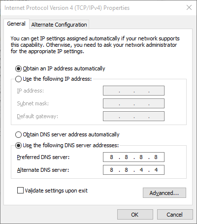

Exercise 8: Troubleshooting
==============================

It is often necessary to troubleshoot network configurations. This lab will present several scenarios and ask you to think about what could be causing the problems.

Prerequisites
--------------------------
A knowledge of fundamental networking concepts such as IP addressing, routing, DHCP, and DNS are assumed.

Learning Objectives
--------------------------
By the end of this lesson, you will be able to:

1. Explain general troubleshooting steps.
2. Use software tools to help diagnose problems.
3. Fix common networking issues.

Troubleshooting Overview
--------------------------
Troubleshooting networking problems or just about any other computer problem boils down to a few key questions:

1. What is the problem?
2. What elements of the system could be causing the problem?
3. What do I know about the elements that could be causing the problem?
4. How can I find out more about the elements that could be causing the problem?

In general, troubleshooting should start with the assumption that something on your end is broken. When you can confirm that your computer is configured properly, the scope of investigation should proceed to the next hop in the network--such as a switch. By starting locally then proceeding outward, you can ascertain the point of failure.

The following scenarios demonstrate a few common networking problems and provide some guidance on how they can be resolved. Each of these represents an actual networking problem.

Scenario 1
--------------------------

You just installed Windows 10 on a brand new computer. The computer boots up and you launch a web browser. When you try to go to yahoo.com, you see an error message similar to the following:

&nbsp;

You get the same error message when going to different websites.

What network settings do you check? In the Windows world, you can run `ipconfig` to check basic network connectivity. In Linux or Mac OSX, you would run `ifconfig`. Suppose we saw the following `ipconfig` output in Windows. What does this information tell you?

&nbsp;

It is an Ethernet adapter, which tells us that we should be looking for a plugged in connection. What do you check next?

It would be important to view the cable to see if it is plugged in properly. A loose cable might be causing the issue. Sometimes, the RJ-45 connections can become damaged, causing cables to slip out. Suppose that you check the cable and it is plugged in properly. However, there are no lights blinking. What does this information tell you?

In Windows, it is often important to check the `Network Connections` in the Control Panel. Suppose you view your Network Connections and see the following output. What does this tell you?

&nbsp;

The `Local Area Connection` is disabled. It can be enabled by right-clicking on the adapter, and choosing `Enable`.

&nbsp;

After enabling the network interface, will you immediately be able to connect to the Internet? What processes must take place before a successful connection?

If the adapter is configured to acquire IP configuration settings through DHCP, it can take a few seconds to obtain an IP address and other network configurations. After about 10 seconds, you should be able to open a web browser and connect to the Internet (assuming that a  disabled network adapter was your only problem).

Scenario 2
-----------------------------

You are able to browse most of the web just fine. Yahoo.com works, cnn.com loads reasonably well, but for some reason when you go to Netflix.com your browser just hangs.

1. What is the problem? A single website (Netflix.com) is not loading in the web browser. When defining the problem, it is good to be as specific as possible.

2. What elements of the system could be casuing the problem?
  - Your ISP might have blocked Netflix.
  - Netflix may have taken the service down for maintenance.
  - The DNS lookup for Netflix might have failed.

3. What do I know about the elements that might be causing the problem.
  - It is unlikely that the ISP would be blocking Netflix. Some service providers throttle traffic to limit bandwidth to particular sites, but it would be unusualy for an ISP to outright block traffic. Only if all other troubleshooting steps failed, you might call the ISP and ask specifally about Netflix.
  - Netflix might not be working. Because you do not have direct access to the Netflix servers, we would want to check if Netflix is working for other people.
  - If DNS is not resolving, we will not be able to get to the website. However, DNS appears to be resolving other websites fine.

There are a few ways to gather information about websites. A basic test that can provide useful information is `ping`. The following screenshot shows the output from pinging Netflix.com. By default, Windows sends four ping requsts and records the response.

&nbsp;

Notice that in the screenshot, the requests timed out. This means that the Netflix server did not response to the pings. For security reasons, some services block ping requsests, so a failed ping does not necessarily mean that the website is down. The ping output shows us that the website netflix.com resolved to the IP address 75.101.139.66. This gives us some assurance that DNS resolution is working properly.

The website http://downforeveryoneorjustme.com/ allows you to enter a website and check if it is accessible from another location.

&nbsp;

If the website is down, then it is probably not a configuration problem on your computer nor an ISP issue. If the website is down for multiple people in different locations, the web server is probably down for everybody. All you can do is wait for the website to restore its service.

Scenario 3
-----------------------

You bring your laptop to the Rotary Club to give a presentation. The Rotary Club allows guests to connect to its WiFi using the password `Pioneer47`. During your presentation you want to show some YouTube videos that you failed to download ahead of time. You connect to the local access point, enter the password, and appear to connect successfully. However, when open your web browser and navigate to youtube.com, the page just hangs and eventually times out. Other people who brought their laptops are able to connect to youtube.com just fine.

What steps do you use to troubleshoot the problem? Options that you might consider are:
  - Loading another website using the domain name (e.g. yahoo.com). What would the outcome of this test tell you?
  - Loading another website using an IP address. What would the outcome of this test tell you?

Assume that loading a different website using the domain name fails, but loading the website via an IP address works. What settings on your computer would you check next?

Looking at the IPv4 configuration, you see the following.

&nbsp;

What do you notice about the DNS settings? What is 8.8.8.8 and 8.8.4.4? Search the Internet if you are unfamiliar with these IP addresses.

Some organizations filter content by DNS. So if you tried to go to poker.com, the DNS server would recognize that site as a gambling site and instead of returning the IP address to the site, it redirects you to a web page telling you that the site is prohibited. These organizations may block DNS lookups to other DNS services to make it more difficult to circumvent their content filtering. By changing your DNS settings to 'Obain DNS server addres automatically,' you would likely be able to connect to websites using a friendly domain name.