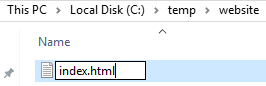
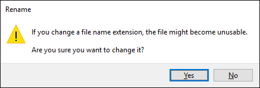
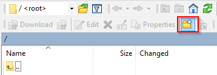
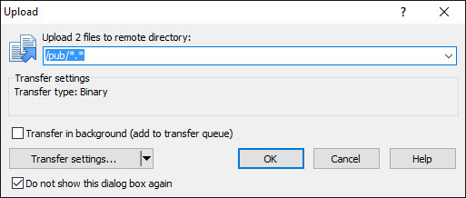
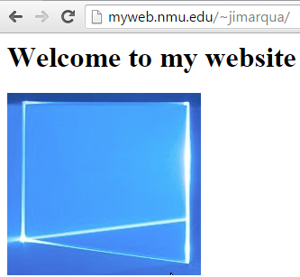

Create a Basic Website
=======================

In this exercise, you will create a basic website to understand how the site is hosted.

Prerequisites
----------------
1. Download and install WinSCP if you do not have it. https://winscp.net/eng/download.php
2. A valid NMU account.

Local Website Creation
----------------------
1. Create a folder for your website on your computer. It is a best practice to keep website folders separate from other files.

&nbsp;

2. Right-click in the folder and choose New > Text file.

3. Name the file `index.html`. You will need to change the file extension.

&nbsp;

4. Confirm that you want to change the extension.

&nbsp;

5. Open the index.html file in Notepad. Add the following text.

```
<html>
<head>
 <title>My Website</title>
</head>
<body>
<h1>Welcome to my website</h1>

</body>
</html>
```

6. Copy a `.jpg` file to your website folder. Rename the file to `image.jpg`.

7. Save index.html. Double click on index.html to open the web page in a web browser. If the image does not show up correctly, confirm that the image is in the same folder as index.html, and that the file name is correct in the `src` attribute in index.html.

&nbsp;

Uploading the Site
------------------

1. Launch WinSCP.

2. Select FTP. Enter `myweb.nmu.edu` in the host name, your NMU ID in the user name, and your NMU password in the password field. Click `Login`.

&nbsp;

3. WinSCP will show your local computer on the left, and the remote server on the right. On the right (remote server), click the icon to create a new folder.

&nbsp;

3. Name the folder `pub`.

&nbsp;

4. Open the `pub` folder by double clicking on it.

5. On the left side of WinSCP (your local folders), navigate to the folder where you created index.html and image.jpg. Highlight both files, then drag them to the right side to upload them.

&nbsp;!(winscp-dragdrop.png)[Drag and Drop]

6. Click `OK` when prompted.

&nbsp;

Verify Your Website
---------------------

1. Open a web browser. Navigate to myweb.nmu.edu/~[nmuid], substituting [nmuid] for your NMU ID. For example, you might go to myweb.nmu.edu/~jxanderx.
2. Verify that the website looks like your local website.

&nbsp;

Investigation
----------------------

1. What protocol did you use to upload the file to the web server?
2. What protocol did you use to load the website in your browser?
3. What web server is the website running on? (Hint: in Chrome, open the developer tools, click the Network tab, then reload the page.)
4. Where is the web server physically located?
5. How many servers is your content deployed to? (Make assumptions.)
6. What would happen if millions of people tried to visit your site simultaneously?