= Armitage for Exploitation

Armitage is a graphical front end for the Metasploit framework and other scanning tools such as nmap. Armitage can be a useful tool for learning to execute specific scans and attacks because it will fill in the necessary parameters and run them for you. Every command that you run can be reviewed in the terminal so you can see the command that was run and the output.

== Prerequisites

* A Kali VM
* A Metasplitable VM (for the challenge)

== Launching Armitage

There are several ways to launch Armitage.

* Click the elf-looking icon on the Kali desktop menu.
+

* Alternatively, you can click `Applications > Exploitation Tools > armitage`.
+
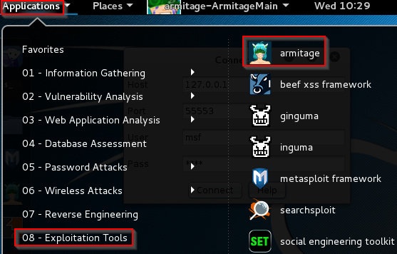
* You can also use the application search tool to find `armitage`.
+
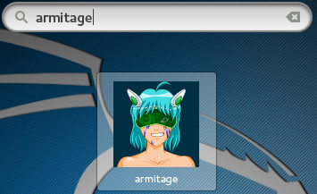
* Armitage must connect to the Metasploit service. In Kali, the connection information should be filled in corretly automatically. The password `test` will be obscured, however. The following information can be used if your settings are deleted for some reason.
    * Host: 127.0.0.1
	* Port: 55553
	* User: msf
	* Password: test
+
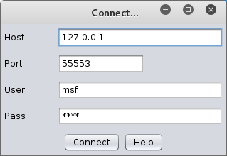
* You will be prompted to start Metasploit if the service is not running. Click `Yes`.
+
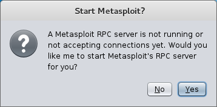
* The first time you run Armitage, you may receive the following error.
+
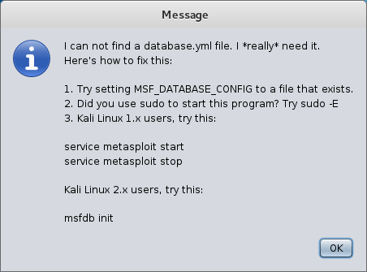
+
If you receive this error, click `OK`. Follow the instructions in the error message by opening a terminal and running `msfdb init`.
+
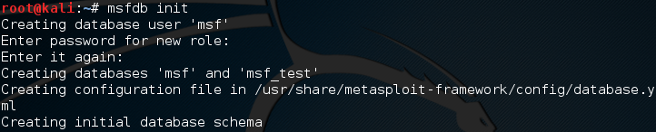
+
Restart Armitage and connect to the Metasploit service.

== Exploring the Armitage Interface

There are four main elements of the Armitage interface.

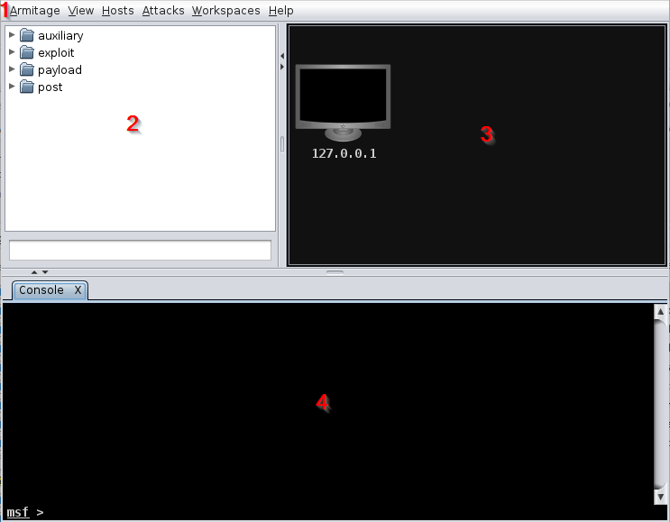

1. The application menu.
2. The tree menu of the exploits and attacks available in Metasploit.
3. The hosts that will be targets of attacks or scans.
4. The output of the commands that are run.

The graphical user interface is just a front end for the commands that will be run from a terminal. Everything that you do in Armitage could be done from the terminal if you knew the commands to run.

== Add Hosts

The hosts are the computers that you will be scanning and/or attacking.

* Click `Hosts > Import Hosts...` to add a computer.
* Add `127.0.0.1` and click `Add`.
+
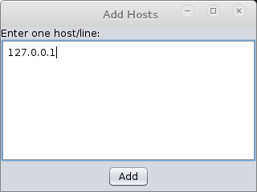
* The host will show up in the interface with the IP address.
+
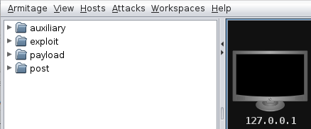

IMPORTANT: Only add hosts that you have permission to access. The host 127.0.0.1 refers to your local Kali virtual machine. If you added a host to a remote server and ran an attack, you could land yourself in serious legal trouble.

== Working With Host

* Right-click on 127.0.0.1 and choose `Host > Operating System > Linux` because it is running Kali Linux. Once you set the Linux operating system, the host icon will change to a penguin (the universal Linux symbol).
+
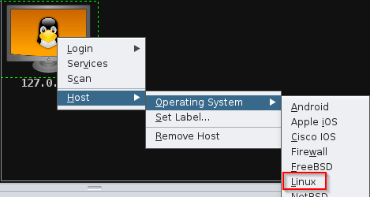
* Right-click on 127.0.0.1 and choose `Scan`.
+
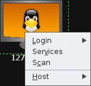
* Note that a new tab will open with the results of the scan. Investigate what commands were run as part of the scan and what was found.
+
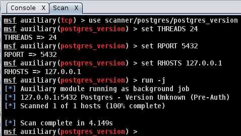
* Right-click on 127.0.0.1 and choose `Services`.
+
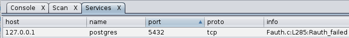
* Again, note that a new tab was opened with a list of services running on the host.
+

* Select the host 127.0.0.1. In the Armitage menu select `Attacks > Find Attacks.` Armitage searches the Metasploit database for attacks that might apply to the host.
+
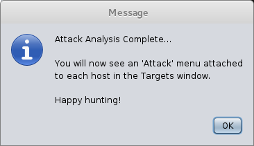
* Right-click on 127.0.0.1 again and explore the new `Attack` option.
+
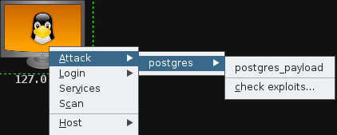
* Click the `postgres_payload` attack. A description of the attack and the Metasploit parameters will be given.
+
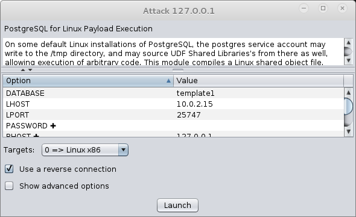
* Click `Launch`. View the output in the new `exploit` tab. Was the exploit successful?

Notice that the right-click menu continues to expand as new scans are run. Armitage remembers key information about the hosts which can be used to refine scans and attacks.

== Launch a Specific Attack on a Host

* In the tree menu of exploits, expand `Exploit > Linux > posgres.`
* Drag `postgres_paylod` onto the 127.0.0.1 host.
* Notice that the attack parameters have been entred for you.
* Click `Launch`.

== Hail Mary

Typically, you will want to use good judgment when determining what exploits to run on a remote server. But sometimes you just want to throw the kitchne sink at a target. You might consider this attack when testing the security of a new server, a machine in a test environment, or other situations where you are not concerned about stealth. To throw every known attack at a target, use the `Attacks > Hail Mary` feature. This option will launch hundreds of attacks at the hosts in the workspace. 

The Hail Mary feature is such a blunt tool that Armitage will prompt you with the following message before you can launch the attack.

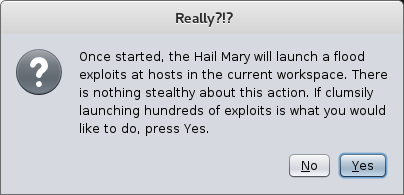

If you're sure, click `Yes`. Go ahead and try it. Was the attack successful?

== Challenge

* Start the Metasplitable VM. Be sure to set the network adapters to `internal network` in VirtualBox. Set the IP addresses to values on the same subnet (e.g. 192.168.2.50/192.168.2.100). Once you establish a connection, scan Metasplitable from Armitage in Kali. Execute attacks.

== Cleanup

* Close Armitage. 
* Save the state for your Metasplitable and Kali virtual machines.