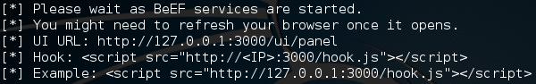

= BeEF Exploitation Framework

The BeEF XSS Framework is a browser exploit tool.

== Prerequisites

* Kali Linux VM installed

== Starting the BeEF Services

* In Kali, click `Applications > Exploitation Tools > beef xss framework`.
* The services will start.
+

+
Note the UI URL. In a few seconds, a web page should open to this URL. However, you will be redirected to a login page at http://127.0.0.1:3000/ui/authentication.
* Login with the username/password combination `beef`/`beef`.

== Basic usage

* The BeEF control panel has a welcome page with information about the tool and basic usage.
* Open the link to the basic demo page (http://127.0.0.1:3000/demos/basic.html).