Comparing Telnet and SSH
==================================


Prerequisites
----------------------------------

All Platforms
  - Install [Wireshark](https://www.wireshark.org/download.html)

For Windows
  - Install [PuTTY](http://www.chiark.greenend.org.uk/~sgtatham/putty/download.html). Choose the Windows installer for everything except PuTTYtel.

For Mac OSX or Linux, you should already have access to telnet and SSH from the command Line.

Learning Objectives
--------------------------
By the end of this lesson, you should be able to
  1. Connect to a remote system using telnet and SSH
  2. Explain the differences between telnet and SSH
  3. Capture SSH and telnet traffic using Wireshark.

Capture Traffic with Wireshark
-------------------------------
  - Launch Wireshark.
  - Select Capture > Interfaces

&nbsp;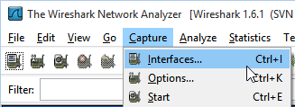

  - Determine your active interface by looking at the number of packets . Your active interface will have the most packets received.
  - Click `Options` next to the active interface.

&nbsp;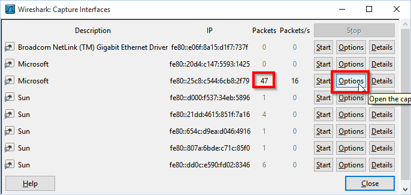

  - The the Capture Filter field, write `tcp port 23`. The field will have a green background when a valid filter is entered. The telnet protocol uses TCP and port 23, so this capture filter will only capture telnet data. You will not capture other network traffic such as ARP requsts, DNS lookups, or regular web traffic.

&nbsp;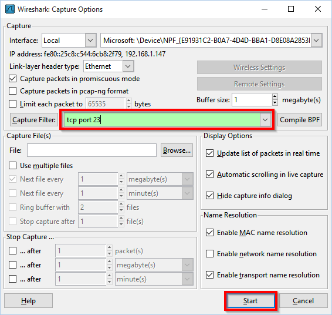

  - Click "Start" after the filter has been applied. Wireshark will immediately begin to capture packets.
  
Connect Via Telnet
--------------------------

For Mac OSX or Linux, open a command prompt and run the following command.

```
$ telnet telehack.com
```

For Windows, launch Putty
  - Enter `telehack.com` in the host name input box.
  - Enter `23` for the port.
  - Select `Telnet` for the connection type.
  - Click `Open.`

&nbsp;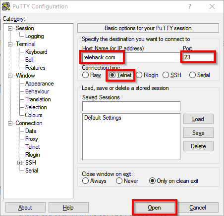

Once you connect, you should see output similar to the following screenshot.

&nbsp;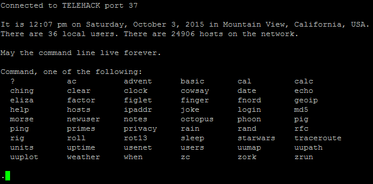

Type the following text, then press `[enter]`:

```
Can anybody read this?
```

Type `quit` and press `[enter]`. If you are using Putty, you can close the Putty window.

Analyze Telnet Data in Wireshark
------------------------------------
  - In Wireshark, click Capture > Stop.

&nbsp;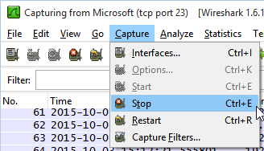

  - Look at the source and destination IP addresses. What do these represent?
  - Right-click on any row of data captured, then choose "Follow TCP Stream."

&nbsp;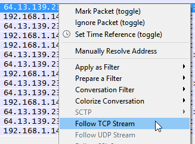

  - Notice that the reconstituted TCP stream contains an approximate reconstruction of your telnet session, including the data that you typed in the console.

&nbsp;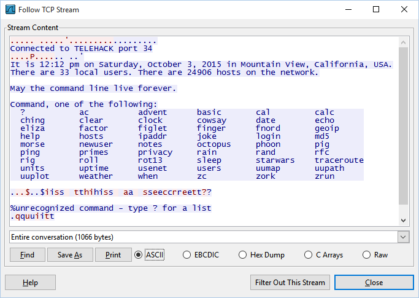

  - If somebody else on the network could sniff your packets, could they see what you typed in your telnet session? The answer is yes--telnet traffic is not encrypted.

Start a New Wireshark Capture
-----------------------------------
  - Click Capture > Interfaces.
  - In your active interface, click Options.
  - In the Capture Filder, write `tcp port 22`. Note that by default, SSH connects using port 22.
  - Click start. You will be prompted to save your last capture. Click `Continue without Saving.`

Connect Via SSH
-------------------------------------
On Mac OSX or Linux, run the following command in the terminal:

```
$ ssh sdf.org
```

In Windows, launch Putty. Put `sdf.org` as the host. Ensure port 22 and SSH are selected, then click `Open.`

&nbsp;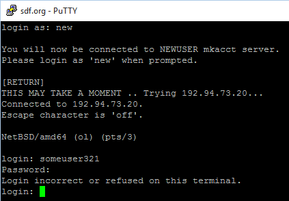

Note that the first time you connect, you will be asked if you accept the server's host key. Click `yes` to accept the key. Though the key provided does not verify the server's identity, it will still encrypt traffic between your computer and the remote server.

&nbsp;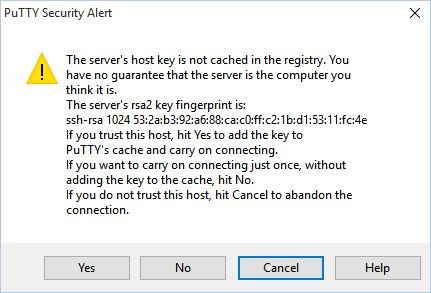

  - You will be asked to login. Type `new` and press `[enter]`.
  - Enter any username that is likely to be unique.
  - Enter `Is this a secret?` as your password.
  - The account creation may fail. This is not important.
  - Close the SSH session.

Analyze SSH Data in Wireshark
--------------------------------------
  - Stop the capture in Wireshark (Capture > Stop).
  - Right click on a row and choose "Follow TCP stream."
  - You should see output similar to the following screenshot.

&nbsp;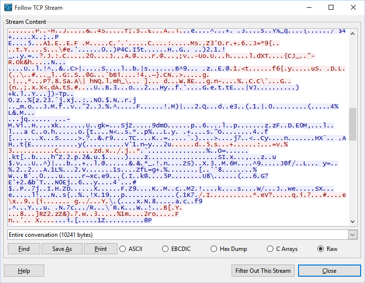

  - Could anybody sniffing your network traffic discover the username and password you tried to register with? The answer is, no. The SSH traffic is encrypted.

Cleanup
---------------------------------------
Feel free to close PuTTY or any terminals you have open. You can close Wireshark--you do not need to save the capture file.

Reflection
----------------------------------------
  1. How are telnet and SSH similar?
  2. How are they different?
  3. Which tool should you implement as a system administrator?
  4. What does following a TCP stream do in Wireshark?