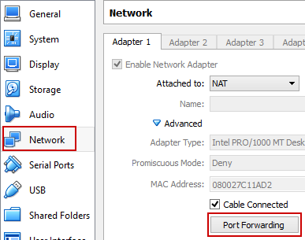
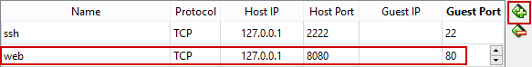

= Creating Honeypots with Modern Honey Network

The software Modern Honey Network (MHN) makes it easier to create honeypots and honeynets. The project home page can be found at https://github.com/threatstream/mhn. Of course, a honeypot or honeynet is not terribly useful unless the network traffic and other activity can be monitored. MHN will install Snort for intrusion detection. Many other tools are installed to make analyzig data easier.

== Prerequisites

* VirtualBox
* An Internet connection (~400 MB download)

== Configure MHN On an Ubuntu Virtual Machine

Open a Windows command prompt and make a new folder for this exercise. The following commands create a new folder in c:\temp.

```
cd \
cd temp
md honey
cd honey
```

Run the following commands to create an Ubuntu server virtual machine.

```
vagrant init ubuntu/trusty64
vagrant up
vagrant ssh
```

Run these commands to install git. Git is a source control program. It is necessary to install because Modern Honey Network is downloaded and installed directly from the source.

```
sudo apt-get update
sudo apt-get install git -y
cd /opt/
sudo git clone https://github.com/threatstream/mhn.git
cd mhn/
sudo ./install.sh
```

The installation will install other required packages automatically. While it is installing, open VirtualBox and go to the network adapter settings for the Ubuntu VM. Click "Port Forwarding."



Add a new rule to forward host port 8080 to the guest port 80. Now, when you open a web browser on your host and go to http://127.0.0.1:8080, the web page will be served from the web server running in the Ubuntu VM listening on port 80.



After a while, you will be prompted for the MHN configuration. Use the IP address listed for your server base URL (this should default to your public IP address).

```
===========================================================
MHN Configuration
===========================================================
Do you wish to run in Debug mode?: y/n n
Superuser email: sample@test.org
Superuser password: password
Server base url ["http://1.2.3.4"]: http://97.95.86.36
Honeymap url ["http://1.2.3.4:3000"]:  http://97.95.86.36:3000
Mail server address ["localhost"]: localhost
Mail server port [25]: 25
Use TLS for email?: y/n n
Use SSL for email?: y/n n
Mail server username [""]: 
Mail server password [""]: 
Mail default sender [""]: 
Path for log file ["mhn.log"]: 
```

The installation will continue. Snort rules must be downloaded installed.

When asked to integrated with Splunk, enter `n`.

```
sudo /etc/init.d/nginx status
```

You should see a message that "* nginx is running."

```
sudo /etc/init.d/supervisor status
```

You should see a message, "is running".

```
sudo supervisorctl status
```

The following services should be running:

* geoloc
* honeymap          
* hpfeeds-broker    
* mhn-celery-beat   
* mhn-celery-worker 
* mhn-collector     
* mhn-uwsgi         
* mnemosyne

If the `mhn-celery-worker` is not running, execute the following commands.

```
cd /var/log/mhn/
sudo chown www-data mhn.log
sudo supervisorctl start mhn-celery-worker
```

== Starting MHN

