= Cygwin Installation and Basic Use

Cygwin contains tools which provide you many Linux tools in a Windows environment. Some Linux applications that are not officially supported in Windows may also work using Cygwin.

== Prequisites

* A computer running Windows (any version)
* An Internet connection (~100 MB will be downloaded)

== Installation

* Go to https://www.cygwin.com on your Windows computer.
* Use 64-bit setup link to download the installation file. (Use the 32-bit installation if you know your processor only supports the 32-bit architecture, but this should be rare.) The setup file is small--less than 1MB. During the installation, many more files will be downloaded.
* Launch the setup executable you downloaded.
* Click `Next`.
+
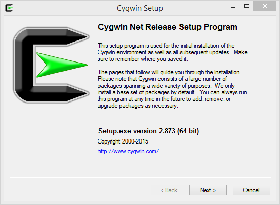
* Choose `Install from Internet`.
+
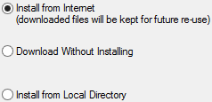
* Keep the default `c:\cygwin64` directory, and leave the `All Users` option checked. Click next.
+
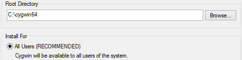
* For the local package directory, any folder will work. The installation should default to your downloads folder, which is fine.
+
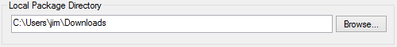
* Most likely, leave the Internet connection as `Direct Connection` unless you are using a proxy.
+
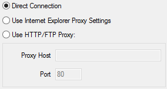
* Choose any download site that seems fast. Generally, it's best to choose a location that is geographically close to you, but it can be difficult to determine just by the domain name. For example, if you are in Michigan, you might choose http://lug.mtu.edu.
+
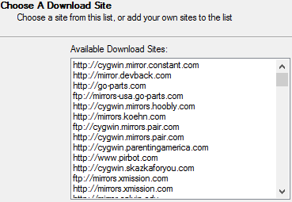
* You will be asked what packages to select. For now, do not choose to install any additional packages. Feel free to expand the options to see what is installed by default.
+
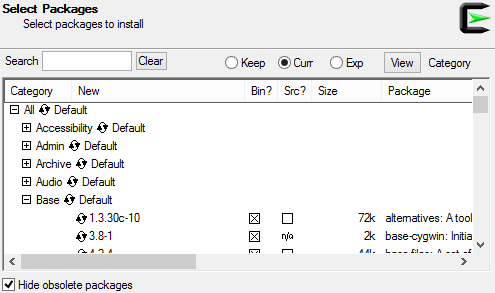
* The installer will determine all prerequisites to install the software. Click next.
+
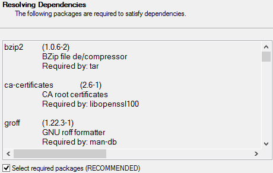
* The sofware will be downloaded and installed.
+
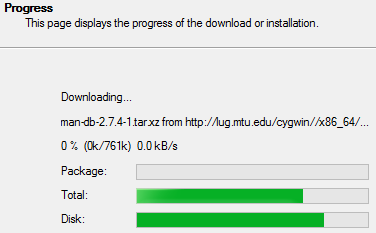
* Choose whether or not to put an icon on the desktop. It is recommended that you put an icon in the Start Menu at a minimum.
+
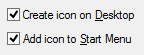

The installation is now complete.

== Using Cygwin

* Start a Cygwin terminal by starting the icon from your desktop, or finding `Cygwin Terminal` in your Start Menu.
+
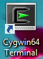
* The first time you launch a Cygwin terminal some files will be created in your home directory. These are similar to files that would exist in a Linux home directory. Notice that you are given a prompt with a dollar sign (`$`). This is the Linux default. This is a hint that you can use your Linux tools.
+
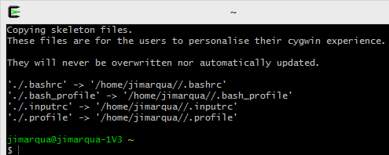
* Not all tools available in Linux will run. For example, run `ifconfig`.
+
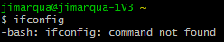
+
The command will fail because Windows uses `ipconfig`. Run `ipconfig` and view the output.
* The tool `openssl` can be used for many crytpographic operations. Run the following command to create a certificate signing request.
+
```
openssl req \
  -new -sha256 -newkey rsa:2048 -nodes \
  -keyout mykey.pem -out myreq.pem
```
+
Follow the prompts to create the request. The details (and success) of this command are not terribly important. The important thing is that you are running a cyrptography tool that does not come standard in Windows.

== Installing New Packages

* Run the setup again. Cygwin will go through all of the installation steps as if you were installing it from scratch.
* On the `Select Packages` screen, search for `wget`.
* Expand `Web`.
* Select the binary version of the wget package.
* Click next and review the dependencies. Click next again to install the packages.
* After the installation is complete, open a new Cygwin terminal.
* Run the following commands:
+
```
cd ~
wget google.com
cat index.html
```
+
The `wget` command downloads the google.com homepage and saves it in index.html. The `cat` command displays the file in the terminal window.

== Challenge

* Find one or two additional useful packages and install them. Ensure that you can run them from a terminal.
* What command can you run to determine where a specif utility is being run from? For example, where is the `ping` application found?

== Reflection

* Why would you use cygwin instead of the built-in tools provided by Windows?
