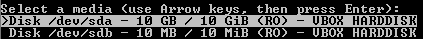
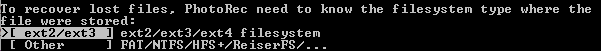
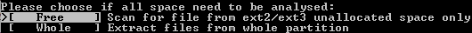
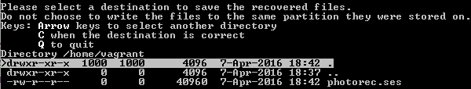
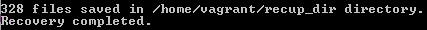

= Data Recovery and Destruction

Most people do not care how a hard drive stores files. If data is not properly disposed of, there is a chance that it can be recovered. Organizations who sell old hardware or dispose hard drives must understand how to properly delete data. It is not as simple as emptying a computers trash or recycle bin.

In this exercise you will:

* attempt to recover a file deleted from a hard drive,
* securely delete a file,
* and "shred" a hard disk to make it suitable for reuse or disposal.

== Prerequisites

* Vagrant
* VirutalBox

== Create the VM and Data

Create an Unbuntu virtual machine using the steps specified below. The custom Vagrant file will create a second 2MB disk on your file system.

```
cd /
cd temp
mkdir data
touch Vagrantfile
```

Replace the entire contents of the Vagrantfile with the following text.

```
# -*- mode: ruby -*-
# vi: set ft=ruby :
disk = './tempdisk/extra_disk.vdi'
Vagrant.configure(2) do |config|
config.vm.box = 'ubuntu/trusty64'
config.vm.provider "virtualbox" do | p |
unless File.exist?(disk)
p.customize ['createhd', '--filename', disk, '--size', 1 * 1024]
end
p.customize ['storageattach', :id, '--storagectl', 'SATAController',
'--port', 1, '--device', 0, '--type', 'hdd', '--medium', disk]
end
end
```

Run the following commands to bring up the virtual machine.

```
vagrant up
vagrant ssh
```

Once connected, run the following command to create a text file in your home directory.

```
"This is a test to see if I can restore this file." > deleteme.txt.
```

Run the following commands to verify that the file exists then delete it.

```
cat deleteme.txt
rm deleme.txt
ls
```

The file should not appear in the output of the `ls` command because it has been deleted. We will attempt to recover it (though successful file recovery is never a guarantee).

== Photorec to Restore Files

The photorec tool from the testdisk package can be used to recover data from unallocated space on the disk. Testdisk can be used to recover partitions which is out of scope for this exercise.

* Run the following command to install photorec.
+
```
sudo apt-get install testdisk
```
* Start photorec with root permission to start the data recovery process.
+
```
sudo photorec
```
* Select the larger disk to recover from if multiple hard disks are present.
+

* Select the larger partition if there are multiple.
+

* The automatically selected file partition should be correct.
+

* Choose `Free`.
+

* Press `c` to select the current output folder. Photorec will create a new folder in this directory.
+

* The scan should complete fairly quickly.
+

* Quit photorec when it has finished.

How many files were found?

* Run `cd recup_dir.1` and then `ls` to see the files found. Your folder name may be different.
* Run `cp *.txt /vagrant` to copy them to the shared folder between your host and guest.
* Open the folder in your host explorer window. For example, I might open C:\temp\data and browse the files.
* Can you find the text file you created? It may be helpful to sort the files by size from smallest to largest.

== Securely Delete a File

* In your virtual machine, create a new text file with the following commands.
+
```
cd ~
echo "super secret" > secret.txt
```
* Install a utility to securely delete single files.
+
```
sudo apt-get install wipe
```
* Securely delete the file you just created with the following command.
+
```
wipe secret.txt
```
+
You must enter `Yes` when prompted ('y') will not suffice. Why do you think this extra confirmation is built into the program?

== Securely Erase a Hard Disk

* Exit from the SSH session.
* Run `vagrant halt to stop the VM.
* Add a hard disk to the VM in the VirtualBox manager. Make it a fixed disk only 0.01 GB large. Save the changes.
* Run `vagrant up` to boot up the VM again. The new hard disk will show up in the operating system as /dev/sdb.
* Run the following commands. Take not in each step what is happening.
+
```
sudo su
parted
(parted) select /dev/sdb
(parted) mklabel msdos
(parted) mkpart primary 0 2
(parted) quit
mke2fs /dev/sdb1
mkdir /mnt/data
mount -t ext2 /dev/sdb /mnt/data
```
* Create some data and verify the file was created.
+
```
cd /mnt/data
echo "testing again" > testing.txt
ls
```
* Nagivate outside of the disk. Unmount the disk from the file system, then "shred" it.
+
```
cd ~
sudo umount /dev/sdb
sudo shred -vzn 3 /dev/sdb
```
+
The `vzn 3` parameters tell the shredding program to overwrite the bits three times.
* Attempt to mount the disk again.
+
```
mount -t ext2 /dev/sdb /mnt/data
```

The last command failed. Why would the disk fail to mount at this point. What should exist on the disk?

== Challenge

* Find an alternative to photorec for restoring deleted files.
* Use photorec or another tool to see what recoverable files exist on your host operating system.

== Reflection

* Why might a deleted file still be recoverable while another file may not be recoverable?
* Do you want files to be recoverable from a security standpoint?
