Encrypting Data with VeraCrypt
================================

VeraCrypt is a tool that creates an encrypted file container on your system. The container is a single file that can be mounted like a USB drive. All of the files in the container are encrypted, such that you could move the container from one system to the other while retaining the encryption. To read the files, one would need VeraCrypt and the encryption key.

Prerequisites
-----------------------
A Windows computer or a virtual machine running a Windows operating system.

Install VeraCrypt
---------------------------
VeraCrypt is hosted on CodePlex. CodePlex is a source code management site owned and operated by Microsoft.

1. Go to https://veracrypt.codeplex.com/
2. Click the download link.
3. When the download completes, launch the installation.
4. Accept the licensing terms.
5. Choose "Install" rather than "Extract."
6. Accept all other defaults. You may choose to unckeck the box to create a system restore point since this will take extra time. Keep the box checked if you are concerned about the software harming your computer.

Create a VeraCrypt Volume
-------------------------------
A volumne is basically a container for files, like a hard disk. 

1. Start VeraCrypt. Click "Create Volume."

&nbsp;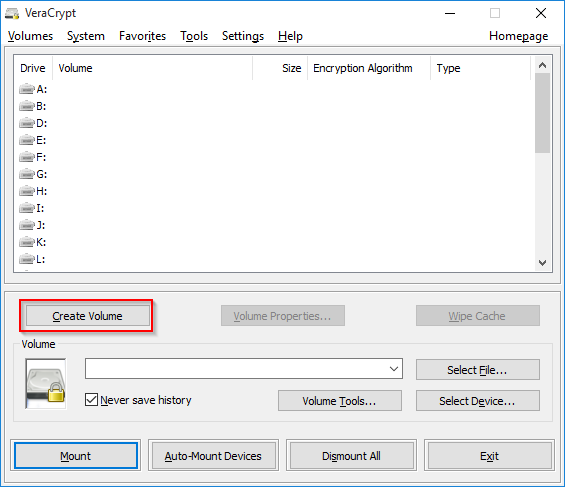

2. Keep the default selection, "Create an encrypted file container." This will allow you to create a file to hold encrypted files without changing affecting any other data on your hard drive.

&nbsp;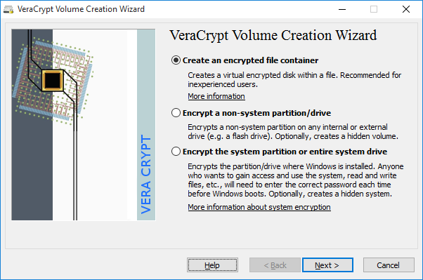

3. Keep the "Standard VeraCrypt volume" option selected.

&nbsp;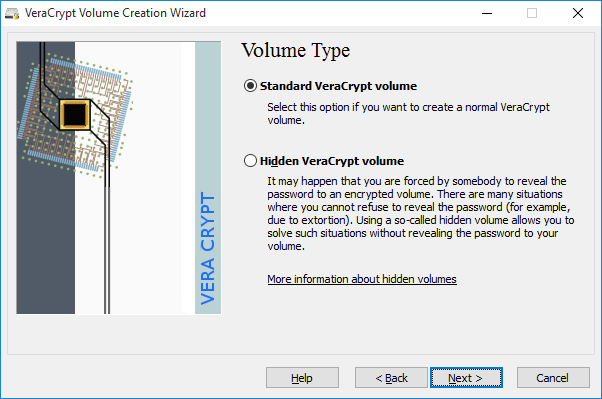

4. Choose a path and file name. You can put the file anywhere you like and give it any extension that you like. In the following example, the file is put in c:\\temp\\veracrypt. The file is named mycontainer.vc. The "vc" file extension is to help me rememver that the file is for VeraCrypt. If you wanted to hide this file, you could name it anything you wanted, such as "kidvideo.mp4."

&nbsp;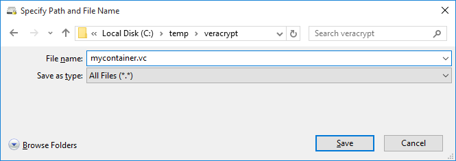

5. The volumne location will confirm your file selection. Click "Next."

&nbsp;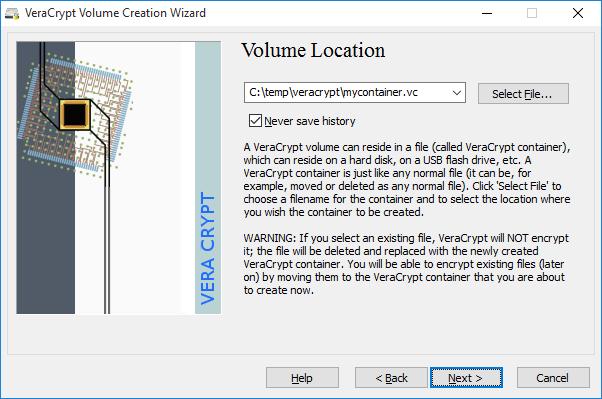

6. Explore the available encryption algorithms and hash algorithms. Keep the default AES encryption and SHA-512 hash algorithms, and click "Next."

&nbsp;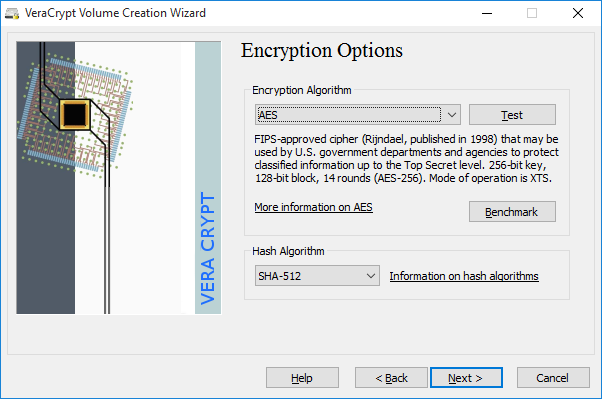

7. Create 1 MB volume. This represents the maximum size of the volume. There is no way to expand a volume once it has been created. In real-world use, the size of your volume would depend on the number and size of the files you planned to store.

&nbsp;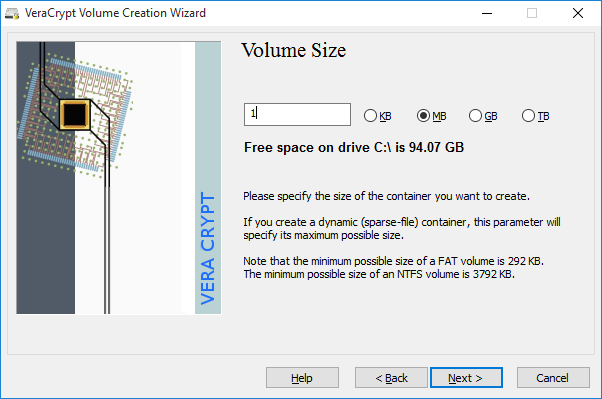

8. Enter a password. VeraCrypt does not force you to choose a strong password.

&nbsp;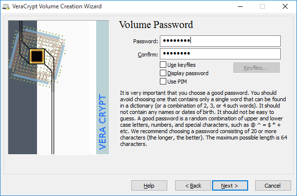

9. VeraCrypt will warn you if the password is short. Click "Yes" to keep your password, or "No" if you want to select a new one. For testing purposes, a short password is fine.

&nbsp;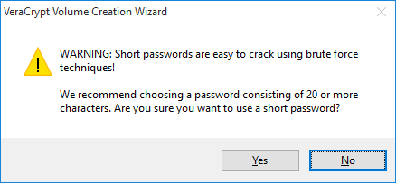

10. By default, VeraCrypt uses a FAT file system. Keep the defaults, and click "Format."

&nbsp;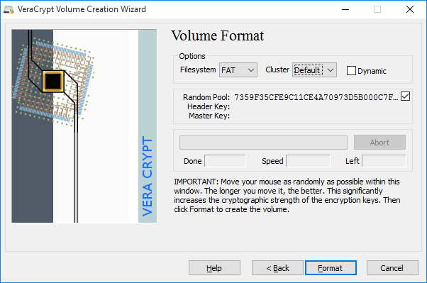

11. A dialog box will tell you when the volume has been created successfully. The larger the volume, the longer it will take to create.

&nbsp;

12. Click "Exit."

&nbsp;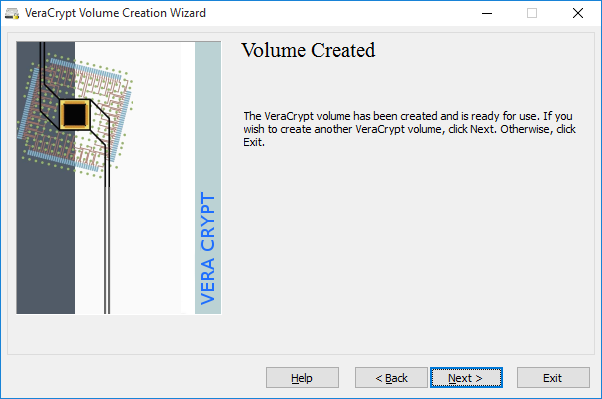

Mounting an Encrypted Volume
----------------------------------

You cannot use your encrypted volumn until you mount it.

1. Select the Z: drive (or another free drive on your computer if Z: is in use.)

2. Click "Select File..." and choose the file that you created in the previous section.

3. Click "Mount."

&nbsp;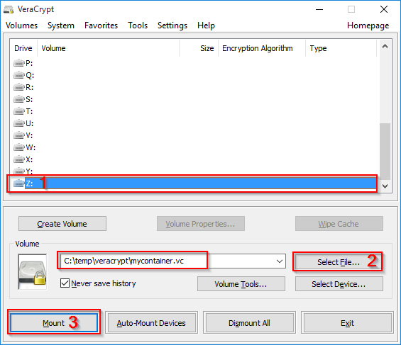

4. You will be prompted to enter the password used to create the volume. If you forgot your password, you are out of luck. By design, there is no way to recover a lost password.

&nbsp;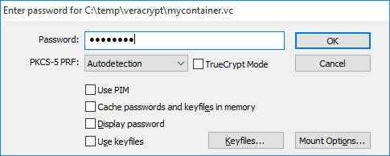

5. Once mounted, VeraCrypt will show the file that was mounted in the main screen.

&nbsp;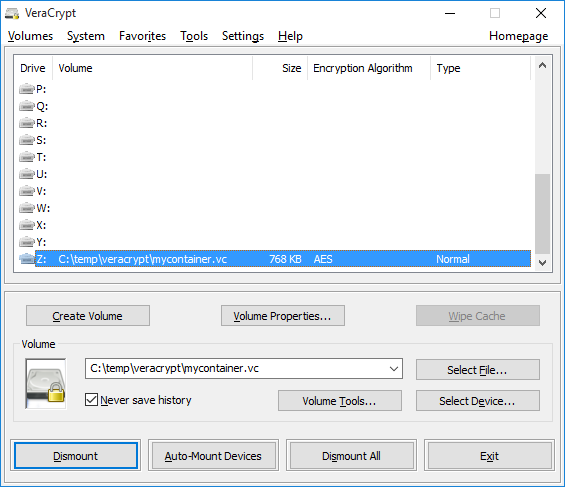

Adding Files to an Encrypted Volume
--------------------------------------
1. In Windows Explorer, navigate to Z:\\. Notice that there are no files.

&nbsp;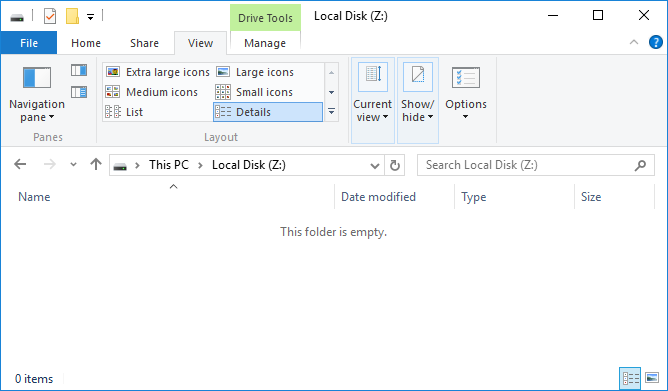

2. Create a text file named "secret.txt" and add some text. Save the file and close it.

&nbsp;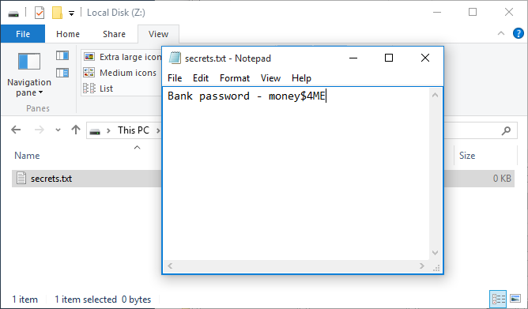

3. Notice that working with these files seems just like working with regular USB drives or hard drives. 

Dismount and Investigate
---------------------------
1. In VeraCrypt, select the Z: drive and click "Dismount." Note that the Z: drive will not be available in Windows Explorer anymore.

&nbsp;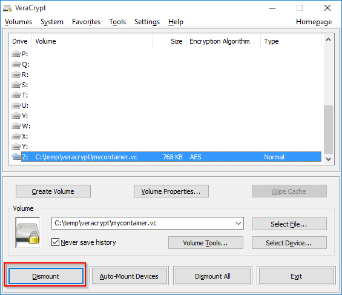

2. In Windows Explorer, navigate to to your encrypted volumne file location. Though it is not a text file, open the file with Windows Notepad to examine the contents. Scan through the file. Verify that you do not see the text that you wrote. You will not even be able to see the name of the file you created.

&nbsp;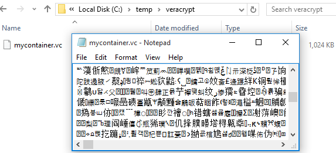

Reflection
------------------------------
1. What are situations where you would use VeraCrypt to encrypt files?
2. How would you manage your VeraCrypt passwords?
3. What would happen if an attacker stole your encrypted volume? How could they break into it?
4. What limitations to privacy exist? For example, if you had malware on your machine that took screenshots periodically, would your VeraCrypt data still be safe?