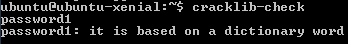
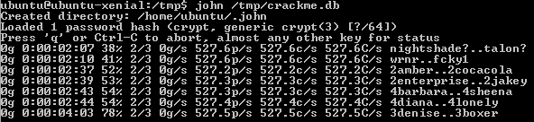

= Password Cracking

Passwords are the most common form of authentication. Passwords are easily to implement and can provide a fair amount of security if they are properly managed. Weak passwords or improperly managed passwords (such as password sharing) can leave systems vulnerable. This exercise will walk you through the process of evaluating password strength and cracking passwords.

== Prerequisites

* Vagrant
* VirtualBox
* Internet conneciton (~20 MB download)

== Virtual Machine Creation

Create a new Ubuntu Xenial 64 virtual machine. As a reminder, here are the commands on Windows to make a folder for this exercise, create the virtual machine, and connect to the virtual machine.

```
cd \temp
mkdir passwordcrack
cd passwordcrack
vagrant init ubuntu/xenial64
vagrant up
vagrant init
vagrant ssh
```

The default network setup should give you internet access. Ping google.com to verify that you internet is working.

== Install Password Cracking Tools

=== Cracklib

* Run the following command to install the cracklib library.
+
```
sudo apt-get install cracklib-runtime
```
* Cracklib comes with a dictionary used to evaluate passwords. Run the following commands to quickly scan the password list.
+
```
cd /
cd user/share/dict
cat cracklib-small
```

=== John the Ripper

* Run the following command to install John the Ripper (also known simply as "john").
+
```
sudo apt install john
```

== Evaluating Passwords

Before cracking passwords, it would be helpful to review what makes a password strong. Strong passwords are typically:

* long (more characters means more strength)
* complex (ixed upper case and lower case, use special characters)
* unique (not common words or combinations of simple words followed by a number).

A package exists to help evaluate password strength.

1. Run `cracklib-check` to launch an application to check password strength. Note that no output will be shown on the screen when the application starts.
2. Type `password1` and press [enter]. You should see the following output.
+

3. Evaluate `p@ssword` and `passw0rd`. Do you agree with cracklib's assessment?
4. Try `correcthorsebatterystaple`. Does cracklib think this all lower-case password composed of dictionary words is okay? Why do you think cracklib made the assessment?
5. Try a few more passwords and see what feedback cracklib gives about them. Is your online banking password secure enough? (Watch out for shoulder sufers.)
6. Press `control+c` to exit the program.
7. Run `clear` to clear the terminal window and hide any passwords you may have tested.

== Add Users

The default VM only has a single user password. Create a few users so that there is something useful to crack. For each user, use the `adduser` command run with root permissions. The following example adds a new user with the username `joe`.

```
sudo adduser joe
```

The only required information is the password. Just press [enter] when prompted for information like full name and work phone to leave them blank. Create the following users.

[options="header"]
|===
| Username | Password
| joe   | password
| sally | p@ssword
| jenny | p@ssword
| kevin | kevin1
| susan | gu@camole
|===

Note that Sally and Jenny have the same password. After adding their user accounts, run `sudo cat /etc/shadow`. Are their password hashes the same or different? How would this affect password hashing?

Add a few more users with passwords of varying complexity.

== Cracking Linux Passwords

1. Combine the unshadow and passwd files using the following command.
+
```
sudo /usr/sbin/unshadow /etc/passwd /etc/shadow > /tmp/crackme.db
```
+ `Unshadow` is part of the john package. Its sole purpose is to combine passwd and shadow files. Ignore any errors about unknown hosts.
2. Run the following command to brute-force attack the passwords. This will be very CPU intensive.
+
```
john /tmp/crackme.db
```
+
This may take a while to complete.
3. Press the space bar to see the current status.
+

4. When john is finished, run the following command to show the cracked passwords.
+
```
john -show /tmp/crackme.db
```

== Challenge

* Determine the algorithm used to store the password when using the `adduser` command.
* Create a list of other techniques you could use to obtain passwords (technical or social).

== Reflection

1. Read the following XKCD cartoon. Do you agree with the author about password strength?
+
image::xkcd-correcthorsebatterystaple.png[title="Source: https://xkcd.com/936/"]

== Cleanup

* Run `exit` to close the SSH session then run `vagrant destroy` to delete the virtual machine from your hard drive.