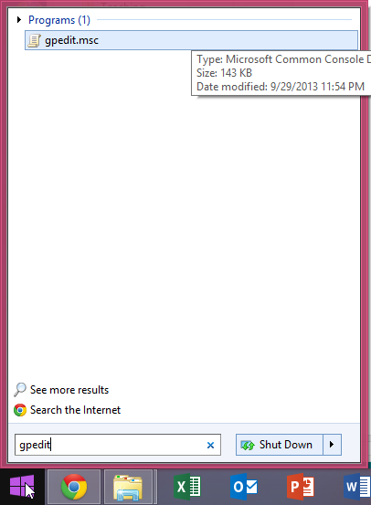
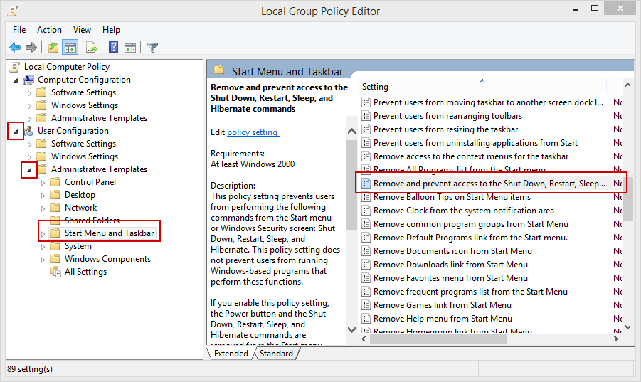
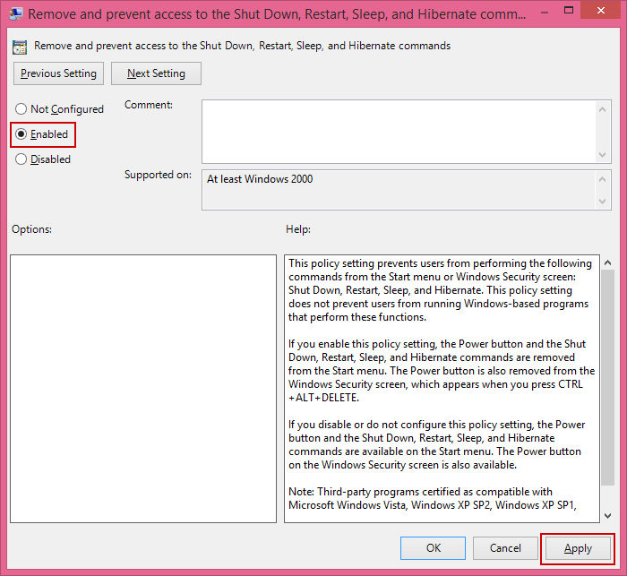
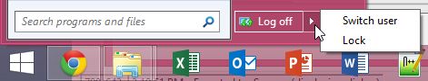

= Exploring Group Policy

In Windows, Group Policy provides a way to define and enforce security policies. Typically, Group Policy is used in conjuction with Active Directory to specify where a specific policy specification should be applied.

== Prerequisites

A computer running Windows 7 Pro, Windows 8 Pro, or Windows Server 2012 is required. The Home versions of Windows do not come with the Group Policy Editor.

== Launch the Group Policy Editor

1. Click Start.
2. In the search box, click `gpedit.msc`.
+


3. Windows should find the program. Click on the program to launch it.

By default, the local group policy will be opened.

== Edit Group Policy

1. Expand `User Configuration` (if it is not already expanded)
2. Expand `Administrative Templates.`
3. Click `Start Menu and Taskbar.`
4. In the right pane, double-click `Remove and prevent access to the Shut Down, Restart, Sleep, and Hibernate commands.`
+


5. Click `Enabled.`
6. Click `Apply,` but do not close the window.
+


== Test Group Policy

1. Click Start.
2. Notice that the sleep, hibernate, and restart commands are no longer available.
+


== Revert Group Policy

1. In the Group Policy Editor, change the power option to `Not Configred` and apply.
2. Verify that the power options have been restored in the start menu.

== Explore Group Policy Options

Hundreds of settings can be changed through Group Policy. Find three settings that you would enable in an enterprise environment to improve security.

```
1. ________________________________

2. ________________________________

3. ________________________________
```

== Explore Network Connections

1. Expand Administrative Templates > Nework > Network Connections.
2. Look at the `TCP/IP advanced configuration` template.
  - When would you want to apply this policy?
  - Would you allow any exceptions?
  - How would you apply exceptions?
