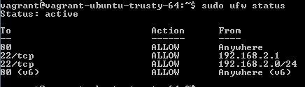
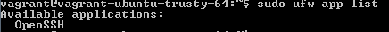
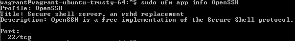

Firewall Setup in Ubuntu Server
=====================================

Ubuntu uses the Netfilter subsystem to filter packets. To learn more about the way Ubuntu manages its firewall, refer to their [server guide](https://help.ubuntu.com/14.04/serverguide/firewall.html). In this exercise, you will setup Ubuntu host-based firewall rules.

Prerequisites
---------------------
1. Vagrant installed and properly configured


Ubuntu Server Virtual Machine Creation
---------------------------------------

Run the following commands to create an Ubuntu server virtual machine and connect to it through SSH.

```
> vagrant init ubuntu/Trusty64
> vagrant up
> vagrant ssh
```

Host-Based Firewall Configuration
---------------------------------

1. Run the following command to enable the "uncomplicated firewall" service.

```
sudo ufw enable
```

Note that you will receive a message warning you that turning on the firewall may interrupt ssh connections. If port 22 were blocked in the firewall configuration, the current ssh session would be terminated. Fortunately, port 22 is not blocked by default.

2. Run the following command to open a port (web traffic in this example).

```
sudo ufw allow 80
```

3. Run the following command to close a port (port 53 for DNS in this example).

```
sudo ufw deny 53
```

4. Run the following command to delete a firewall rule:

```
sudo ufw delete deny 53
```

5. Run the following command to allow SSH access from 192.168.2.1 to any IP address on the server.

```
sudo ufw allow proto tcp from 192.168.2.1 to any port 22
```

6. Run the following command to allow SSH access from any IP address on the 192.168.2.0/24 subnet.

```
sudo ufw allow proto tcp from 192.168.2.0/24 to any port 22
```

7. Use the "--dry-run" option to list the firewall rules without applying them.

```
sudo ufw --dry-run allow smtp
```

8. To check the status of the firewall, run the following command:

```
sudo ufw status
```



9. Run the following command to disable the firewall.

```
sudo ufw disable
```

10. Enable the firewall again.

11. Turn logging on:

```
sudo ufw logging on
```

12. Turn logging off:

```
sudo ufw logging on
```

### Configuring the Firewall for Applications


Many applications help the operating system determine the firewall rules needed to make them work properly.

1. Run the following command to see which applications have installed a profile.

```
sudo ufw app list
```

You should see output similar to the following figure.



2. Run the following command to add a registered application's firewall rules to the current firewall rules.

```
sudo ufw allow OpenSSH
```

3. Run the following command to see the ports, protocols, and other settings defined for applications.

```
sudo ufw app info OpenSSH
```



4. If you want to allow OpenSSH connections from a range of IP addresses, use the following command:

```
ufw allow from 192.168.2.0/24 to any app OpenSSH
```

Exercise
-----------------------------------
Modify the firewall rules so that the following requirements are satisfied:

  - HTTP traffic is allow from anywhere.
  - DNS traffic is blocked.
  - Port 22 is open from anywhere on the 10.0.0.0/8 network

Delete and add rules as necessary.

Network-Based Firewall
-------------------------------------
A host-based firewall protects a single machine on the network. A network-based firewall filters traffic to protect other machines on the network. For a device to server as a network-based firewall, IP masquerading must be configured. At a high level, IP masquerading ensures that private IP addresses can be routed to public IP addresses.

Several Ubuntu configurations must be updated to allow IP masquerading.

1. Edit /etc/default/ufw by running the following command.

```
sudo nano /etc/default/ufw
```

Change "DEFAULT_FORWARD_POLICY" TO "ACCEPT.

2. Edit /etc/ufw/sysctl.conf

```
sudo nano /etc/ufw/sysctl.conf
```

  - Uncomment "net/ipv4/ip_forward=1" by deleting the "#" at the beginning of the line.
  - Uncomment "net/ipv6/conf/default/forwarding=1" by deleting the "#" at the beginning of the line.

3. Edit /etc/ufw/before.rules

```
sudo nano /etc/ufw/before.rules
```

Type the following text at the top of the file:

```
# nat Table rules
*nat
:POSTROUTING ACCEPT [0:0]

# Forward traffic from eth1 through eth0.
-A POSTROUTING -s 10.0.2.0/24 -o eth0 -j MASQUERADE

# don't delete the 'COMMIT' line or these nat table rules won't be processed
COMMIT
```

4. Run the following command to reload ufw and apply the changes.

```
sudo ufw disable && sudo ufw enable
```

Cleanup
----------------------------

Exit from the ssh session and run `vagrant destroy` to delete the virtual machine when you are finished.