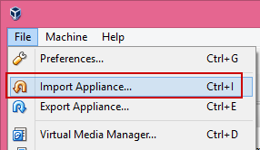

= Kali Linux Installation

== Prerequisits

VirtualBox installed and properly configured.

== Download Kali and Setup VirtualBox

1. Go https://www.offensive-security.com/kali-linux-vmware-arm-image-download/
2. Download the latest 64-bit version in the Prebuilt Kali Linux VirtualBox Images section.
3. Unzip the file. There should be a single .OVA file.
4. In VirtualBox, click File > Import Appliance.
+


5. Select the .OVA file you just downloaded.
+
image::Kali-import-2.png[]

6. The default virtual machine configuration allocates 2GB of RAM. Lower the amount of RAM if you computer only has 4GB of RAM installed.
+
image::Kali-import-3.png[]

7) After the virtual machine has been creted, right-click on the Kali VM, choose Settings > Network. Change Adapter 1 from `NAT` to `Internal Network`. Click `OK` to save the settings. The Internal Network option allows your VM to communicate with other virtual machines on the host, but it does not allow you to connect to the Internet.

== Basic Kali Configuration

Kali will boot up without any installation required.

1. At the login screen, click and drag up to unlock the window.
2. For the user, enter `root`.
3. The password is `toor` (root backwards).
4. Open a command terminal. Run the following command to set the IP address and subnet mask.

```
ifconfig eth0 192.168.2.5 netmask 255.255.255.0
ifconfig
```

The output of `ifconfig` should look similar to the following figure. The IP address and subnet mask should match.

image::kali-ip-config.png[]

== Lock Screen Configuration

Lock screens can help protect your laptop from unauthorized access. However, running Kali inside a VM makes its lock screen less necessary. If you wan to disable the lock screen, follow these steps. If you want to keep the lock screen, skip to the next section.

* Click the icon with the 9 boxes to open the search menu.
+

* Search for `settings` and click on the settings application.
+
image::Kali-settings.png[]
* Click on the power options.
+
image::Kali-settings-power.png[]
* Change the `Blank screen` option to `never`.
+
image::Kali-settings-power-never.png[]
* Close the power options and use the back arrow to return to the main settings.
* Open the `Privacy` settings.
+
image::Kali-settings-privacy.png[]
* Change the `Screen Lock` to off.
+
image::Kali-settings-privacy-lock.png[]

== Note About Network Adapters

If the network adapter for your Kali virtual machine is set to `NAT`, you will be able to connec to the internet but not other virtual machines. If your network adapter is set to `internal network`, you will be able to connect Kali to other virtual machines but not the internet directly.

== Troubleshooting Kali

If the internet connection is not working. Try the following:

1. Ensure that the network adapter is set to `NAT` in VirtualBox.
2. In VirtualBox, disable the network adapter the enable the network adapter. This is sometimes helpful if a virtual machine has been suspended.

== Keeping Kali Up to Date

The Kali Linux maintainers will publish new versions of packages in the distribution. You can get them by running the following commands from a terminal in Kali.

```
apt-get update
apt-get upgrade
```

`apt-get udpate` gets a list of the latest packages available to install. `apt-get upgrade` installs the newst versions of the packages that you have on your system. You should run these commands fairly frequently, perhaps once a month.

The above commands work well for minor version updates (e.g. Kali 2.0.1 to 2.0.2). However, when Kali Linux gets a major update (e.g. Kali 2.0 to 3.0), it may be best to install the new version from scratch. If you really want to updgrade directly without reinstalling everything, you would run the following commands.

```
apt-get update
apt-get dist-upgrade
reboot
```

The `apt-get dist-upgrade` command will take a long time to run. Often, it would be fast to download a pre-built VMWare image to create a new virtual machine.