= Windows Command Prompt

Before Windows 95, it was necessary for most Windows users to be familiar with the command line interface. Over the years, Microsoft has improved its graphical user interface so that the majority of users never have to open a command prompt. However, power users and administrators must be familiar with running commands from the command prompt. This lesson will introduce the command prompt and teach you how to run basic commands.

== Prerequisites

1. Access to a computer running a Windows operating system (desktop or server).

== Opening a Command Prompt

There are several ways to open a command prompt.

=== Start Menu

To open a command from the start menu, type `cmd` in the search bar.

The start menu will find the command prompt. Simply click the program to launch the command prompt.

image::search-best-match.png[]

The Windows version number will be displayed, along with a prompt for input. Note that in the screenshot below, the current path is C:\Users\Jim. Your path will be different based on your username or the system defaults. Sometimes the command prompt will open to C:\Windows\system32. Just be aware of the path that opens.

image::empty-command-prompt.png[]

=== Run Dialog

It may be faster to use the `Run` dialog to start the command prompt. Hold the Windows key (between the left control and alt keys on most keyboards) and press `r` (Win+r). This keyboard shortcut will open the `Run` dialog that allows you to run a single command. Type `cmd` and click OK or press enter.

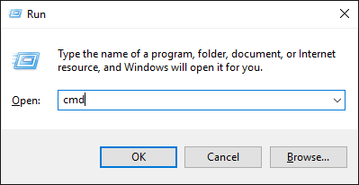

A command prompt shoud open.

=== Shift-Right Click a Folder

Sometimes, it is convenient to open a command prompt and have the path set to a specific folder. Open a file explorer window and navigate to a folder. Hold the shift key, then right-click on the folder. Choose `Open command window here`.

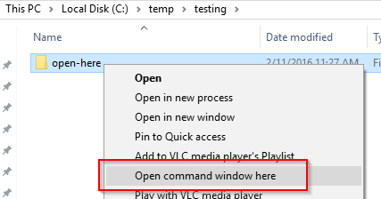

Notice that the path matches the folder that you clicked on.

image::command-prompt-new-path.png[]

This technique is especially useful if the folder you want to access is nested many folders deep on your disk.

=== Win+X

Newer versions of Windows added a new shortcut--Windows key + X (Win+x). The shortcut opens the following menu.

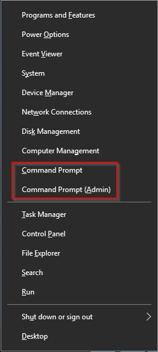

Notice that there are two options for a the command prompt: `Command Prompt` and `Command Prompt (Admin)`. In most cases, the default command prompt is fine. However, the default command prompt will not allow you to change certain files, such as any file in c:\windows\system32. If you run a command and find that you have insufficient rights, you likely need to open a command prompt with administrative rights.

=== Start Menu as Admin

Like any application, the command prompt can be started with administrator privileges from the start menu. Find the command prompt as described previously by searching for `cmd`. Next, right-click on the application, and choose `Run as administrator`.

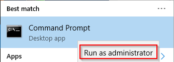

You may receive a `User Account Control` warning. Click yes. Notice that the path may be different.

image::path-system32.png[]

== Basic Commands

The following are useful commands.

[width="75%",frame="topbot",options="header"]
|========================================================================================
|Command|Purpose                                              | Example
|dir    |Show files and folders in a directory                | `dir *.txt`
|cd     |Change directories                                   | `cd ..`
|mv     |Move files                                           | `mv test.txt test.backup`
|cp     |Copy files                                           | `cp test.txt backup.txt`
|del    |Delete files                                         | `del badfile.txt`
|touch  |Updates a file modification time or creates the file | `touch .htaccess`
|ping   |Network utility to send an ICMP request              | `ping google.com`
|========================================================================================

=== Navigating

One challenge is navigating between folders. The `cd` command is critical to understand.

* `cd ..` moves up a folder from the current folder.
+
image::cd-dot-dot.png[]
* `cd foldername` moves into the folder name specified. This is a `relative` command because `foldername` is evaluated in relation to the current folder.
+
image::cd-foldername.png[]
* `cd /` moves to the root folder.
+
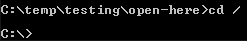
* `cd C:\Program Files (x86)\Microsoft Office\root\Office16` moves to the absolute path specified. You could run this command from any folder and it will always take you to the same place.
+
image::cd-absolute.png[]

== Customizing the Command Prompt

The default command prompt behavior can be improved.

* Click the icon at the top left, and choose `Defaults`.
* In the `Options` tab, check `Quick Edit Mode`.
+
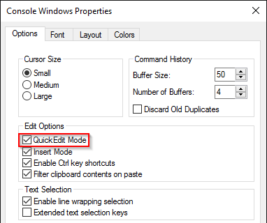
+
When Quick Edit Mode is enabled, you can highlight any text in the command window and press [enter] to copy it. Also, you can right-click to paste into the command window. This is especially useful for copying long commands.
* Click on the `Layout` tab. Adjust the size of the window to fit more text as needed. There is a balance between displaying more text and taking up screen real estate.
+
image::defaults-size.png[]
* When done, click `OK` to save the changes. You will need to open a new command prompt for the changes to take effect.

== The PATH Variable

You can type many commands from any path in the command prompt and they will run just fine. For example, `ping.exe` is a program found in c:\Windows\system32. Ping is a network utility that attempts to connect to a remote machine. However, you can run the program from c:\temp or any other folder.

* Open a command prompt.
* Run `cd \` to go to your root folder.
* Type `ping` [enter]
    * When you run "ping" without any parameters, ping will only output the usage instructions.
* The `ping` program should run and show its output. 
+
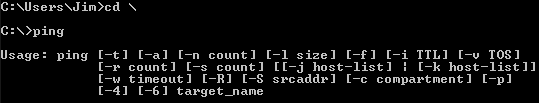

The ping executable is in c:\Windows\system32\ping.exe. But somehow Windows was able to find the executable and run it when it was launched from c:\. In the next example, you will attempt to launch Microsoft Word from the command prompt.

* Type `winword` [enter]
* You probably have Microsoft Word on your computer. The Word executable is called "winword.exe." However, running the "winword" command did not start Microsoft Word.
+
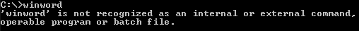
* Type `cd C:\Program Files (x86)\Microsoft Office\root\Office16` [enter]
    * Note: the location of winword.exe may be different on your system if depending on the version of Office and whether your version is 32 or 64 bit. Search your computer for winword.exe if the above path does not exist on your computer.
* Microsoft Word should open in a new window.
+
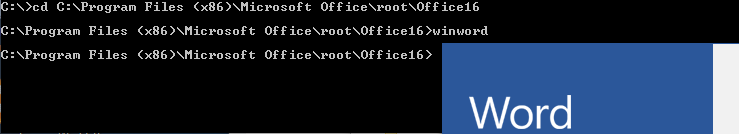

Why did `ping` work from the root directory (c:\), but `winword` failed? The answer has to do with the PATH environment variable. The path environment variable tells Windows what directories to look in for commands, such as executables. Because `ping.exe` is in c:\Windows\system32, and c:\Windows\system32 is in your PATH variable, Windows will find the command no matter which folder you launch it from.

=== Viewing Your PATH Variable
    
Use the following steps to view your PATH variable.

* Press Win-x and choose `System`.
* Click `Advanced system settings`.
+
image::system.png[]
* Click the "Environment Variables" button
+
image::advanced.png[]
* Notice that there may be two PATH variables, one for your user account and one for the system. These variables act the same way. The only difference is that the path for your user account is specific to you and no other user on the system. The system PATH variable is shared among all users. Essentially, the paths are combined when you open a command prompt, so in theory you can change either the user or system PATH variable. Note that the case of the variable is uninmportant (i.e. path, PATH, and Path are treated the same in Windows).
+
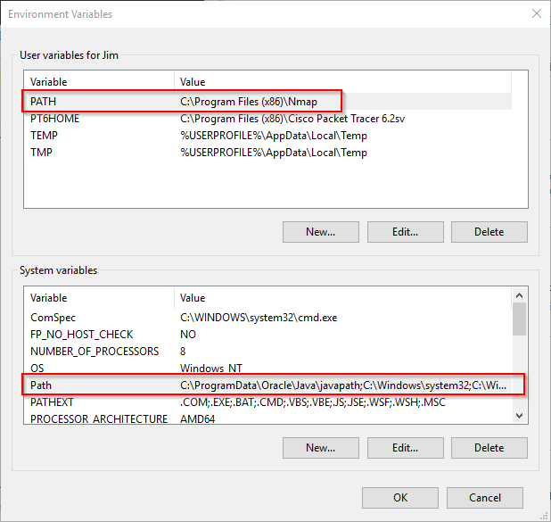

=== Changing your PATH Variable

WARNING: The PATH variable is very important. Take care that you do not delete important paths or certain commads will not run correctly in your system. Mistakes to the PATH variable can be fixed and will probably not cause major harm, but care should be taken.

* Highlight the system PATH variable and click `Edit...`. An editor will open.
+
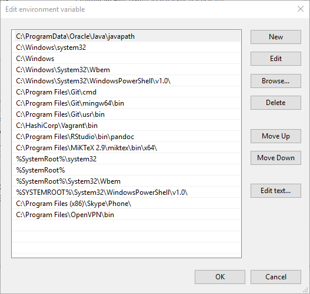
* Note that in previous versions of Windows, only a single text box would open and all paths would be on a single line separated by semi-colons. You can see this view of the PATH variable by clicking `Edit text...`.
+
image::edit-path-text.png[]
* Click `Cancel` to return to the friendlier view.
* Click `New`, then `Browse...` to add a folder to the end of the list. In the following screenshot, the folder c:\temp\testing\open-here was added to the PATH.
+
image::path-new.png[]

Suppose an executable called `playmusic.exe` were not put in c:\temp\testing\open-here. Now that executable could be run from any folder inside the command prompt. The command prompt looks in the following places for executables.

1. The current folder
2. All of the folders in the system PATH from top to bottom
3. All of the folders in the user PATH from top to bottom

Note that some applications will prompt you to modify the PATH variable during installation. The following screenshot shows part of the installation of the Ruby language. Notice that it asks to add the Ruby executables to the PATH. By default, the box was unchecked.

image::ruby-path.png[]

== Reflection

1. You just installed the Ruby programming language on your computer. You are supposed to be able to run `gem install` from the command prompt to install extensions, but you get the error "'gem' is not recognized as an internal or external command, operable program or batch file." How do you fix this problem?

2. Which of the ways to open the command prompt will you rely on most frequently and why?
