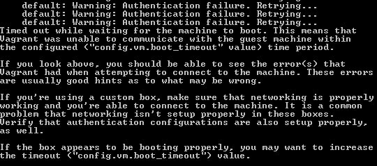
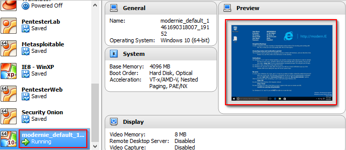

= Windows Virtual Machines

There are time when you may not want to install suspicious software, debug malware, or do anything else to alter your host computer's configuration. Virtual machines are useful in that they can isolate a system from your host so that you can do testing without worrying about causing problems. Microsoft has released virtual machine templates to make the process of creating Windows virtual machines easier.

For more information, see Microsoft's web page at http://dev.modern.ie/tools/vms/windows/.

The virtual machines expire every 90 days. The license is valid for non-commercial, testing purposes only.

== Prerequisites

* VirtualBox installed
* Vagrant installed
* Internet connection (`~6 GB download`)

== Creating a Windows 10 Virtual Machines

1. Go to http://dev.modern.ie/tools/vms/windows/.
2. For "Virtual machine" select a Microsoft Ege on Windows 10 box. The versions will constantly change, so more than one version will appear. Choose one that is stable.
3. For "platform" select Vagrant.
4. Download the ZIP file (it will take a while to download).
5. Extract the zip file in a temporary folder (such as Downloads\Win10VM). Remember where you extracted the file to.
6. Once the .box file has been extracted, run the following command to register the box with Vagrant.
+
```
vagrant box add windows10 "c:\users\Jim\Downloads\Win10VM\MSEdge - Win10TH2.box"
```
+
Note that the path and name of the box may be slightly different based on your folder names and the version of the box.
7. Open a command prompt and create a new folder. Run the init command to create a Windows 10 VM. The following commands show an example, though you may choose to initialize the VM in a different folder.
+
```
cd \temp
mkdir Windows10VM
cd Windows10VM
vagrant init windows10
vagrant up
```

Note that you may receive an error when bringing up the VM. The following screenshots shows one possible error.



If you get an error, open VirtualBox and find the newly created virtual machine. Likely it will be at the bottom of the list of your virtual machines. The following screenshot shows that the virtual machine is running. A preview of the graphical user interface shows the familiar Windows interface.



With the Windows VM selected in VirtualBox, click the `Show` button to bring up the graphical interface.


As shown on the Windows desktop, the username is `IEUser` and the password is `Passw0rd!`.

Open a web browser and verify internet connectivity by visiting a website.

== Challenge

1. Drag-and-drop is disabled by default. Enable drag and drop between your host computer and the Windows 10 guest.
2. View how much memory is available for the virtual machine. How much is currently being used?
3. Windows Defender runs by default. Disable it. (Re-enable it if you want, but the performance penalty may make using the virtual machine less pleasant.)

== Reflection

1. What are the benefits of using a Windows virtual machine for learning about security?
2. Why should security professionals be comfortable with multiple operating systems?
3. Microsoft's licensing makes it more difficult to create Windows virtual machines than it is to create Linux virtual machines. Does barrier to using Windows virtual machines make Windows more secure? Why?

==  Cleanup

You have a few options for cleaning up at the end of this exercise.

* Run `vagrant suspend` to save the machine state but keep all the files. Choose this option if you plan to use the virtual machine in the near future.
* Run `vagrant destroy` to power off the machine and delete all the files. Choose this option if you have no immediate plans for using the virtual machine.