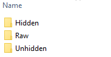
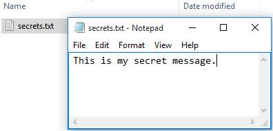
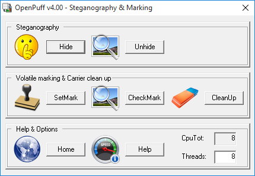
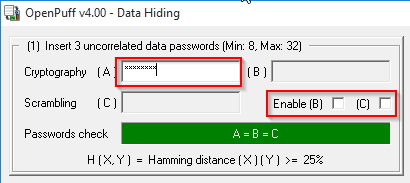
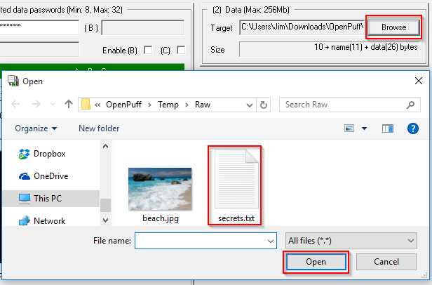
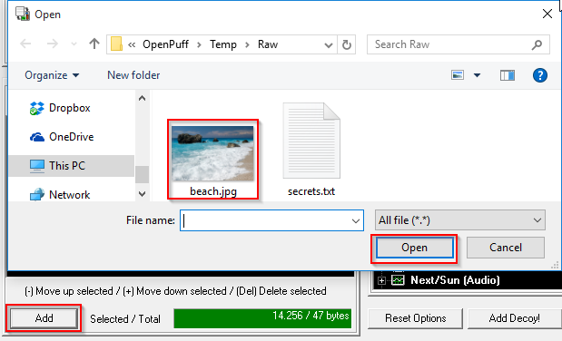
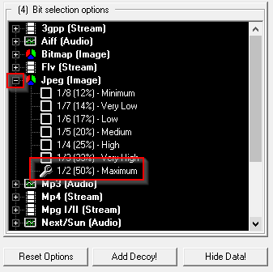
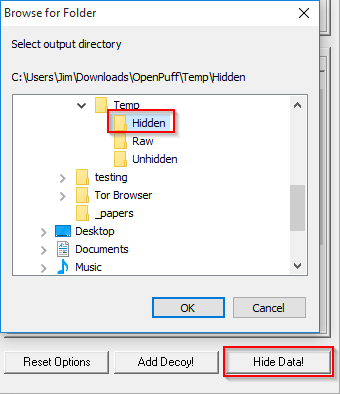
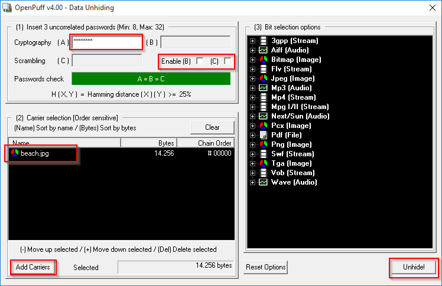
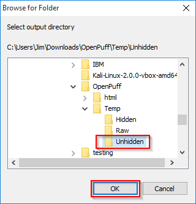

Hiding Data with Steganography
===============================

Learning Objectives
--------------------------
By the end of this lesson, you will be able to:

1. Explain what steganography is used for
2. Hide information with steganography tools
3. Unhide data hidden with steganography

Prerequisites
---------------------------
- A Windows Server 2012 virtual machine or Windows desktop OS

OpenPuff
------------------------------------
OpenPuff is a free steganography tool.

### Data Setup

1. In Windows Explorer, create 3 folders:
  - Raw
  - Hidden
  - Unhidden

  

2. Place a large jpeg image in Raw. It should be at least 100 kilobytes.
3. Create a text file called secrets.txt inside the Raw folder.

  

4. Add some text to secrets.txt, then save and close the file. The text does not need to match the example above.

### Hide Data

1. Download the latest version of OpenPuff from:

```
http://embeddedsw.net/OpenPuff_Steganography_Home.html
```

2. Install the program by simply unzipping the program into a new folder.
3. Run OpenPuff.exe.
4. Click "Hide."

&nbsp;

5. Uncheck Enable (B) and (C). For testing purpose, a single password will suffice. Dismiss the warning messages.

&nbsp;

3. Enter a password in field (A).
4. Click "Browse" to find the target. Select simple.txt in the Raw folder.

&nbsp;

5. Click "Add" in the "Carrier selection" and choose your jpeg image.

&nbsp;

Note that some JPG images do not work well. If you receive an error, try using a different JPG file.

6. In the bit selection options, expand Jpeg(image), and choose maximum.

&nbsp;


7. Click "Hide Data!" and select the "Hidden" output folder you created earlier.

&nbsp;

In Windows Explorer, find the jpeg file in the "Hidden" folder and open it. Does it look any different?

Email your jpeg to a classmate. Include the password you used to hide the data.

### Unhiding Data

1. Save your classmate's jpeg into the "Hidden" folder you created earlier.
2. In OpenPuff, close the "Data Hiding" window to return to the main screen.
3. Click "Unhide."

&nbsp;

4. Uncheck Enable (B) and (C).
5. Enter your classmate's password in (A).
6. Click "Add Cariers" and find the jpeg with the hidden data in your "Hidden" folder.

&nbsp;

7. Click "Unhide!" and select the "Unhidden" folder you created as your output folder.

&nbsp;

8. You should see a success message.
9. In Windows Explorer, view the Unhidden folder. You should see a file called secrets.txt. Open it and see what secrets your classmate entered.

### Reflection

- Why would you want to use steganography?
- How would you prevent employees from using steganography to leak sensitive information?