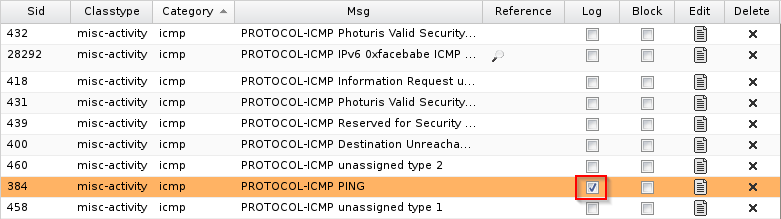
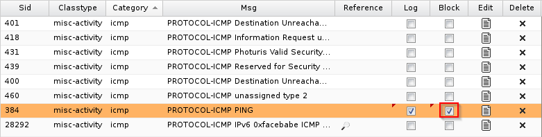
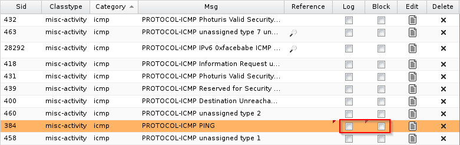

Intrusion Detection and Prevention with Snort
=======================================

Prerequisites
--------------------
1. An Untangle VM
2. Vagrant installed and working properly


Snort Setup
------------------------------------------------

Untangle uses Snort for intrusion prevention. However, you will not see the Snort logo or name anywhere in the Untangle interface.

Before proceeding, reboot your Untangle VM. In your Untangle VM, check that you have Internet access.

In the Untangle management dashboard, install the "Reports" app if it is not already installed.

If you have not installed the "Intrusion Prevention" app, click the Install button to install it. If you have already installed it, clicks Settings > Run Intrusion Detection/Prevention Setup Wizard.

1. In Classtypes, click "Custom."
2. In addition to the selected option, check "icmp-event (low)." 
3. Click "Next."
4. For Categories, keep "Recommended (default)" selected.
5. Click "Next" and "Close."
6. After the wizard runs, click the "Rules" tab.
7. Expand "Classtype: misc-activity."
8. Find "SID: 384, Msg: PROTOCOL-ICMP PING" and check the box to "Log" activity.



9. Click "OK."

Client Configuration
------------------------------
In this section, you will create a client VM that will use the Untangle server as its gateway. All connections to the Internet will go through the Untangle server.

1. Create a new folder on your computer.
2. Hold shift, right-click, and choose "Open command window here."
3. Run the following command to create a Vagrantfile:

```
vagrant init ubuntu/Trusty64
```

4. You should see the following output:

```
Management with Untangle>vagrant init ubuntu/trusty64
A `Vagrantfile` has been placed in this directory. You are now
ready to `vagrant up` your first virtual environment! Please read
the comments in the Vagrantfile as well as documentation on
`vagrantup.com` for more information on using Vagrant.
```

5. Edit the Vagrantfile in Notepad or any other text editor. Replace the entire contents of the drive with the following text:

```
# -*- mode: ruby -*-
# vi: set ft=ruby :

$script = <<SCRIPT
echo Changing the default gateway to 192.168.2.1...
sudo route del default
sudo route add default gw 192.168.2.1
SCRIPT

Vagrant.configure(2) do |config|
  config.vm.box = "ubuntu/trusty64"
  config.vm.network "private_network", ip: "192.168.2.10", virtualbox__intnet: true
  config.vm.provision "shell", inline: $script
end
```

6. Save the file.
7. Run the following commands from the command prompt:

```
vagrant up
vagrant ssh
```

8. In Ubuntu, run the following commands to change your default gateway to the Untangle server.

```
route
```

The last command will display the currently configured routes. The default gateway should be 192.168.2.1---the IP address of the Untangle server. If the default gateway is not correct, run the following two commands to update the default gateway.

```
sudo route del default
sudo route add default gw 192.168.2.1
```

9. Run the following command to ping the Untangle server.

```
ping 192.168.2.1
```

10. The ping should succesfully reach the server. After 10 or so pings, press Control+c to cancel the command.

11. Go to your Untangle VM and reload the management dashboard. The Intrusion Prevention "Sessions logged" should increase. Investigate the reports by clicking Settings under "Intrusion Prevention" in the management dashboard.

Update Snort Configuration to Block Pings
-------------------------------------------------------

1. In your Untangle VM, edit the Intrusion Prevention settings.
2. Click the Rules tab.
3. Expand "Classtype: misc-activity."
4. Find "SID: 384, Msg: PROTOCOL-ICMP PING" and check the box to "Block" activity.



5. Click "OK."
6. The dashboard will reload. Notice that the Intrusion Prevention statistics on the dashboard will reload.
7. From Ubuntu, runthe following command to ping the Untangle server.

```
ping 192.168.2.1
```

The command should fail. Press Control+c to stop the command.

8. Examine the Untangle dashboard. The number of sessions scanned, sessions logged, and sessions blocked should reflect the updated ping blocking rules.

Update Snort Configuration to Prevent Ping Blocking and Logging
----------------------------------------------------------------
Regular ping requsts are unlikely to cause problems. In this section, you will disable blocking logging.

1. In your Untangle VM, edit the Intrusion Prevention settings.
2. Click the Rules tab.
3. Expand "Classtype: misc-activity."
4. Find "SID: 384, Msg: PROTOCOL-ICMP PING" and check the box to "Log" activity.



5. Click "OK."
6. The dashboard will reload. Notice that the Intrusion Prevention statistics on the dashboard will reload.
7. From Ubuntu, runthe following command to ping the Untangle server.

```
ping 192.168.2.1
```

8. Examine the Untangle dashboard. The number of sessions scanned will increase, but the sessions logged will not increase.

Cleanup
---------------------------------
If you want to save your Ubuntu server, run the following command to exit the SSH session and save the machine state. (Note--no need to enter the dollar sign or greater-than symbols--they merely indicate the prompt that you should see when running the commands.)

```
$ exit
> vagrant suspend
```

If you want to delete your Ubuntu server, run the following commands to exit the SSH session and delete the machine completely.

```
$ exit
> vagrant destroy
```

