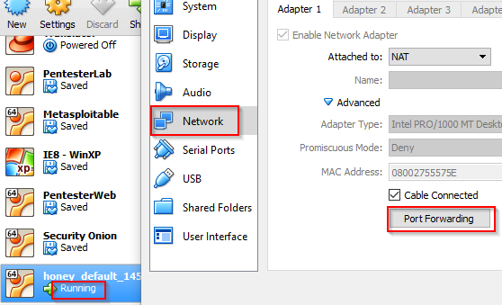
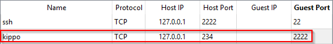
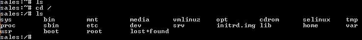

= Kippo Honeypot

Kippo is a class (i.e. old) honeypot. Kippo accepts SSH connections and emulates a Linux file system. This exercise will run you through the bare basics of getting Kippo running in a virtual environment. To deploy an effective honeypot, greater care would need to be taken to customize the honeypot to that it is not easily recognizable.

== Prerequisites

* VirtualBox
* Vagrant
* Internet connection (~10 MB download)

== Installing Kippo

Open a Windows command prompt. Run the following commands to create an Ubuntu virtual machine.

```
cd \temp
md honeypot
cd honeypot
vagrant init ubuntu/trusty64
vagrant up
vagrant ssh
```

In the Ubuntu terminal, run the following command to install necessary python libraries.

```
sudo apt-get install python-twisted
```

Kippo should run under its own account. Run the following command to add a new `kippo` user.

```
sudo adduser kippo
```

Choose any password you like ("kippo" would work fine). Hit enter a bunch of times to accept the defaults.


Run the following commands to download then extract Kippo.

```
wget http://kippo.googlecode.com/files/kippo-0.5.tar.gz
tar xzf kippo-0.5.tar.gz
```

Navigate to the newly created kippo-0.5 folder and run `ls` to look at the directory structure.

```
cd kippo-0.5
ls
```

To start Kippo so that it can start fishing for hackers, run the following command.

```
./start.sh
```

You should see output that Kippo has started.


Run `cat kippo.cfg | more` to scan Kippo's configuration. Especially note the `2222` SSH port.

== Connecting to Kippo

Kippo is listening on port 2222. SSH is listening on port 22. Normally, you might want to change your default SSH port and put Kippo on port 22, but keep the current configuration for now. VirtualBox must be configured to access these ports in the virtual machine. Open VirtualBox, right-click on the running VM, and go to the network adapter settings. Click `Port Forwarding.`



Add a new rule named Kippo with the 127.0.0.1 host IP, 234 host port, and 2222 guest port. Save the setting. Now, when you access 127.0.0.1:234 on your host, it will redirect to the virtual machine on port 2222.



Open a new command prompt in Windows. Here, you will simulate being a hacker who has found a potential entry point into the system via SSH. You use the following command to attempt to connect via SSH. The command connects to the localhost (127.0.0.1) through port 234, which will be directed to the virtual machine.

```
ssh root@127.0.0.1 -p 234
```

Kippo uses oldery encryption algorithms, so you may need to run a custom command to access the server via SSH. The following command explicitly allows the algorithm used by Kippo.

```
ssh -oKexAlgorithms=+diffie-hellman-group1-sha1 root@127.0.0.1 -p 234
```

You will be prompted for a password. Hint: idiot luggage to 6. Look at the Kippo configuration file for the password in plain text if you need it.

You are now connect to the Kippo honeypot. Spend a few minutes investigating. Can you "hack" the system?



After you have navigated a bit, return to the Linux terminal. What data can you see in the kippo-0.5 directory that has a record of the "hack" attamp?

== Challenge

* Edit the kippo configuration file to change some basic settings.
* Use the guide at http://how-to.linuxcareer.com/deployment-of-kippo-ssh-honeypot-on-ubuntu-linux to customize the honeypot even more.
* Make Kippo listen on port 22. Change your SSH port.

== Reflection

* Who would get caught in this honeypot?