= Maltego for Intelligence Mapping

Maltego is an application that maps relationships between people, social networks, companies, organizations, and more. it provides a graphical interface to see these relationships. For security professionals, Maltego could be used in the fingerprinting stage or when  crafting a social engineering attack.

In this lesson you will use the community edition which is free as in beer. The community edition comes with a few limitations.

1. You cannot use the community edition for commercial use.
2. Transforms (such as downloading DNS information) are limited to 12 results.
3. Bug fixes are not rolled into the community edition. A new community edition is released with every major version.
4. There are various performance limitations compared to the professional edition.

Using the community edition will give you a good sense for how the tool can be used. A professional license costs about $750 with an annual license fee of about $350. If intelligence gathering and penetration testing is your full-time job, this could be money well spent.

== Prerequisites

* Kali Linux virtual machine

== Setup Kali

* Open VirtualBox.
* Right-click on your Kali VM and choose settings.
* Change the network adapter to `NAT`. Ensure that the `Cable Connected` box is checked. Click `OK` to save the settings.
* Boot your Kali VM.
* Login with `root`/`toor` if needed.
* Run `ifconfig eth0 192.168.2.50` to set the IP address.
* Open a terminal and run `ping google.com` to verify connectivity. The ping should be successful. Troubleshoot connectivity before proceeding. It may take a few moments for the Internet to work under normal conditions, so just retry after 30 seconds if the ping fails.

== Maltego Startup

* Click `Applications > Information Gathering > maltego`.
+
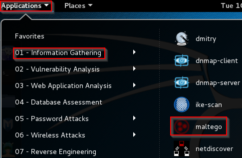
* A startup wizard will guide you through the setup process. Click `Next`.
+
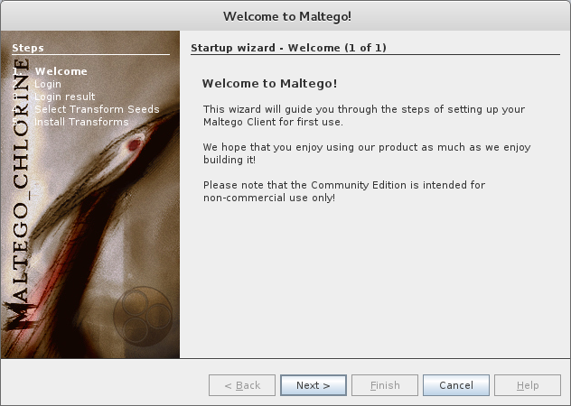
* You will be asked to login. If you do not have a username and password, you will need to register using the link on the form. The login will not work until you have activated your account, so use a valid email address.
+
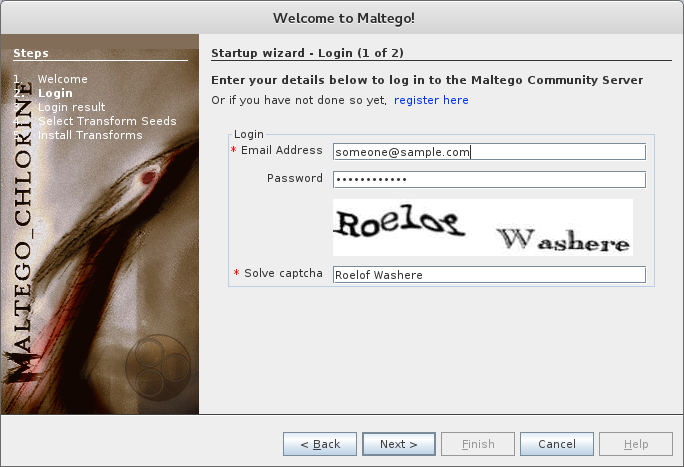
* After logging in with an active account, you should see a welcome message. You will notice that your API key expires fairly soon. When the API key expires, you will simply have to login with your username and password again.
+
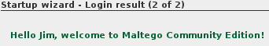
* Keep the default settings when selecting transform seeds. `Transforms` are basically computer scripts that process information such as DNS records.
+
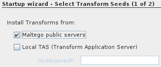
* In the final step, click `Go awa, I have done this before!`. It's okay if you have not actually done this before. Your computer will not know that you are being deceptive and will think no less of you as a person.
+
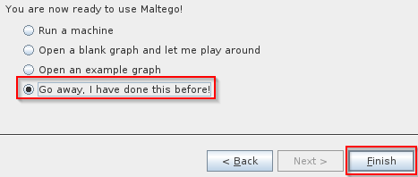

== Start a New Graph

A graph is an investigation or a part of an investigation. Graphs are a core concept in Maltego.

* Click the application icon at the top left and click `New`. (`Control+t` or the `+` icon next to the application icon can also be used to open new graphs.) Multiple graphs can be added and they will appear as new tabs in the interface.
+
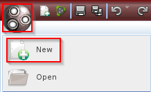
* The application layout will automatically change.
+
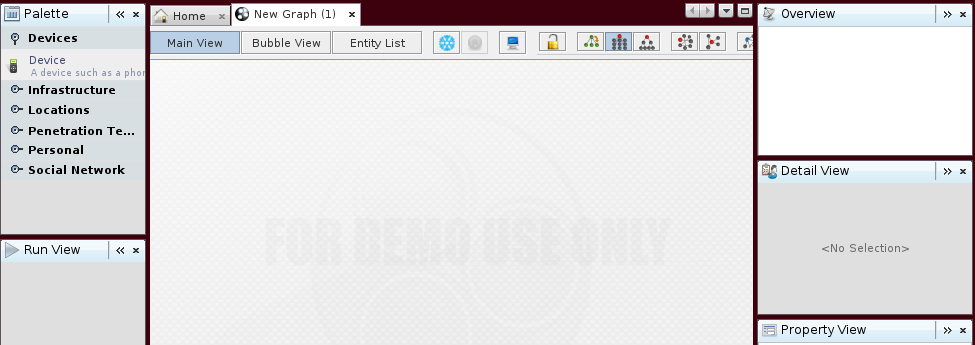
* The palette contains different entities that can be added to the graph.
+
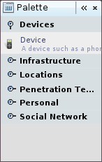
* Click on the entities to expand and explore each category.
* Expand `Personal`.
* Click and drag `Person` to the graph workspace. Notice that the person has been given a name already.
+
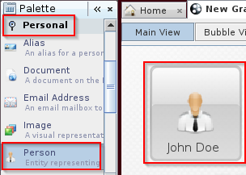
* Double-click John Doe to edit his details. Change the name to something else. Notice that you should edit the `First Names` and `Surname` fields. The `Full Name` will be constructed automatically.
+
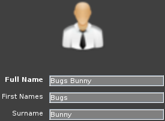
* If the close buttons do not appear, right-click the `Details` bar and choose `Close`.
* Drag a `Location` object (pyramid icon) onto the workspace. Double-click on the location name to enter a quick edit mode. Change the location name.
* Click on an empty part of the workspace so that no object is selected.
* Click and drag from the person to the location. (This should be a single click, then hold, then release. Do not click to highlight the person, then click again to drag.)
* A dialog box will open asking for relationship properties. Give the relationship a descriptive label.
+
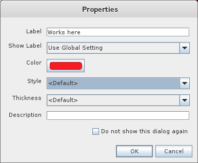
* When you save the properties, the graph will be updated.
+
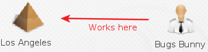
* Add several more locations and people to make the graph more complete.
+
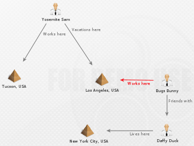

== Navigation in Maltego

* Select an object on your graph. Use the scroll wheel to zoom in and out.
* Notice that when you zoom out far, the objects will appear as round icons. When the icons appear, a key will show up in the bottom of the screen.
+
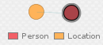
* Pan the graph by right-clicking and dragging the graph.
* Zoom in until a portion of the graph is visible. Notice that the satellite view shows the entire graph and what portion is currently visible. Drag the visible portion around to navigate.
+
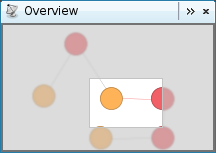
* If navigating with a mouse is cumbersome (or you are using a track pad that does not support scrolling), zooming icons are also available on the toolbar.
+
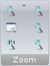

== Selecting Objects

* Hold the shift key and click multiple objects to select them. Notice that the detail view will update to show the information for multiple objects in a list.
+
image::objects-multiple-selected.png[]
* Multiple objects can be selected by drawing a box around objects.
* When an object is selected, press `Control+up` or `Control+down` to navigate to the parent or child objects. Basically, the selection will follow the direction of the arrow. The down arrow will go to where the arrow is pointing, and the up arrow will go to the objects that are pointing to the current object. Experiment with navigating using this method.
* Use Control+Shift+down to select an entire tree of objects. This technique is useful for copying portions of a graph to a new graph.
* In a large graph, it might be useful to search for a specific entity. Press Control+f to open the find menu at the bottom of the screen. Enter a search term and click `Find`. Maltego will bring you to the matching entity.
+
image::find.png[]
* Investigate the `Selection` menu. Find an option that will allow you to select all `person` entities in the graph.
+
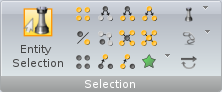

== Getting Data Into Maltego

In the first part of this tutorial, you manually dragged entities onto the graph. This can be a tedius process if you have a lot of information to document, or if you already have much of the information documented in another source.

* Minimize Maltego.
* Search for and launch `Leafpad`.
* Add a few names to the empty text document. In one of the names, delete the space between the first and last name. Your list should look something like the following screenshot.
+
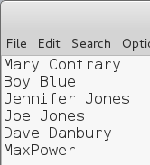
* Select the names and copy them to the clipboard.
* Open Maltego. Press `Control+v` to paste the data. Maltego attempts to figure out what kind of entity was pasted.
+
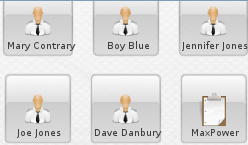
* Notice that MaxPower was imported as a phrase instead of a person. To change the entity type, right-click on the entity, choose the transform icon, then select `Personal > Person`.
+
image::paste-transform.png[]

== Transforms to Import Data

One of the most powerful features of Maltego is mining data. Maltego uses open source intelligence gathering tools to collect information, but other transforms are available.

* Copy the following data to your clipboard. The following are domains owned by Google.
+
```
google.ac
google.ae
google.at
google.ac
google.be
google.az
google.am
google.ad
google.ag
google.ba
google.as
```
* In Maltego, create a new graph and paste the data. The import should look like the following screenshot.
+
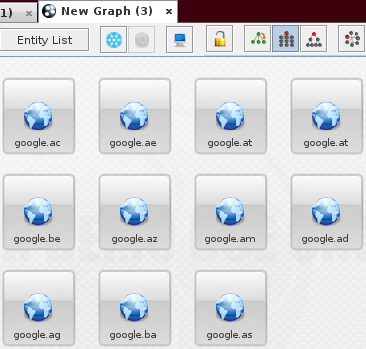
* While the domains are highlighted, right-click on one of the domains and choose `To Website [Quick lookup]`. This is a transform.
+
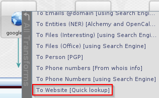
* Website entities will automatically be created and linked to the domains.
* Notice that the websites are still selected. What shortcut could you use to select the websites? (Notice that the arrows are pointing from the domains to the website entities?) Select all of the websites using the method you prefer.
* Run the `To IP Address [DNS]` tranform. Investigate the resulting changes in the graph.
+
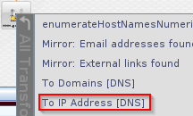
* Click `Bubble View`. Note that the IP addresses are larger than the domains or the websites. This occurs because they have more links to them, and are therefore more "important." In a social network graph, an influential person with a lot of connections would have a large bubble, and people on the peripherals would have smaller bubbles.
+
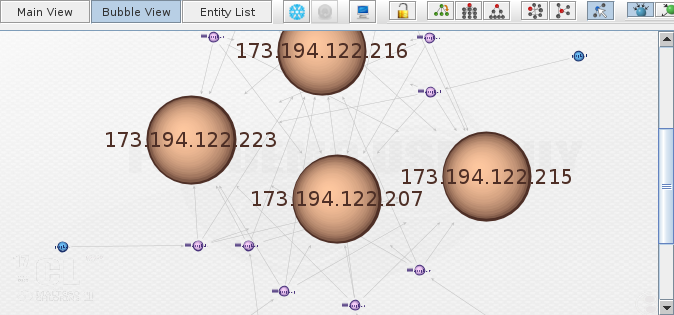
* Right-click the IP addresses and use a tranform to graph the locations.

== New Transforms

* In Maltego, click Manage > Transform Hub.
* Investigate which transforms are available.
* Install The Movie Database.
* Review what was installed.
+
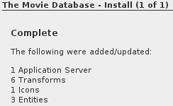
* Drag a new `phrase` entity onto the graph (Personal > Phrase).
* Rename the phrase to a movie title.
* Right-click and select the `Search for Movie` transform.
* You will need to enter any 5 digits to continue (e.g. `12345`).
* Select the movies, then right-click and choose `Movie to talent`.
* Were there any actors who starred in more than one of the movies that were found?
* Create a new graph. Find all movies and the associated talent for `mad max`.
* Go to the `Bubble View`.
* Notice that some actors have larger bubbles.
+
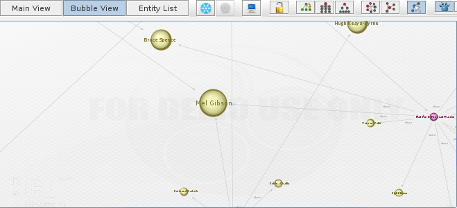


== Challenge

* Create a graph of an organization that you are familiar with. Use transforms to populate the data.
* Use transforms to see what information is returned for yourself.

== Cleanup

* Close Maltego. You do not need to save the graphs.
* Save the state of your Kali VM.

== Reflection

* How would Maltego help you organize your intelligence gathering activities?
* How would Maltego help you craft a social engineering attack?