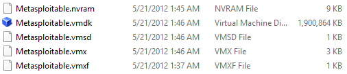
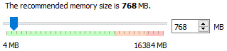
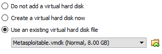
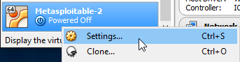
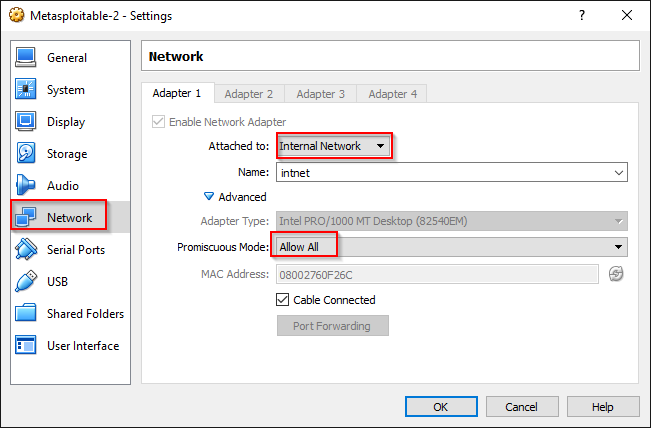

Metasploitable Installation Instructions
==========================================

Metasploitable is a Linux distribution that is intentionally vulnerable to attack. Metasploitable was built to work with the VMWare virtualization platform. While some VMWare products are free for personal use, they must be purchased for use in classroom or company environments. This lab will guide you through using VirtualBox to setup and use Metasploitabe.

Prerequisites
----------------
VirtualBox installed

Download and Extract
---------------------

1. Download the latest Metasploitable release from http://sourceforge.net/projects/metasploitable/.

2. Unzip the downloaded file. You should see a list of files similar to the following screenshot.

&nbsp;

3. In the VirtualBox manager, click the `New` button.

&nbsp;

4. Name the VM Metasploitable-2. The type should be Linux, Ubuntu.

&nbsp;

5. Any memory between 512 MB and 1024 MB should work okay. Adjust the memory size depending on your available resources and how many other virtual machines you will be running simultaneously.

&nbsp;

6. Select the option to use an existing virtual hard disk. Browse for the Metasploitabl.vmdk file. Then click `Create`.

&nbsp;

7. The Metasploitable-2 VM should now exist in the VirtualBox manager.

&nbsp;

8. Right-click on the Metasploitable-2 VM and choose settings.

&nbsp;

9. Select the Network tab. Change the adapter to `Internal Network`. Change promiscuous mode to `Allow all`.

&nbsp;

10. Start the Metasploitable-2 virtual machine.

11. Login with the username `msfadmin` and the password `msfadmin`.

12. Check the ip address by running `ifconfig`. If no IP address is set, set it to 192.168.2.50 using the following command.

```
sudo ifconfig eth0 192.168.2.50
```

You will be prompted for the password (`msfadmin`).

13. Verify that the IP address was set correctly by running `ifconfig`.

&nbsp;

Now, any virtual machine using an "Internal Network" adapter in the 192.168.2.0/24 network range should be able to connect to the Metasploitable-2 VM.