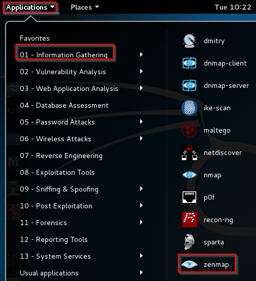
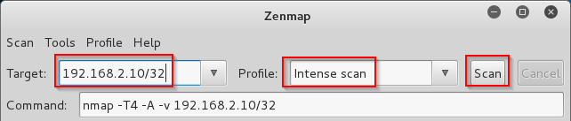

Network Scanning with Nmap Instructions
========================================


Learning Objectives
-------------------------------
By the end of this lesson, you will be able to:

1. Perform basic network scanning with Zenmap (an nmap front-end).
2. Understand basic nmap command line options.

Installation
----------------------------------
Download Zenmap from https://nmap.org/zenmap/. Zenmap will install nmap. Zenmap is a graphical user interface that uses nmap under the hood to perform network scanning.

First Scan
-----------------------------------
1) Launch Zenmap.
2) In the target, enter "scanme.nmap.org". (No quotes.)
  - The command text box will show "nmap -T4 -A -v scanme.nmap.org"
3) In profile, keep the "Intense Scan" option.
4) Slick Scan.
  - The scan can take a minute to run.
5) Look at the output in the Nmap Output tab.
  - Examine the different tasks that nmap completed.
6) Examine the Ports/Hosts tab.
7) Examine the topology tab.
8) Examine the Host Details tab.
9) Examine the Scans tab.

Start and Configure PentesterWeb and Kali
------------------------------------------

1. Start your Kali and PentesterWeb virtual machines.
2. In Kali, set the IP address.

```
root@kali:~# ifconfig eth0 192.168.2.5
```

3. In PentesterWeb, set the IP adddress:

```
user@debian:~$ sudo ifconfig eth0 192.168.2.10
```

4. Ensure that the machines can ping each other.

```
root@kali:~#: ping 192.168.2.10
```

Scan PentesterWeb from Kali
------------------------------------

1. In Kali, start Zenmap by clicking Applications > 01 - Information Gathering > zenmap.

&nbsp;

2. In the Target, put the IP address `192.168.2.10/32`. Keep `Intense Scan` as the profile. Click `Scan`.

&nbsp;

3. Analyze the zenmap output.
  - What ports are open?
  - What services are likely running on the machine?
  - How could an attacker use this information?
  - How is this computer different than scanme.nmap.org?

Scan a Range
-----------------------------------------

1. In Zenmap, change the target to `192.168.2.10/24`.

&nbsp;

2. Click `Scan`.

3. How is this scan different from the previous scan? When would this type of scan be useful?