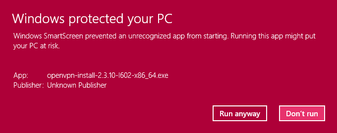
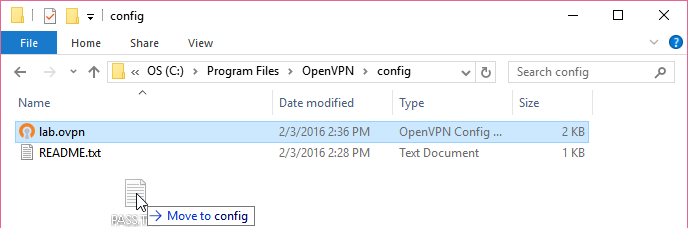
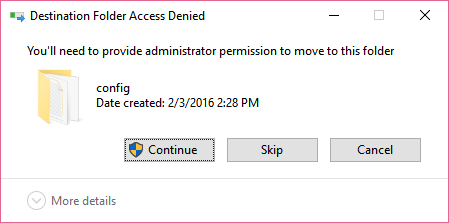
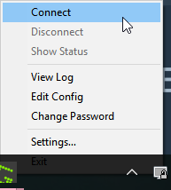
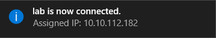
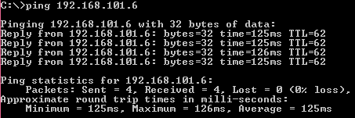
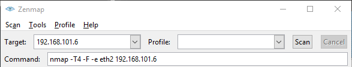

PENTESTIT Labs
================================

A challenge in learning penetration testing is finding a legal target. The PENTESTIT Penetration Testing Laboratories has created environments that mimic real computer networks and systems. In this lab, you will connect to their lab and perform basic penetration testing.

Prerequisites
-----------------------
None

Install OpenVPN
---------------------------

You will connect to the lab using OpenVPN. Essentially, you computer will act as if it is on the lab's local network. Download and install OpenVPN from https://openvpn.net/index.php/open-source/downloads.html. (The lab recommends that you not use the version for Windows Vista, so download the version for Windows XP to be safe. The version for Windows XP has been verified to work correctly on Windows 10). Additional download and installation instructions can be found on https://openvpn.net/index.php/open-source/documentation/howto.html#install.

When installing OpenVPN on Windows, you may be presented with a SmartScreen warning message. Click "Run anyway." Accept all defaults when installing.

&nbsp;

The Target
---------------------------------------------

Open a web browser and go to https://lab.thecybershark.com/pentestlabs/4. Read about SaS Bank. Open the network diagram and examine the environment. Basically, you will try to hack into the bank's systems.

The following image is from the website that describes the problem.

&nbsp;

Sign Up
------------------------------------------
Go to https://lab.thecybershark.com/signup to register. You will have to verify your email address before you can connect.

Connect
------------------------------------------
Follow the instructions on https://lab.pentestit.ru/how-to-connect to connect. Be sure to click the appropriate tab for your operating system. If you are logged in, you will be displayed the contents of pass.txt that are specific to your account.

You will have to create two text files. In Windows, the files will need to be put in C:\\Program Files\\OpenVPN\\config. Adding or changing files in this directory requires administrator permissions. It is easiest to create the two files on your desktop, then move them into the config folder. Another option is to start your text editor with administrator permissions.

&nbsp;

When copying or moving the files into the config folder, you will need to click Continue to temporarily elevate permissions.

&nbsp;

In Windows, you must start OpenVPN as an administrator. To do this, type OpenVPN in the search bar. Right-click on the OpenVPN GUI, and choose "Run as administrator."

The OpenVPN icon will appear in the taskbar. Right-click the icon and choose "Connect."

&nbsp;

If you have problems connecting, you may need to change the OpenVPN settings so that the proxy is set to Use System Proxy Settings or Use OpenVPN Config-file Settings.

After a few moments, the connection should be established. You should see a successful message with your IP address.

&nbsp;

Verify connectivity by pinging one of the outer network devices.

&nbsp;

Explore
------------------------------
Now, the two gateways listed on the network map should be available. A good starting point for the exploration would be to conduct a port scan to see what is open.

&nbsp;

Note that you may need to supply the network interface. To see a list of network interfaces available to zenmpa, run "nmap --iflist". Then, you can ammend any nmap command using "-e eth5" where eth5 is the interface that should be used.

Using Kali
-----------------------------
It is possible to use Kali as a virtual  machine to connect to the lab. Ensure that the network adapter is configured as NAT (rather than internal or host only). If running Kali in a virtual machine while your host is connected via OpenVPN, there is no need to establish a VPN connecting within Kali.

Cleanup
-------------------------
Be sure to disconnect your VPN session when done.

