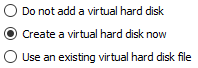
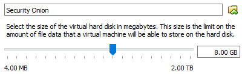
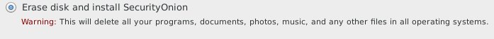
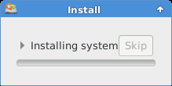
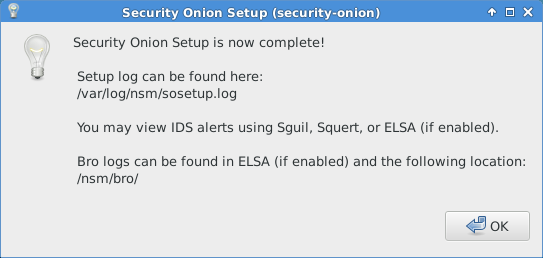

= Security Onion Installation

Security Onion is a Linux distribution that includes intruction detection, network security monitoring, and log management packaged in a way that is easy to implement. For smaller deployments (less than 10 employees), you might be able to put a single server at the perimeter of your network for suffucient protection from many threats.

== Prerequisites

* VirtualBox installed
* Internet connection (~1.2 GB download)

== Download ISO and Prepare VirtualBox

* Go to https://github.com/Security-Onion-Solutions/security-onion/blob/master/Verify_ISO.md
* Click the link to the latest ISO image to download the file.
* In VirtualBox, click the `New` icon.
+
image::vb-new.png[]
* Name it `Security Onion`, select `Linux` for the type, and choose `Ubuntu (64-bit)`.
+
image::vb-name-type.png[]
* Increase the memory to 1.5 GB. The Security Onion creators recomend a minimum of 3 GB, but 1.5 GB should be suffucient for testing purposes.
+
image::vb-memory.png[]
* Leave the default option to create a virtual hard disk.
+

* The default VDI type is fine.
+
image::vb-vdi.png[]
* Leave the disk as dynamically allocated to save hard disk space on your host.
+
image::vb-dynamically.png[]
* The default folder for the disk is probably fine. Choose a new folder if you want. An 8 GB disk is fine for testing purposes. Note that this would not hold sufficient log data in a real environment.
+

* The VM will now exist in VirtualBox. Select the `Security Onion` VM and click `Settings`.
+
image::vb-settings.png[]
* Go to the network tab. `Adapter 1` should be setup be attached to `NAT`.
+
image::vb-adapter1.png[]
* Click `Adapter 2`. Check the box to enable the adapter. Attach it to `Internal Network`.
+
image::vb-adapter2.png[]
* Save the settings in VirtualBox.
* Start the Security Onione VM.
* VirtualBox will prompt you to select a startup disk. Choose the Security Onione ISO file you downloaded and click `Start`.
+
image::vb-startup-disk.png[]

== Security Onion Installation

* When the Security Onion first boots, you will see a menu. Select `install`. If you do not select an option, the installation will begin automatically.
+
image::so-install-1.png[]
* Select your language.
* Do not download updates while installing or install third-party software. You can do this later if you wish.
* Choose the option to erase the disk and install Security Onion. This will only erase the files in your VM--it will not touch anything on your host computer.
+

* Click `Continue` when prompted to make changes to disks.
* Select your time zone, keyboard layout.
* Enter your name. Give the computer a name you would recognize on your network. Pick a username and password. For testing purposes, you can choose a simple password such as `password`. However, if this machine were deployed on the perimeter of your network, a weak password could potentially be attacked.
+
image::so-install-user.png[]
* You will see the installation progress.
+

* Restart the computer when prompted.
* If you receive an error about ejecting media, ensure that the CD drive in VirtualBox is empty (Devices > Optical Drive > Remove media).
* When you reboot, a new option should appear. The operating system will boot automatically after a few seconds.
+
image::boot.png[]
* Login with your username and password.
+
image::login.png[]

== Security Onion Network Configuration

* Click on the network icon and verify that two network adapters exist. Adapter 1 represents the adapter that you might connect to your ISP's cable modem. This is the externally facing connection. Adapter 2 might connect to your router or a switch internally. The picture of the icon may change as IP addresses are obtained.
+
image::two-network-adapters.png[]
* Open the application menu and click on `Terminal Emulator`.
+
image::open-terminal.png[]
* Run `ifconfig` to see the network connection status. Notice that `eth0` has been assigned an IP address, but `eth1` has not. Give `eth1` an IP address using the following command. (Be sure to enter `eth1` instead of `eth0`.)
+
```
sudo su
ifconfig eth1 192.168.2.200
```
+
Note that if you accidentally change the settings for eth0, the easiest way to fix them is to go to the VirtualBox network adapter settings for Adapter 1, uncheck "cable connected", save the settings, then check "cable connected" and save the settings. The adapter will be reassigned an IP address automatically in about a minute.
* Verify connectivity to the internet with the following command.
+
```
ping google.com
```
+
The ping should be successful.

== Security Onion Configuration

* Double click the `Setup` icon on the desktop.
+
image::so-setup-icon.png[]
* Enter your password when prompted.
* Click `Yes, Continue!`
* Click `Yes, congiure /etc/network/interfaces!` It is unclear if the enthusiasm inspired by configuring a network interface file warrants an exclamation point, but who am I to argue with the developers.
* For the management interface, select `eth0` with DHCP.
* Click `Yes` to configure `monitor` interfaces. `eth1` should be the only interface option because `eth0` was already setup as a management interface.
* Click `Yes, make changes!` when finished.
* Reboot when prompted.
* Login with your username and password. Double click the Setup icon again and re-enter your password.
* Click `Yes, skip network configuration`.
* Choose `Evaluation Mode` to make the process faster.
+

* Ensure that `eth1` is being monitored.
* Choose a username and password for Sguil (the same ones as before will work).
* Click the button to proceed wtih the changes.
* You will see a message saying that the installation is complete.
+

* Read the messages about the applications that were installed.

== Browse Squert

* Double click the Squert icon on the desktop.
* Chromium (an open source verion of Google Chrome) will open.
* You will receive a security warning the first time you open the page. You must click "Advanced" and "Continue to localhost". Why do you think this error happened. Is it a security concern?
* Login to Squert with your username and password.

== Challenge

* How much would it cost to build a server for a medium sized network? See https://github.com/Security-Onion-Solutions/security-onion/wiki/Hardware for hardware recommendations. Use http://pcpartpicker.com/ to choose and price specific hardware.

== Reflection

* How does the Security Onion distribution compare to Untangle?
* Look at Cisco's security products at http://www.cisco.com/c/en/us/products/security/product-listing.html. What advantage might a proprietary vendor have over an open source solution? Would the following Cisco product work http://www.cisco.com/c/en/us/products/security/asa-firepower-services/index.html as a replacement for the Security Onion?
* Many applications were installed and configured as part of the Security Onion installation. How confident do you feel that you know how the system was configured? Would you feel comfortable installing and running this system in a production environment? How would you learn about the different tools?
