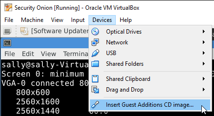
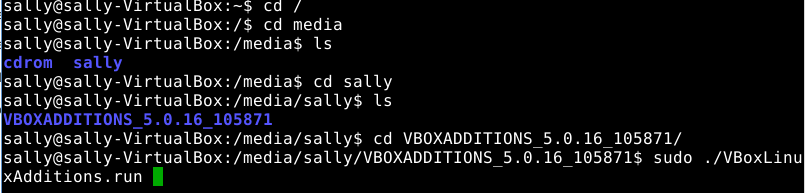
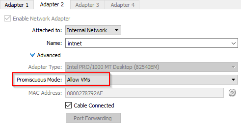
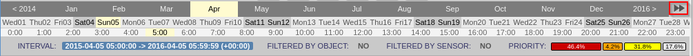
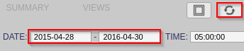
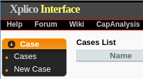
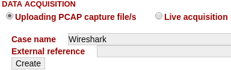
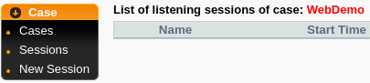
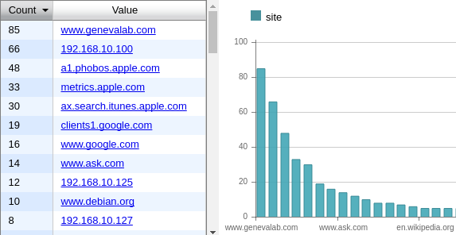
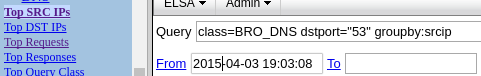

= Security Onion For Network Security

The Security Onion comes packaged with several powerful tools. This exercise will introduce several core tools.

== Prerequisites

* Security Onion VM installed on VirtualBox
* Internet connection (~10 MB download)

== Configure Security Onion VM

You must install the VirtualBox guest additions from VirtualBox for the scren resolution to be expandable. In the VirtualBox Security Onion menu, Devices -> Insert Guest Additions CD image.



A new icon will appear on the desktop. Right-click and choose `Mount Volume`. This is basically emulates putting a CD in the CD-ROM drive of the computer.

image::mount-iso.png[]

Open a terminal and navigate to /media/[username]/VBOXADDITIONS_5.0.XX. Replace [username] with your username. The folder name of the VBOXADDITIONS will depend on your verison of VirtualBox. Use tab completion to make life easier. When you are in the VirtualBox additions folder, run the following command.

```
sudo ./VBoxLinuxAdditions.run
```

Proceed with the installation despite any warnings you might be given. An example of the commands is given in the screenshot below.



Reboot the VM with the following command.

```
sudo shutdown -r now
```

When the machine boots up, you should be able to resize the window.

In VirtualBox, edit the Security Onion VM adapter 2 so that its promiscious mode is set to `Allow VMs`.



In the Security Onion VM, run the following command to set the IP address of adapter 2. (Be sure to use `eth1`.)

```
sudo ifconfig eth1 192.168.2.200
```

== Populating Events

A challenge when evaluating network monitoring tools is populating data. In this section, you will essentially put a bunch of malicious data through your network interfce which will be captured in a database.

* In VirtualBox, uncheck the `Cable Connected` box for adapter 1. Essentially, this will break your Internet connection. The next command you will run will simulate network traffic, and you do not want to accidentally send malicious traffic across the network.
* Open a terminal and run the following command. The command will simulate network traffic.
+
```
sudo tcpreplay -i eth1 -M10 /opt/samples/*.pcap
```

== Using Sguil

From the Sguil project homepage at http://bammv.github.io/sguil/index.html:

[quote]
Sguil (pronounced sgweel) is built by network security analysts for network security analysts. Sguil's main component is an intuitive GUI that provides access to realtime events, session data, and raw packet captures. Sguil facilitates the practice of Network Security Monitoring and event driven analysis. The Sguil client is written in tcl/tk and can be run on any operating system that supports tcl/tk (including Linux, *BSD, Solaris, MacOS, and Win32).

* Launch Sguil and monitor eth1.
* Expand the Sguil window to see all columns if necessary. A key column is the "Event Message" column.
* In Sguil, right-click on the different fields for one of the events withe source IP of 188.72.243.72 and a destination of 192.168.3.65.

Spend a few minutes exploring the interface. How would this data be useful?

* The `ST` column is the alert status. A status of `RT` means that an alert was captured in real-time and is awaiting some action. Right click on one of the `RT` alerts, and choose `Expire Event as NA With Comment`. Add any comment you like that indicates that the event is not a threat.
* Right-click on another RT status and choose `Update Event Status > Cat VII: Virus Infection`.
* In the ST column, right-click and choose Quick Query > Cat VII: Virus Infection. Notice that a new tab appears on the interface.

Why would it be important to classify each even captured in real-time? How much investigation do you think it would take to properly investigate each alert?

Close Sguil when you are finished.

== Using Squert

From the Squert project homepage at http://www.squertproject.org/:

[quote]
Squert is a web application that is used to query and view event data stored in a Sguil database (typically IDS alert data). Squert is a visual tool that attempts to provide additional context to events through the use of metadata, time series representations and weighted and logically grouped result sets. The hope is that these views will prompt questions that otherwise may not have been asked. 

* Double-click the Squert icon to launch a web broser. You may need to accept the security risk of browsing the site because it uses a self-signed certificate.
* Investigate the Squert interface.
* Click on the interval to select a different time period to display.
+

* Click the double-right arrows for a friendlier view.
+

* Manually enter new date ranges. Click the refresh button to load the events in the selected time period.
+


What benefits (if any) does Squerty offer over Sguil? What benefits (if any) does Sguil offer over Squert?

== Xplico Usage

From the Xplico project page at http://www.xplico.org/about:

[quote]
The goal of Xplico is extract from an internet traffic capture the applications data contained.
For example, from a pcap file Xplico extracts each email (POP, IMAP, and SMTP protocols), all HTTP contents, each VoIP call (SIP), FTP, TFTP, and so on. Xplico isn’t a network protocol analyzer. Xplico is an open source Network Forensic Analysis Tool (NFAT).

Because you have made many changes to your network adapters by this point, it is best to reset everything and reboot your machine.

* In VirtualBox, edit network Adapter 1 settings and check the `Cable Connected` checkbox.
+

* Run the following command to reboot the computer.
+
```
sudo shutdown -r now
```
* After logging into the Security Onion VM, Double-click the Xplico icon on the desktop.
* Login with the xplico/xplico username and password (these are the Xplico defaults).
* Click `New Case`.
+

* Give it the name Wireshark, and choose "Live Acquisition."
+

* Click on the newly created Wireshark case.
* Click `New Session`.
+

* Give the session the name `Wireshark`.
* Click the newly created session.
* Open a new tab in the web broser and go https://wiki.wireshark.org/SampleCaptures. If you Google "wireshark sample captures" this page will be the first result.
* Download and extract "http_with_jpegs.cap.gz". Search for the text to find the file to download.
* Upload the .cap file to your session in Xplico. It may take a minute to process the data.
+
image::xplico-cap-upload.png[]
* When the file is done processing, explore the `Web` menu.
+


How does this representation differ from a capture file you might view in Wireshark?

== ELSA for Log Analysis

According to the project home page (https://github.com/mcholste/elsa):

[quote]
Enterprise Log Search and Archive (ELSA) is a three-tier log receiver, archiver, indexer, and web frontend for incoming syslog. It leverages syslog-ng's pattern-db parser for efficient log normalization and Sphinx full-text indexing for log searching. The logging backend scan be scaled to N nodes in a distributed system if a load balancer is placed in front of the incoming logs as a virtual IP address. The normalization process assigns each incoming log a class ID which is used, in conjuction with the log sender host and program for the basis of permissions. Users can be granted granular permissions for a given host, program, or class (or a combination therein). The permissions are whitelists or full access for each of the permissions components. That is, a user may be restricted to one or n given hosts but be able to query any program or class on those hosts.

Use the following steps to investigate the log data. Remember that the vast majority of this traffic will have come from the simulated network traffic done earlier.

* Double-click the ELSA icon on the desktop. 
* Expand HTTP and choose Top Sites.
+

* Expand Weird and choose Top Weird Types.
* Expand Snort/Suricata and choose Top NIDS Alerts.
* Notice that when you click on one of the links in the navigation pane, the web interface is populated with a query.
+

* Use the interface to investigate and query some of the search parameters.

How would this information be useful to you as an administrator?

== Reflection

* How does network forensics offered by Xplico differ from alert classification in Sguil?
* How does the log analysis in ELSA complement Sguil or Squert?

== Challenge

* Create a new case in Xplico. Use sample capture files in /opt/samples/ to upload data instead of capturing it live. Investigate what you can find from previously captured data.
* Start Wireshark on your host machine. Capture a web browsing session. Save the capture file, then copy it to the Security Onion VM. Start a new case, upload, and analyze the capture file.
* Create a custom ELSA query.