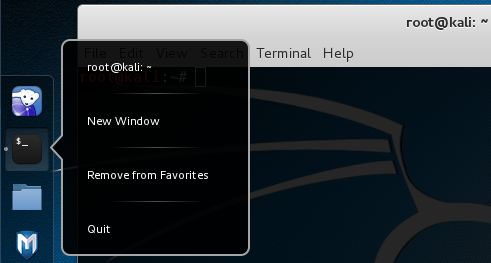
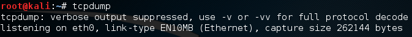
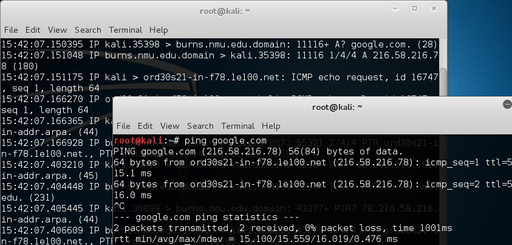
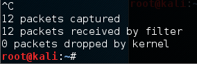
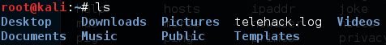
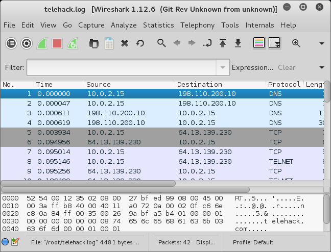

= TCPDump for Capturing Packets

TCPDump is a command line utility for capturing packets. The command line options make it a good choice for starting very specific types of packet captures. In this exercise, you will capture packets with tcpdump, then analyze the packets in Wireshark.

== Prerequisites

A Kali virtual machine

== Learning Objectives

By the end of this exercise you should be able to:

1. Capture packets using tcpdump
2. Explain basic command line options of tcpdump
3. Open capture files for later analysis

== Capture Packets with TCPDump in the Terminal Window

1. Restore your Kali VM.
2. Open a terminal by clicking on the `$_` icon.
3. Open a new terminal by right-clicking on the `$_` icon and selecting `New Window`.
+

4. In the first terminal window, run the following command:
+
```
tcpdump
```
+
You should see output similar to the following screenshot. Depending on what processes you have running, no network traffic might be generated, and therefore no packets will appear in the capture.
+

5. In the second terminal window, run the following command.
+
```
ping google.com
```
6. Press `control+c` to cancel the packet capture after a couple of responses. Notice that packets were captured in the first terminal window.
+

7. Packets will continue to be captured until you cancel tcpdump. Press `control+c` in the first terminal to cancel tcpdump. A summary of the capture will be displayed.
+


== Capture Packtes with TCPDump to a File

It can be difficult to analyze packets in the terminal window. It may make more sense to capture packets to a file.

1. In the first terminal window, run the following command:
+
```
tcpdump -w telehack.log
```
+
The `-w` switch tells tcpdump to write the packets to the specified file.
2. In the second terminal window, run the following command:
+
```
telnet telehack.com
```
3. A telnet session should be established. Type `quit` to end the session.
4. In the first terminal, press `control+c` to stop capturing packets.
5. Run `ls` in the terminal to see the list of files. The file `telehack.log` should be present.
+


== Analyzing a TCPDump Capture File in Wireshark

There are two ways to open the capture file in Wireshark.

1. Run the following command to open the capture file in wireshark.
+
```
wireshark -r telehack.log
```
+
Notice that using this method, the terminal does not allow any input until Wireshark is closed.
2. Use the menus to find `Applications > Sniffing & Spoofing > wireshark`. Then, click `File > Open` and open telehack.log.

Using either method, you should be able to analyze all of the packets captured with tcpdump.



== Challenge

1. Run `man tcpdump` to read what options exist for customizing your packet capture with tcpdump.
2. Run tcpdump with additional paramters to customize the capture.
3. Create a shell script for running a customized capture.