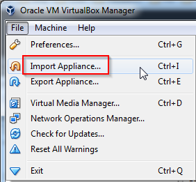
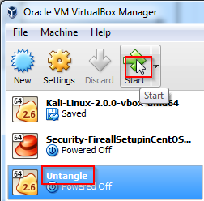
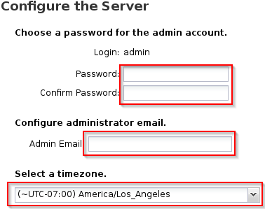
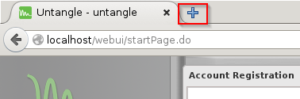
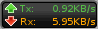
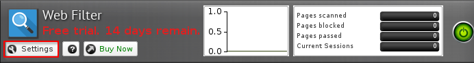
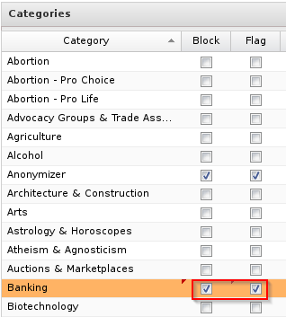

= Unified Threat Management with Untangle

Unified Threat Management (UTM) solutions combine common network defense applications in a single package. They typically combine firewall, web filtering, anti-virus, intrusion detection, and VPN services.

Untangle is a UTM solution with free and paid versions. The free version is fully functional and allows you to explore

== Prerequisits

Vagrant and VirtualBox installed and properly configured.


== Install Untangle

1. Go to http://www.untangle.com/get-untangle
2. Download the 64-bit OVA (VMware Appliance)
3. In VirtualBox, click File > Import Appliance.
+


4. Select the untangle OVA file you previously downloaded, then click Next.
5. Adjust any of the appliance settings, such as RAM based on your machine's power. You will notice that two network adapters are defined--be sure to keep two network adapters.
  - Finalize the import when you are satisfied with the settings.
+
```
IMPORTANT: If you are connecting to the Internet through WiFi, change the type of your first adapter from "Bridged" to "NAT." VirtualBox does not currently bridge WiFi adapters properly. Right click on your untangle VM, click Settings > Network > Adapter 1. Change "Attached to: Bridged Adapter" to "Attached to: NAT."
```
 + 
6. Highlight Untangle, then click Start.
  - The installation should proceed without any user intervention for several minutes.
  - Note that clicking in the Untangle window will likely *capture* your mouse. To releaes your mouse, press the right control key on your keepboard. Wile your mouse is captured, you will not be able to move the mouse outside of the window.
+

  
7. When prompted, select your language and click Next.
8. A wizard will guide you through the rest of the initial setup. In "Settings,", do the following:
  - Enter a password for the admin login.
  - Enter your email for the admin email.
  - Select your time zone.
+


9. In "Network Cards," leave the network card settings as they are. If you were setting up Untangle in a live network environment, eth0 would be your interface with the ISP, and eth1 would connect to your internal network.
10. In the "Configure the Internet Connection," select the appropriate settings. "Auto (DHCP)" is probably appropriate for most scenarios. You must be connected to the Internet for the remainder of the setup to work.
11. In "Configure the Internal Network Interface," select "Router" and keep the other defaults.
  - Internal Address: 192.168.2.1
  - Internal Netmask: /24 - 255.255.255.0
  - Enable DHCP Server - Yes
12. In "Automatic Upgrades," select "Instal Upgrades Automatically."
13. Click "Finish" when done, then "Continue."

== Initial Untangle Configuration

After installation, an account registration page will appear. Before filling out the registration, ensure that your computer can connect to the Internet. Because the MAC address of your virtual machine may not be registered with your organization, you may need to register. Your external network card is setup in "bridged" mode, meaning that your virtual machine will appear like another computer on the network.

1. In the Iceweasel web browser, open a new tab by cliking the "+" at the top of the application.
+


2. Go to any website, such as "google.com" and ensure that the page loads.
  - If you see the website your entered, close the tab.
  - If you must register your device, enter your credentials. Proceed with the instructions once you are able to load a website outside of your organization.
3. Register with Untangle and login.
4. After successfully logging into Untangle, click "No, I will install the apps manually."

== Client Configuration

In this section, you will create a client VM that will use the Untangle server as its gateway. All connections to the Internet will go through the Untangle server.

1. Create a new folder on your computer.
2. Hold shift, right-click, and choose "Open command window here."
3. Run the following command to create a Vagrantfile:
+
```
vagrant init ubuntu/Trusty64
```

4. You should see the following output:
+
```
Management with Untangle>vagrant init ubuntu/trusty64
A `Vagrantfile` has been placed in this directory. You are now
ready to `vagrant up` your first virtual environment! Please read
the comments in the Vagrantfile as well as documentation on
`vagrantup.com` for more information on using Vagrant.
```

5. Edit the Vagrantfile in Notepad or any other text editor. Replace the entire contents of the drive with the following text:
+
```
# -*- mode: ruby -*-
# vi: set ft=ruby :

$script = <<SCRIPT
echo Changing the default gateway to 192.168.2.1...
sudo route del default
sudo route add default gw 192.168.2.1
SCRIPT

Vagrant.configure(2) do |config|
config.vm.box = "ubuntu/trusty64"
config.vm.network "private_network", ip: "192.168.2.10", virtualbox__intnet: true
config.vm.provision "shell", inline: $script
end
```

6. Save the file.
7. Run the following commands from the command prompt:
+
```
vagrant up
vagrant ssh
```

8. In Ubuntu, run the following commands to change your default gateway to the Untangle server.
+
```
route
```
+
The last command will display the currently configured routes. The default gateway should be 192.168.2.1---the IP address of the Untangle server. If the default gateway is not correct, run the following two commands to update the default gateway.
+
```
sudo route del default
sudo route add default gw 192.168.2.1
```

9. In Ubuntu, run the following command to verify that traffic is going through the Untangle server.
+
```
tracepath whitehouse.gov
```

The output should show the first hop being 192.168.2.1, and the command should reach its destination. You can also see if the data is going through the Untangle server by looking at the data transmission statistics while running the tracepath command. The bits send and received should go up when the tracepath command is issued.

If you are connecting to the Internet through WiFi and a NAT adapter, the tracepath command will not complete. Press Control+c to stop the command. You should see, however, that the path you are taking to reach the internet goes through 192.168.2.1.



== Web Filter

The web filter prevents web surfers from accessing different types of websites.

1. In Ubuntu, run the following command to download a sample banking website.
+
```
w3m bankofamerica.com
```
+
The website will not look great in the terminal web browser, but you should be able to verify that it is Bank of America's website. Press q, y, to quite the w3m web browser.

2. Install the web filter in Untangle by clicking the "Install" link. Next click "Settings" in the Web Filter.
+


3. Click the checkbox to block banking websites, then click OK.
+


4. In Ubuntu, run the wget command again to download the banking website.
+
```
w3m bankofamerica.com
```

You should see the following text included in the website.

```
This web page is blocked because it violates network policy.
If you have any questions, Please contact your network administrator.

Host: bankofamerica.com

Reason: Banking - Web pages operated by or all about banks and credit unions, particularly online banking web app
lications, but excludes online brokerages.
```

This confirms that your traffic is being handled through the Untangle server following the rules that you configured.

== Cleanup

If you want to save your Ubuntu server, run the following command to exit the SSH session and save the machine state. (Note--no need to enter the dollar sign or greater-than symbols--they merely indicate the prompt that you should see when running the commands.)

```
$ exit
> vagrant suspend
```

If you want to delete your Ubuntu server, run the following commands to exit the SSH session and delete the machine completely.

```
$ exit
> vagrant destroy
```