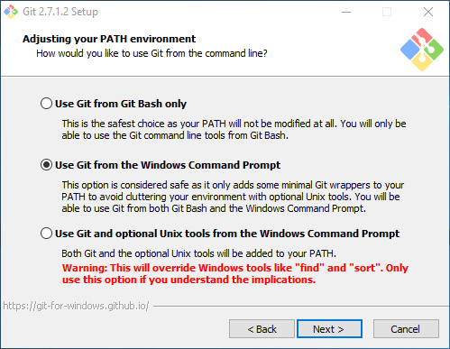
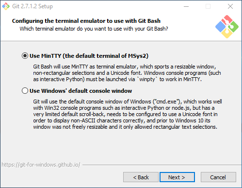
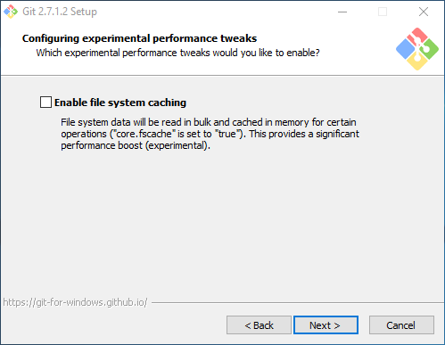
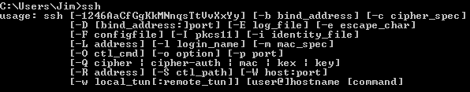
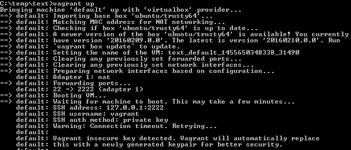
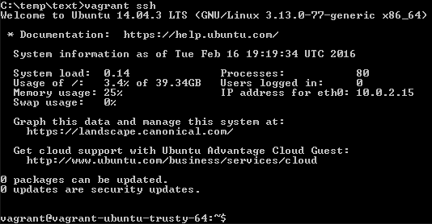

= Vagrant Introduction

One of the best ways to study network security is to use virtual machines. Vagrant makes it easy to create and delete virtual machines. Instead of spending an hour clicking through installation options to bring up a virtual machine, Vagrant uses boxes (like templates) to create a virtual machine in minutes with just a few commands. Vagrant integrates with several virtualization platforms such as Amazon, VMWare, and VirtualBox. VirtualBox integrations are used here because it is cross platform and free.

== Prerequisites

* VirtualBox installed
* Virtualization options enabled in the BIOS

== Installing SSH on Windows

Windows operating systes do not come with a native SSH program. An SSH program is necessary to make a connection to a virtual machine created with Vagrant. The following steps ask you to install Git because it comes with a native SSH application that works well with Vagrant. Git is a source code management platform, but we will not use its source code management capabilities.

* Download Git for Windows here: https://github.com/git-for-windows/git/releases/latest
    * Scroll to the bottom of the  page for downloads. You will typically want the 64-bit.exe.
* Accept the license by clicking `Next`.
+
image::git-1.png[]
* The default components are fine. However, if you plan to use Git for source control, you may want to enable Windows Explorer integration.
+
image::git-2.png[]
* Select `Use Git from the Windows Command Prompt`. The Unix tools that come with Git are fine, but there is no need to let them override existing Windows tools for our purposes.
+

* It does not matter what line ending conversons you select (unless you are collaborating with peers on source code).
+
image::git-4.png[]
* Again, it does not matter what terminal emulator you select.
+

* Leave file system caching unchecked.
+


At this point, the installation will proceed to copy files to your C:\Program Files folder. Click `Finish` when the installation completes.

It is now necessary to add the folder where ssh.exe resides to your PATH.

* Open C:\Program Files\Git\usr\bin. If ssh.exe exists in that folder, then the folder should be added to your path.
* If you did not find ssh.exe in C:\Program Files\Git\usr\bin, search for ssh.exe on your computer and record its location.
+

* Edit your environment variables (Win+X > System > Environment Variables...).
* Add a new path to the folder where ssh.exe resides and save the changes.
+
image::path-update.png[]
* Opan a new command prompt. (Win+X > Command Prompt)
* Run `ssh`. You should see basic instructions for using SSH.
+


If you received an error that ssh could not be found, try the following steps.

1. Verify that ssh.exe exists in the folder that is in your PATH.
2. Double check that you clicked `OK` to save your updated PATH.
3. Close all open command prompt and open a new command prompt. The PATH variable is read when a command prompt is opened, therefore changes to the PATH will not be recognized in command prompts that were already open.

== Installing Vagrant

* See https://www.vagrantup.com/docs/installation/ for installation instructions. Follow the link on the installation page to the downloads.

== Key Vagrant Terminology

A Vagrant `box` is an operating system that has been partially configured. Vagrant boxes are like templates. You use a box to create a virtual machine. The alternative to using boxes would be to install the operating system using a CD/DVD .ISO image and going through all of the menus to select the appropriate installation options. The manual way using an .ISO can take a long time. using boxes makes the processes of bringing up a new virtual machine dramatically faster.

Vagrant stores configuration information for a single virtual machine or set of virtual machines in a `Vagrantfile`. Inside this file the operating system, memory, network interfaces, IP addresses, and other information can be set. It will sometimes be necessary to edit the Vagrantfile to complete exercises.

== Creating a Virtual Machine with Vagrant

From your operating system command line, run the following commands to create a new virtual machine using the 6-bit Trusty Tahr server version of Ubunutu. Note that the first time you use a new version of an operating system, the box will have to be downloaded which can take a long time depending on your Internet connection.

The command `vagrant init` creates a Vagrantfile in the folder where the command was run.

```
vagrant init ubuntu/trusty64
```

image::vagrant-init.png[]

The command `vagrant up` will do all work necessary to bring a virtual machine up. If the virtual machine does not exist, it will be created. If the virtual machine had already been created, this will resume the existing virtual machine. This can take several minutes to complete. There may be several warnings as Vagrant attempts to connect to the virtual machine. These warnings are normal and should be expected.



After running `vagrant up`, the virtual machine will be running. You can verify this by opening VirtualBox and seeing that a new virtual machine exists in the running state.


The command `vagrant ssh` will connect you to the virtual machine through the command line. After an SSH connection is established, the commands that you run will occur from within the virtual machine. Notice that in the following screenshot that the prompt changed from `C:\temp\text>` to `vagrant@vagrant-ubuntu-trusty-64:~$`.



Run the Linux command `ls -al` to list the files in the current folder. At this point, we are done with the virtual machine. You can run `exit` to disconnect your SSH session and return to the prompt on your host computer.

== Cleaning Up

The following Vagrant commands tell vagrant what to do with virtual machines.

* `vagrant suspend`
    * This is equivalant to putting your virtual machine in sleep mode. The memory state is saved so that you can run `vagrant up` and continue working where you left off.
* `vagrant destroy`
    * This deletes the virtual machine from disk. After running `vagrant destroy`, you can still run `vagrant up` but vagrant will recreate the virtual machine.

Run `vagrant destroy` now to delete the virtual machine. You will be asked to confirm. In a few moments, the command should complete. Check VirtualBox to ensure that the virtual machine no longer exists.
	
The following operating system commands will clean the files in the folder where you ran `vagrant init`. Run these commands now.

* `rm Vagrantfile`: Deletes the Vagrantfile file.
* `rm -rf .vagrant`: Deletes the .vagrant folder and any files in that subfolder.

== Maintaining Vagrant

Operating system maintainers periodically make changes to update the software. These updates are often rolled into the Vagrant boxes. To recieve the latest versions of operating systems, the following commands should be run periodically (once a month or every few months is typically fine).

* `vagrant box update`
    * This command will look for a Vagrantfile configuration document and check to see if a new version of the box specified in the file is available. For example, if you ran `vagrant init ubuntu/trusty64`, then ran `vagrant box update` vagrant would check for the latest version of Ubunutu Trusty64 and automatically download the updates.
	* This command will not do anything if you run it in a folder without a Vagrantfile.
* `vagrant box list`
    * Lists all of the vagrant boxes with their version number.
* `vagrant box remove ubuntu/trusty64 --box-version 20150427.0.0`
    * Deletes a vagrant box with a specific version number. This is useful if you've run `vagrant box update` and do not want the old version to take up space on your hard drive.

== Troubleshooting Vagrant

* Invalid state. If you receive a message about invalid state when running `vagrant up`, you may need to delete your virtual machine from VirtualBox and run `vagrant up` again. In the worst case, delete the entire .vagrant folder before running `vagrant up`.
+
image::error-invalid-state.png[]
* Vagrant and VirtualBox work closely together. Sometimes, VirtualBox may not be working properly (especially after operating system updates). Sometimes problems can be fixed simply by rebooting your computer.
