= Virus Creation in Kali

For educational purposes, it is important to know how easy it is to create a simple computer virus. This exercise will not give you the skills to create the next Stuxnet, but you will become familiar with one method for creating infected media.

== Prerequisites

* Kali Linux running in a virtual machine

== Creating the Virus

* Launc the Social Engineering Toolkit in Kali by running Aplications > Exploitation Tools > social engineering toolkit.
+
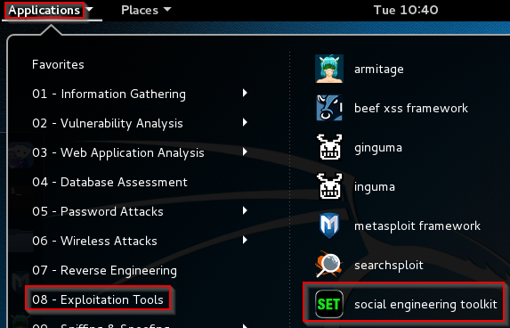
* You may see an error saying that your version of the Social Engineering Toolkit may be out of date. For the purposes of this exercise you can press `[enter]` to ignore this message.
+
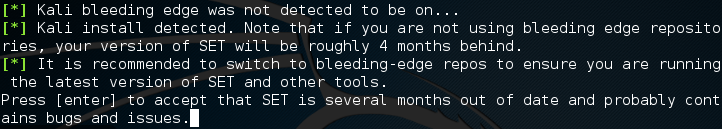
* At the menu, type `1` to select Social Engineering Attacks and press `[enter]`.
+
image::set-menu.png
* In the subsequent menu, select `3`--Infectious Media Generator.
+
image::set-menu-2.png
* Select `2`--Standard Metasploit Executable.
+
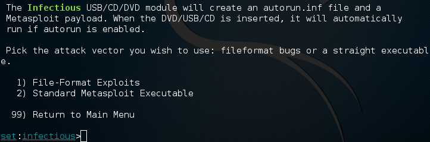
* For payloads, select `1`--Windows Shell Reverse_TCP.
+
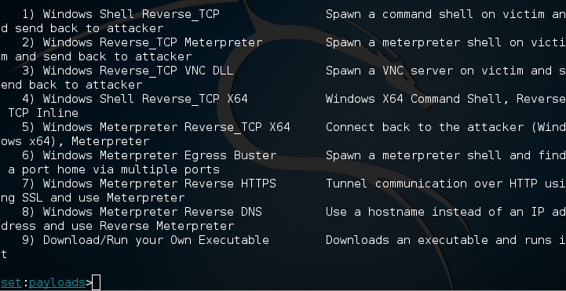
* When prompted for the IP address of the payload listener, enter `127.0.0.1`. Typically, you would use an IP address of an machine that you control. This is the IP address that the infected computer would attempt to connect to.
+

* Set the port to `2000`. After pressing enter the payload will be created as /root/.set/payload.exe.
+
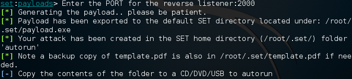
* When prompted, type `yes` to start the payload listener.
+
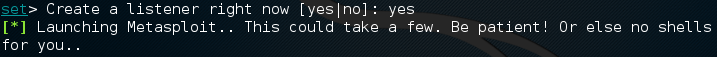
* Notice that the metasploit framework console will start and automatically set parameters for you.
+
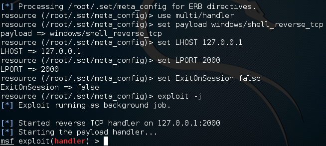
* Type `quit` to return to the Social Engineering Toolkit.
* Type `exit` to move back to the main Social Engineering Toolkit menu and `exit` again to quit.

== Explore Your Virus

* Click on the folder icon to open a file explorer window.
+
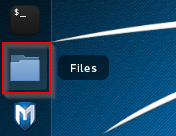
* Use the drop-down menu to show hidden files. Then click `Computer`.
+
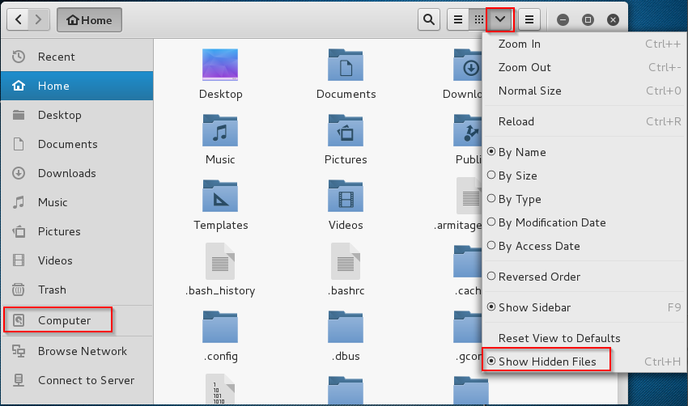
* Navigate to `/root/.set/`. Notice the autorun folder and payload.exe. Here is the virus you created.
+
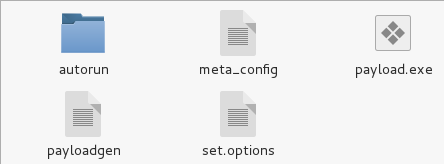

== Moving Your Virus to Your Host Machine

* Create a folder on your computer called `virus`.
* In VirtualBox, go to your Kali VM settings.
* Click `Shared Folders`.
* Add a new shared folder to the `virus` folder on your computer. Select the `Auto-mount` option.
+
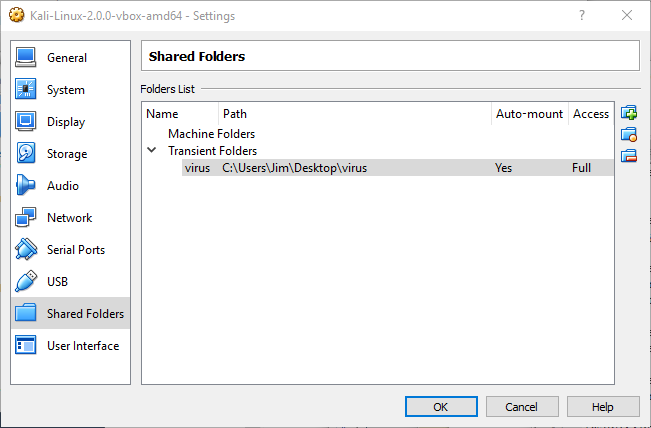
* Reboot your Kali virtual machine.
* Login to Kali with the root/toor username and password combination.
* Open the file explorer to Computer > Media > sf_virus.
* Open a new file explorer to Computer > Root > .set. (Hint: be sure to show hidden files.)
* Copy payload.exe from the `.set` folder to the `sf_virus` folder. You may see a warning from your anti-virus program.
+

The warning message should prove that the virus was created successfully. If desired, you can disable your antivirus and copy the file again.

== Challenge

* Copy the autorun folder to a USB drive. Plug it into a Windows computer that you have permissions to test on.
* Create another exploit using the Social Engineering Toolkit.

== Reflection

* What danger exists in using your personal IP address for the payload listener?
* Do you trust the executable created by the social engineering toolkit?
* In this exercise, payload.exe was caught by your anti-virus. How would you disguise this file to get around anti-virus?

== Cleanup

* Power off your Kali machine.
* In VirtualBox, delete the shared folder.
* Delete the virus. :)
