= Vulnerability Scanning with OpenVAS

Port scanning software gives an indication of what services might be running on a remote computer. However, a service running on the computer may not necessarily be vulnerable to attack. Vulnerability scanning is a more targeted process in which the remote machine is probed for specific vulnerabilities, such as having an unpatched version of a piece of software.

== Prerequisites

* Kali Linux virtual machine created
* Metasploitable virtual machine created
* An active Internet connection (the faster the better)

== Kali Setup

You should already have a Kali Linux virtual machine setup in VirtualBox.

* Start the Kali instance in VirtualBox.
* Login with the `root`/`toor` username and password.
* In VirtualBox, change the Kali network adapter to `NAT`. This will allow you to connect to the Internet. Ensure that "Cable Connected" is checked.
* Run the following command to ensure that your Internet connection is working.
+
```
ping google.com
```
+
The ping should be successful. If needed, troubleshoot your Internet connection until the ping is successful.
* Run the following commands to update the software running in Kali.
+
```
apt-get update
apt-get upgrade
```
+
When prompted, enter `y` to confirm the changes that will be made to the system. It may take a few minutes to connect.
* After the software has been updated, close the terminal window in Kali.

== OpenVAS Setup and Starting the OpenVAS Service

* In the Kali menu, choose `Applications > Vulnerability Analysis > openvas initial setup`. This will open a terminal and run the installation procedure.
+
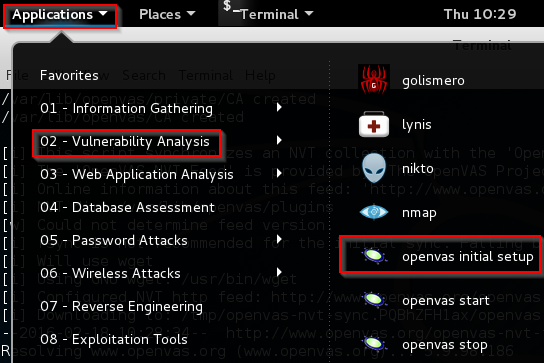
+
It will take several minutes to install and configure the software. Several hundred megabytes of data will be downloaded to ensure that the exploit database is up to date. Many of the file names are `nvdcve` XML files. These files come from the National Vulnerability Database published by the National Institute of Standards and Technology. You'll have some time, so check out https://nvd.nist.gov/download.cfm to read more about the files.
+
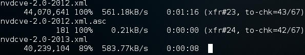
* After half of forever, the installation process will complete. You will see that a user was created with a specific password. It will not be a very friendly password, but at least it should be hard to guess.
+
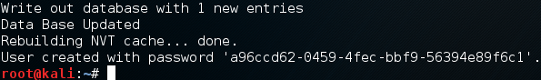
* Copy the password by selecting the text, right-clicking, and choose copy. Paste it into a blank text document either in Kali or on your host computer. Just keep the password handy. If you lose the password, see the troubleshooting secton at the end of this exercise for commands you can run in the terminal to reset the password.
* In the Kali menu, run `Applications > Vulnerability Analysis > openvas start`. This will open a new terminal window.
+
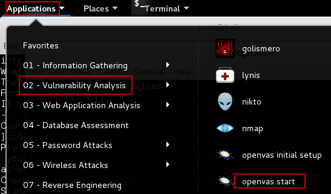
+
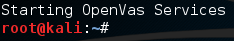
* OpenVAS is now running in the background.

== Running a Scan on Localhost

* Launch Iceweasel.
* Open the OpenVAS web interface by going to https://127.0.0.1:9392 (make sure to use `https` because the page will not be found if you just type the IP address and port).
* The OpenVAS website uses a self-signed certificate, so you will receive a browser warning.
+
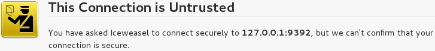
* Expand, `I Understand the Risks` and choose `Add Exception...`.
+
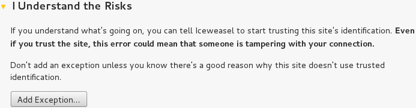
* Click `Confirm Security Exception`.
+
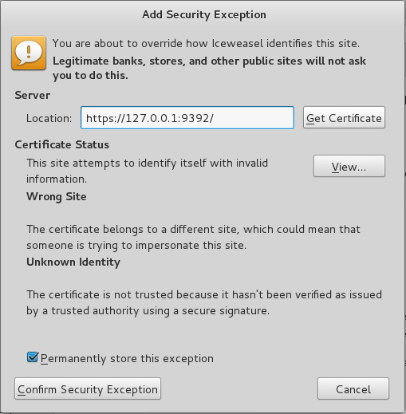
* At the login page, enter `admin` for the username, and paste the password you copied previously.
+
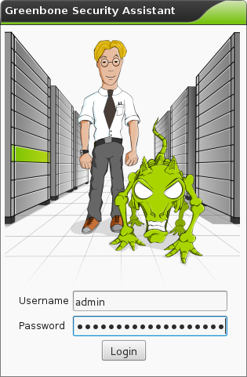
* You will see the menu. The Greenbone Security Assistant is a front-end that manages the OpenVAS vulnerability scanning.
+
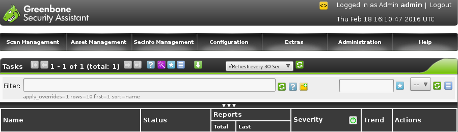
* To scan an IP address, enter `127.0.0.1` in the quick start text box and click `Start Scan`.
+
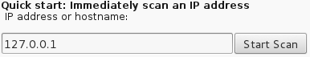
* The web page will report the progress of the scan. In a few moments, the scan should complete.
+
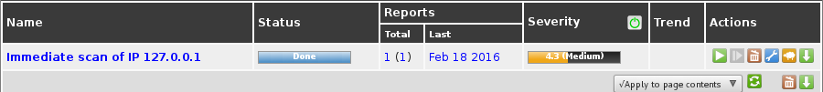
* Click `Done` to see the scan report.
+
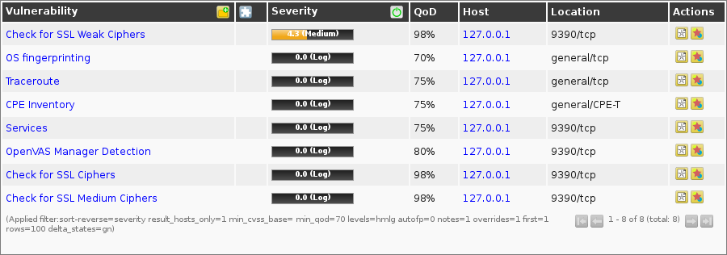
* Click the folder icon to expand the description of the vulnerabilities.
+

* Note the `QoD` column. This column represents the reliability of the detection. With any scan, there are possibilities of getting false positives or false negatives. With false positives, a vulnerability might be found reported that does not actually exist. False negatives occur when no vulnerability is reported, but a vulnerability may actually exist.

Based on the scan of your machine (localhost--127.0.0.1), how do you feel about its security?

== Editing the Admin Password

The big ugly admin password created in the setup process might not be ideal because you have to write it down. Also, the website can timeout periodically requiring you to enter the password again.

* Change the admin password by clicking on the `Administration > Users` menu.
+
image::users-admin.png[]
* Click the wrench icon.
+
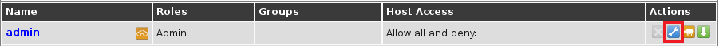
* Set a new password, then click `Save User`.
+
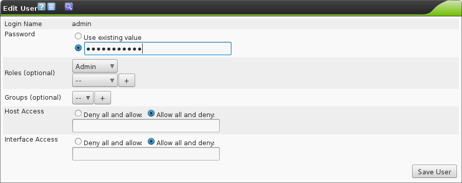

== Scan Metasploitable

The Metasploitable virtual machine was intentionally created to be vulnerable to attack. In this section, the Metasploitable virtual machine will be treated like a remote system that you might scan during a penetration test or security audit.

* Launch the Metasploitable virtual machine. Login with the `msfadmin`/`msfadmin` username and password if needed.
* In VirtualBox, change the adapter settings for Kali and Metasploitable to `Internal Network`.
* In Kali, run the following command to set the IP address.
+
```
ifconfig eth0 192.168.2.50
```
* In Metasploitable, run the following command to set the IP address.
+
```
sudo ifconfig eth0 192.168.2.100
```
+
You will need to confirm the `msfadmin` password.
+
Note that it does not matter what exact IP addresses the machines have as long as they are on the same subnetwork and you remember which IP addresses you assigned.
* Confirm that you can ping Metasploitable from Kali. In Kali, run the following command.
+
```
ping 192.168.2.100
```
+
The ping should be successful. Troubleshoot the networking if the ping failed before proceeding.
* In Kali, open Iceweasel again to https://127.0.0.1:9392.
* In the quick scan, enter `192.168.2.100` (the IP address of Metasploitable) and click `Start Scan`. The scan status will update automatically. It may take a few minutes to complete the scan. Check the clock to get a general idea of how long the scan takes.
+
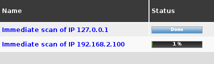
* Note that you can click on the scan status to see a report of vulnerabilities while the scan is still running.
+
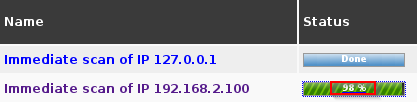
* Review the report when the scan completes. In your opinion, how secure is the Metasploitable virtual machine?

== Challenge

* Look at the vulnerability report for Metasploitable. Research a method to exploit one of the vulnerabilities.
* Exploit one of Metasploitable's vulnerabilities found in the report. Document the commands or tools that you used.

== Reflection

* Are port scans (like using nmap) unnecessary since vulnerability scanners exist?
* As a penetration tester (attacker), would you be more concerned about false positives or false negatives?
* As a network engineer (defender), would you be more concerned about false positives or false negatives?
* As a security officer, how would you use vulnerability scanning as part of your operations?
* Suppose that you are a company's chief security officer. What would you do if a technically proficient employee in the purchasing deparmtnet told you that she ran a vulnerability scan on an internal company database server and found a potential security weakness? Vulnerability scanning is not in her job description.

== Cleanup

* In Kali, run `Applications > Vulnerability Analysis > openvas stop` to free up system resources.
+
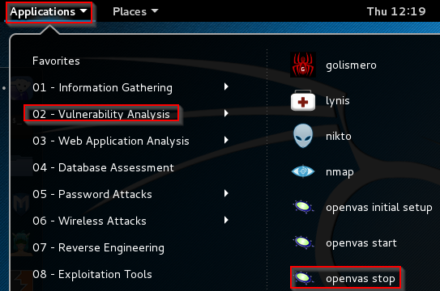
* Close your Kali and Metasploitable virtual machines. You can either save state or just power them off.

== Troubleshooting

OpenVAS is powerful, but there are a lot of moving parts. A single misconfiguration in the chain can prevent scans from completing successfully.

* If you closed the terminal window without getting the password, or you simply want to change the password, use the following command in the terminal.
+
```
openvasmd --user=admin --new-password=new_password
```
* If the scan produces empty results, see https://www.alienvault.com/forums/discussion/1714/vulnerability-scans-produce-empty-results
* There are several status checks that can be performed to assess the health of the OpenVAS service.
+
```
/etc/init.d/openvas-scanner status
/etc/init.d/openvas-manager status
/etc/init.d/openvas-administrator status
```