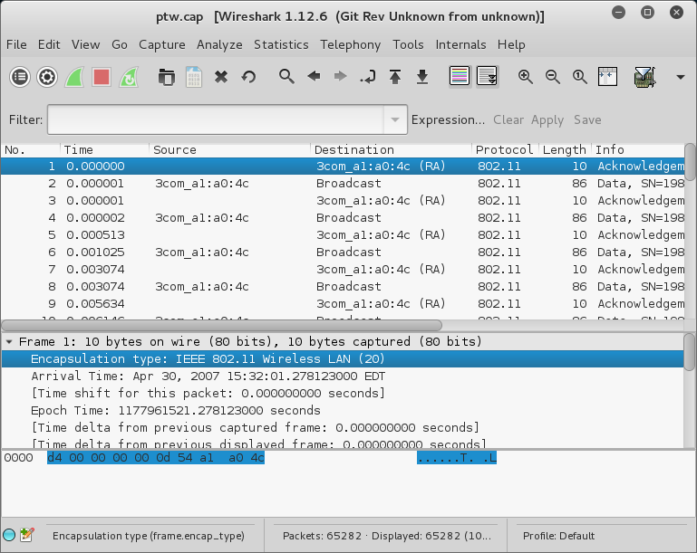
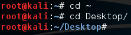
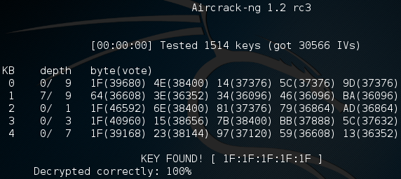

= WEP Cracking with Aircrack-NG

Wired Equivalent Privacy (WEP) was the first attempt to secure WiFi connections. Unfortunately, it failed to meet its goals. Cryptographic experts were not sufficiently consulted in the development of the standard, and weaknesses were discovered soon after its introduction. Many tools exist to crack WiFi security. In this exercise, you will use aircrack-ng to attack a WEP connection.

Not all wireless cards are created equal. Because of limitations in drivers and cracking software, it may be impossible to capture packets in the method necessary to crack wireless encryption. Also, if you run Kali inside a virtual machine, your network apadter is treated as a wired connection, even if your host operating system uses a wireless connection. Because of these challenges, the packet capture file will be given to you.

== Prerequisites

* Kali VM installed
* An Internet connection to download a packet capture file (~4MB)

== Investigating a Wireless Capture File

* Start your Kali VM. While Kali is starting, proceed to the next step.
* Download http://dl.aircrack-ng.org/ptw.cap. Save the file anywhere on your computer.
* When Kali loads, drag the file from your computer onto your Kali desktop.
* Double click the ptw.cap file to open it in Wireshark. Ignore any warning about starting Wireshark as root.
* Spend a few minutes examining the packets in Wireshark.
+

* How many packets are in the capture?
* How long did the capture take (in minutes)?

== Cracking a WEP Capture with Aircrack-NG

* In Kali, open a terminal and navigate to the desktop.
+
```
cd ~
cd Desktop
```
+
The `cd ~` command is a shortcut to go to your home directory. This should take you to /root/.
+

* Run the following command to crack the WEP key.
+
```
aircrack-ng ptw.cap
```
* You should see the WEP key `1F:1F:1F:1F:1F:`.
+

* How long did it take to crack the WEP key?

Note that in this instance, aircrack-ng uses the Pyshkin, Tews, Weinmann (PTW) technique to crack the key. A limitation of this method is that it can only attack 40 and 104 bit WEP keys. Other methods are available if the PTW technique will not work.

== Challenge

* How common do you think 40 bit WEP keys are? Visit https://en.wikipedia.org/wiki/Wired_Equivalent_Privacy to read more about the standard.
* Use `airodump` to capture packets that can be used with aircrack-ng. You will not be able to do this inside your virtual machine.

== Reflection

* What do you think about WEP?
* What you tell an IT administrator who said that WEP is "good enough?"

== Cleanup

* Delete ptw.cap from your Kali desktop.
* Save your Kali VM machine state in VirtualBox


 