Web Analysis with Burp Suite
=================================

Burp Suite is a tool used to test websites for vulnerabilities. Burp Suite can also be used simply to better understand the data that is being sent between the web browser and the web server.

Prerequisites
------------------
1. Kali Linux installed in VirtualBox
2. PentesterWeb installed

Virtual Machine Setup
------------------------
1. In VirtualBox, ensure that the network adaptesr for Kali Linux and PentesterWeb are both set to "internal network."
1. In VirtualBox, start the Kali Linux and PentesterWeb virtual machines.
2. Ensure that the IP addresses are correct. Run `ifconfig` in a terminal to determine if the IP address matches the value below.
  - Kali: 192.168.2.10
  - PentesterWeb: 192.168.2.5
  
If the Kali IP address needs to be udpated, run:

```
ifconfig eth0 192.168.2.10
```

If the PentesterWeb IP address needs to be updated, run:

```
sudo ifconfig eth0 192.168.2.5
```

3. Ensure that the machines can ping each other. You can close the Kali terminal when the pings are successful.

Kali Iceweasel Configuration
------------------------------
Iceweasel is a custom version of Mozilla Firefox.

1. In Kali, Launch Iceweasel by clicking on the icon with the polar bear.

&nbsp;

2. In Iceweasel, open preferences.

&nbsp;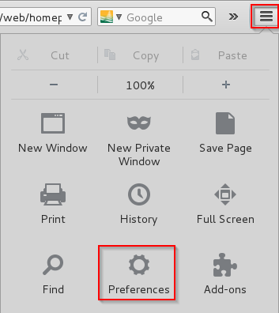

3. Click `Advanced`, `Network`, `Connection Settings`.

&nbsp;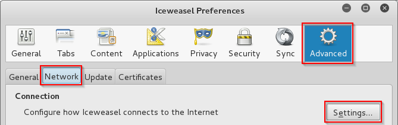

4. Make the following changes to the proxy.
  - Select `Manual proxy configuration`.
  - Enter `127.0.0.1` as the HTTP Proxy.
  - Enter `8080` for the port.
  - Check the box to use the proxy for all protocols.
  - Delete all text in the "No proxy for:" textbox.

&nbsp;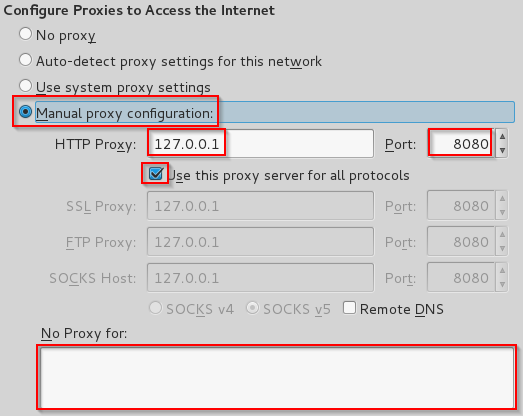

5. Click OK and Close to save the settings.

Burp Suite
---------------------------------
1. Launch Burp Suite by clicking on the gray and orange icon on the Kali desktop.

&nbsp;

2. Click the `Proxy` tab. Notice that button that says, "Intercept is on." All traffic going from Iceweasel to the web will be intercepted by Burp Suite.

&nbsp;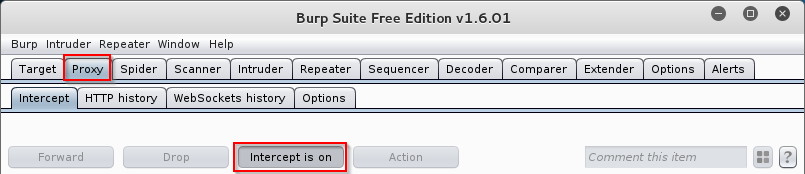

3. In Iceweasel, enter `192.168.2.5` for the URL and press [enter].

&nbsp;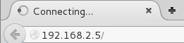

Notice that the page does not render.

4. Open Burp Suite. A new `GET` request should show up on the Proxy > Intercept tab.

&nbsp;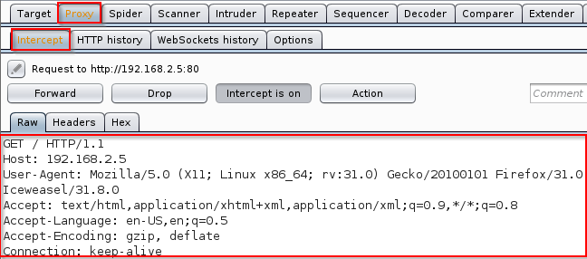

5. Click the `Forward` button in Burp Suite.

&nbsp;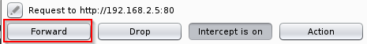

Notice that the page will begin to load in Iceweasel. Also notice that Burp Suite wil show other requests that have been intercepted. All images and other files needed by the web page will have to be forwarded for the website to render as if no proxy were being used.

6. In Burp Suite, click the "Intercept is on" button to turn off intercepting.

7. Reload the page in Iceweasel. Notice that the page will load almost instantly with no need to forward the requests from Burp Suite.

Why do you think it would be helpful to intercept all requsts and responses?

Request Analysis
--------------------------------------
1. Turn Burp Suite intercepting on.
2. In Iceweasel, click the XSS Example 1 link.
3. The `GET` request will be captured in Burp Suite.
4. Click the `Params` tab to see all parameters being sent to the server. You may need to resize the columns to see all data.

&nbsp;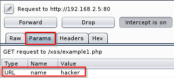

5. Modify the `name` parameter value by double clicking on the existing value. Change it to "friend."

&nbsp;

6. Click `Forward`.

7. In Iceweasel, look at the output. Notice how the name value in the URL does not match the name value in the web page. Why do you think this happened?

&nbsp;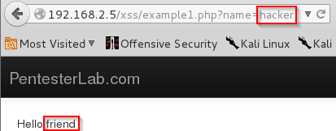

Burp Suite Repeater
-----------------------------
1. In Burp Suite, choose the Proxy > HTTP history tab.

&nbsp;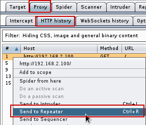

2. Right-click on a page in the history, and choose "Send to Repeater."

3. You will notice that the Repeater tab will be highlighted, but it will not be opened automatically.

&nbsp;

4. Click on the Repeater tab. The HTTP request will be shown on the left. The values can be manipulated. Click `Go` to send the request to the web server.

5. After clicking `Go`, the response will be shown on the right.

&nbsp;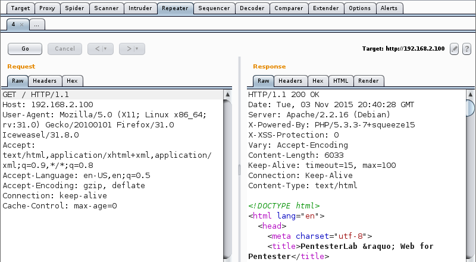

6. Note that there are several view of the response. The `Raw` view contains the HTTP headers and the website HTML that was returned. The `Headers` view just show the HTTP headers, and the `HTML` tab only shows the HTML. The `Render` shows a rough idea of what the website looks like, though its rendering is not as sophisticated as a modern web browser.

Why would it be useful to use the repeater functionality?

Burp Intruder
------------------------

1. In Iceweasel, navigate to XSS Example 4. Make sure that the Burp Suite is intercepting the requests. You will need to forward them.

2. In Burp Suite, go to the Proxy > HTTP History. Right click on the exampl4.php request, and choose "Send to Intruder."

&nbsp;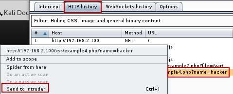

3. Click on the Intruder tab. There will be four subtabs. Keep the Target unmodified.

&nbsp;[Intruder Target](intruder-target.png)

4. Click on the Positions tab. Notice that the `hacker` variable is highlighted. Burp Suite correctly guessed that we would want to manipulate this variable.

&nbsp;[Intruder Target](intruder-positions.png)

5. Click on the Payloads tab. Add a few values in the the list. These will replace the "hacker" text in the request.

&nbsp;![Intruder Payloads]intruder-payload.png

6. Explore the Intruder > Options tab, but there is no need to modify anything.

7. To begin the attack, click Intruder > Start Attack.

&nbsp;[Start Attack](intruder-start-attack.png)

Note that with the free version, you will see a message indicating that the attack will be throttled. You can dismiss this error message.

&nbsp;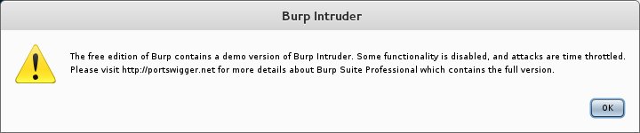

8. When the attack runs, you will see the results in a new window. Explore the results. The output is similar to the Proxy > History tab in that you can see the requests and the response.

&nbsp;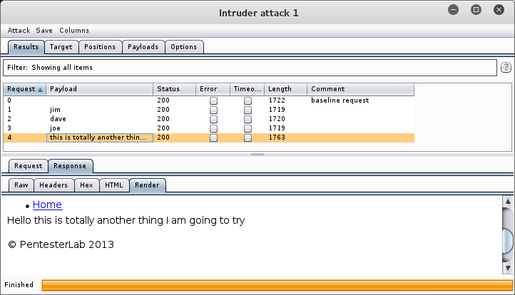

When would you want to use this Intruder functionality?

Refelection
----------------------------

1. Can you trust user input?

2. Can you trust user input if you use JavaScript validation?

3. How can you properly sanitize user input?
  
4. Whose responsiblity is it to run web vulnerability analysis in an organization? Web developers? Security experts? Network administrators?

5. Your network analysts detected that somebody appears to be executing an attack on your website. You have the attackers IP address. It appears to be coming from a residence in a neighboring state. What are your next steps?

6. You find an employee in the accounting department running Burp Suite to look for vulnerabilities in the company website. He claims he was just being proactive and trying to protect the company. However, company policy prohibits the use of penetration testing tools to authorized users, and he is not authorized. What are your next steps?