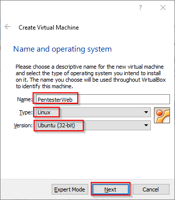
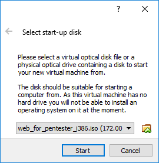
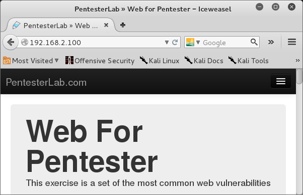

= Web Vulnerabilities

Many website are vulnerable to attack. Typically, you should have permission before attempting to exploit a real website. Some companies invite ethical hackers to find weaknesses, and they provide official channels and protocols for reporting those weaknesses. In this lab, you will setup virtual machines to practicing web server exploits.

== Install the PentesterLab Linux ISO

1. Go to https://pentesterlab.com/exercises/web_for_pentester
2. Download the ISO linked on the web page.
3. In VirtualBox, click the `New` button to start the virtual machine creation wizard.
4. Name it `PentesterWeb`, select Linux as the operating system type, and choose Ubuntu 32-bit. Any Linux type should work, however.
+


5. Keep the default ram if you system has enough capacity. If you computer does not have a lot of ram, you can adjust it down to 512MB.
6. Do not create a hard drive. You will not need to save anything to disk.
  - Click past the warning message.
7. After the virtual machine has been creted, right-click on the PentesterWeb VM, choose Settings > Network. Change Adapter 1 from `NAT` to `Internal Network`. Click `OK` to save the settings.
8. Boot up the VM.
9. When prompted, select the ISO that you downloaded.
+


10. The machine will boot up. You will see a command prompt. Change the IP address with the following command.

```
user@debian:~$ sudo ifconfig eth0 192.168.2.100 netmask 255.255.255.0
```

The machine has been properly configured and is ready to be exploited.

== Setup Kali Linux

1. Ensure that the Kali virtual machine has its network adapter set to `Internal Network` in VirtualBox.
2. Launch the Kali virtual machine.
3. Login with username `root` and password `toor` if needed.
4. Launch a terminal and set the IP address with the following command.
+
```
root@kali:~# ifconfig eth0 192.168.2.50 netmask 255.255.255.0
```

5. Launch the Iceweasel web browser by clicking on the icon that looks like a polar bear.
+


6. In the URL, type http://192.168.2.100 and press [enter]. You should see a website with the title "Web for Pentester."
+


== Web Vulnerabilities Tutorial

Explore the exploitable web pages inside the Pentester Web site. For additional information on exploiting the pages, see https://pentesterlab.com/exercises/web_for_pentester/course.

