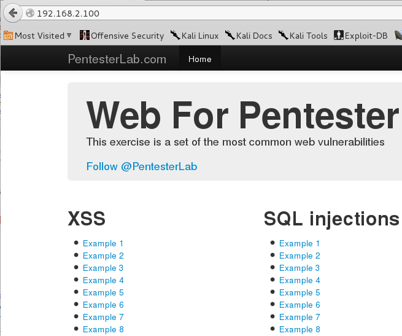
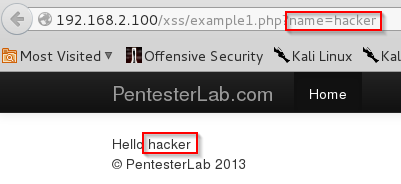
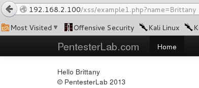
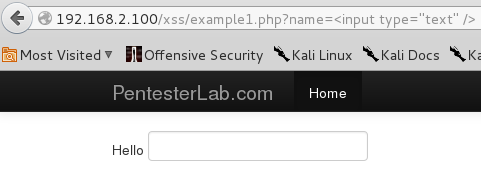
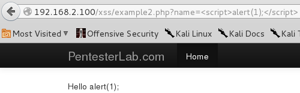
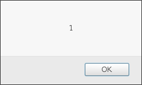
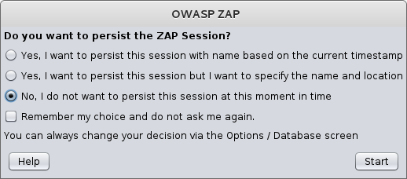
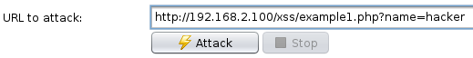
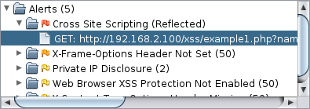
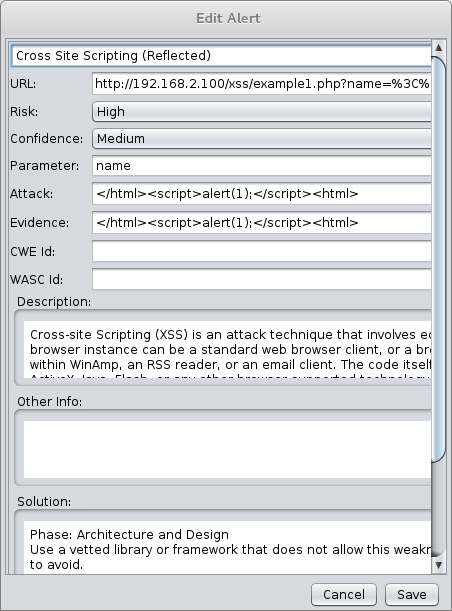

= Cross Site Scription Exploitation and Discovery with the Zed Attack Proxy

Cross Site Scripting (XSS) attacks are extremely dangerous. Unfortunately, it is easy for web developers to accidentally create code that is vulnerable to XSS attack. In this lab, you will execute several XSS attacks. You will also learn how to use the Zed Attack Proxy to find XSS vulnerabilities in web pages.

== Prerequisites

* Kali VM
* Pen Tester Web VM

== Configure the Virtual Machines

* In VirtualBox, ensure that the network adapters for both the Kali and Pen Tester Web VMs are set to `internal`.
* Run the following command in Kali to set the IP address to `192.168.2.50`.
+
```
ifconfig eth0 192.168.2.50
```
* Run the following command in the Pen Tester Web VM to set its IP address to `192.168.2.100`.
+
```
sudo su
ifconfig eth0 192.168.2.100
```
* Note that the Pen Tester Web VM may "capture" your mouse. By default, Virtual Box uses the right control key as a shortcut to release your mouse.
* Verify that you can ping the Pen Test Web machine from Kali.
+
```
ping 192.168.2.100
```
* Troubleshoot the network connection before proceeding if the ping fails. Note that if you change the network adapter to `internal` in VirtualBox, you may need to set the IP address again.

== XSS Exercises

* In Kali, open Iceweasel to http://192.168.2.100. You should see the following website.
+

* There are 9 web pages that are intentionally vulnerable to XSS attacks.

=== XSS Example 1

* Click on the link for the first XSS example and examine the URL.
+
```
http://192.168.2.100/xss/example1.php?name=hacker
```
* Notice that the word `hacker` is used in the URL as well as in the web page. What does this potentially tell you about how the web page works?
+

* Change `hacker` to another name and look at the result.
+

* The text you changed should appear in the web page. Web developers may use this technique intentionally to change the content of web pages. A problem occurs when these variables are not secured.
* Change the variable to something potentially malicious. Instead of `hacker`, change the name to `<input type="text" />`
+

* Notice that instead of a name, now a text box is appearing in the page. Why would this be a problem?
* Change the name variable to `<script>alert('Warning: You may have a virus');</script>` and see what happens. 

=== XSS Example 2

* Open the second example. Change the name variable to `<script>alert(1);</script>` to attempt to exploit the page in the same way as example 1.
* Notice that no alert box popped up. However, the text was inserted in the page.
+

* Because we do not have access to the website source code, we do not know what technique it used to sanitize the user input. However, we can investigate several techniques.
* Enter `<sCript>alert(1);</sCript>` (note the capital `C` in each script tag).
+

* What mistake did the web developer make to leave the site vulnerable to attack?

== Finding XSS Vulnerabilities with the Zed Attack Proxy (ZAP)

* In Kali, start `owasp-zap` in the Web Application Analysis menu, or use the search tools.
* When you start ZAP, select `No, I do not want to persist this session at this moment in time` and click Start.
+

* In the the URL to attack, enter `http://192.168.2.100/xss/example1.php?name=hacker`.
+

* Click `Attack`.
* The scan should finish in less than 10 seconds. A list of alerts is found at the bottom left portion of the interface. Expand `Cross Site Scriptiong (Reflected)`.
+

* Double click on single item in that category to open a summary of the attack.
+


Notice that ZAP gives the URL of the attack, a risk assessment, the name of the vulnerable parameter, a sample attack, and a description of the attack. ZAP even gives a recommended solution.

What do you think of ZAP's recommendation?

== Challenge

* Find ways to exploit all 9 vulnerable XSS web pages to show a JavaScript alert. For hints, refer to 
https://pentesterlab.com/exercises/web_for_pentester/course. Search the page for "Example 1".
* Use the Zed Attack Proxy to scan the entire http://192.168.2.100 website. Did ZAP find all of the vulnerabilities?

== Refelction

* At what part of the system should user input be sanitized? The browser? The network? The server? The database?
* Why is XSS so dangerous?
* Do modern web frameworks eliminate the danger of XSS?

== Cleanup

* Save the state for both virtual machines.
