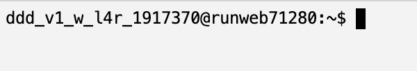
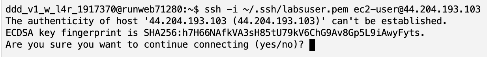
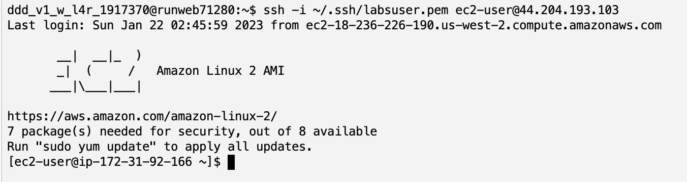
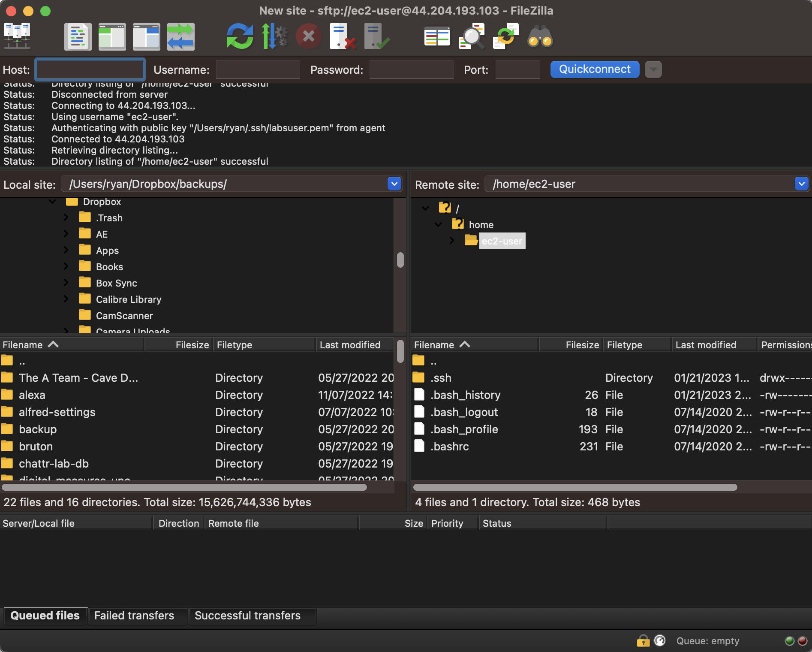

= Logging into an AWS Academy EC2 Instance
Ryan Schuetzler <ryan@schuetzler.net>
v0.1, 2023-01-21
:icons: font
:source-highlighter: rouge
:rouge-style: github
:xrefstyle: short
:experimental:

AWS Instance Connect makes it easy to get logged into your EC2 VM as long as you set things up the right way. 
Sometimes the easy way doesn't work, though. 
And sometimes you want to do something that isn't possible through the Instance Connect.
When that happens, you need to be able to SSH directly into the machine using a public/private keypair.

Last updated: {revdate}

== Objectives

* Understand what SSH is
* Be able to log into an EC2 instance with Instance Connect and a local SSH client
* Use the keypair to log in and transfer files with FileZilla

https://filezilla-project.org/download.php?type=client

== Set up

Create a new EC2 instance using Amazon Linux, or have an existing instance running that you can connect to. 
If you create a new instance, make sure you follow the original instructions so that it has the `vockey` keypair added for login.
Go to the instance's page in the AWS Admin console and note the "Public IPv4 Address."
I will use `44.204.193.103` in examples, because that is my server's address. 
Substitute your own address when you see that number.

TIP: EC2 instance IP addresses are not permanent. When your instance stops, that IP address gets put back into AWS's big pool of addresses that they hand out to other things. When you come back and start your instance again, you'll get a new address. Just something to keep in mind when you try the same address that worked last week and it won't connect.

== What is SSH?

SSH stands for "**S**ecure **SH**ell." It's a way for you to securely access and control another computer remotely, over the internet. Think of it like a virtual door that you can use to get into another computer and use it as if you were sitting in front of it.

It's often used by developers and system administrators to access servers and perform tasks remotely. For example, you might use SSH to log into a server in a data center and run commands to update software or check on the health of the server. Because SSH encrypts the connection, it's much more secure than using something like Telnet, which sends your data in plain text.

== Logging in with Instance Connect

Logging in with Instance Connect was covered in the Cloud AWS Intro activity. 
Go back and review the instructions there to get logged in.
It provides a way to get SSH access to your server without needing to download your keypair or even have any SSH software on your computer.

While it would be fine for quick changes/updates, I would not recommend using this for more intensive server operations, because it is prone to disconnecting and losing your session.
Despite this shortcoming, the Instance Connect console is a nice way to log in and just check if your server is up and running.
As demonstrated during the Cloud AWS Intro, it works as an easy way to connect to your server.
But there are better tools.

== Logging in with the AWS Academy console

The AWS Academy lab environment comes with its own console that looks something like <>.
You'll see this in the Canvas page once you click on the Learner Lab module.
This console is loaded up with goodies to help you connect with your AWS lab environment, and we'll cover some of those in later activities. 

[#img-academy-console]

For now, we're just going to use the keypair that was created for you.
When you created your lab environment, AWS Academy generated a keypair that you could use to log into your servers.
That keypair is automatically available to you in the lab console under the name `labsuser.pem`.
To log into your server using that key, you have to use the `ssh` command, and tell it to use a specific identity as follows:

[source,console]
....
ssh -i ~/.ssh/labsuser.pem ec2-user@44.204.193.103
....

This command has 3 parts:

1. Calling the SSH program with `ssh`
2. Telling it to use the identity file stored in the `~/.ssh` directory with `-i ~/.ssh/labsuser.pem`
3. Telling it a user name and server address with `ec2-user@44.204.193.103`

The first time you connect you will get a scary looking message that `The authenticity of host can't be established` (see <>).

[#img-known-host]

Don't be afraid.
Just like SSH uses private and public keys to authenticate you with the server, it uses keys to authenticate the server with you. 
When you first connect with a server, your computer (or the Academy console) doesn't know what the server's identity should be, so it asks you if you want to accept it.
The next time you log in at the same IP address, SSH will check that the identity of the server hasn't changed, to protect you from a man-in-the-middle or spoofing attack.

Since this is the first time, we'll just type "yes" and hit kbd:[Enter].

After that, you should see an SSH prompt appear as in <>.
Notice that the prompt changes - initially it said `ddd_v1_w...`, and now it says `[ec2-user@ip-172...]`. 
This prompt change and the big "EC2" ascii art logo tells us that we have successfully connected to our server.

[#img-academy-ssh]

You can do all the same things through this SSH session that you can do through the Instance Connect window.
Try it out by editing your /var/www/html/index.html file, or installing a new package with `yum`, or doing whatever you want.
When you are done with your session, you can close it by typing `exit` and hitting kbd:[Enter].

== Logging in with local SSH

So far, we've logged into a server two different ways - through Instance Connect and through the Academy console. 
Those are both great, but they have one major limitation - they're happening through your web browser.
That means that sometimes the browser's connection might time out and your session will get reset, which stinks if you're in the middle of editing a big file, or even if you forget exactly what you were doing.

Thankfully, you can also log in with a program on your computer to avoid the limitations of the browser.
The instructions for Macs and Windows are slightly different, so I'll have two separate sections here to explain.

=== Logging in on a Mac

[NOTE]
====
On Mac and Linux computers, SSH keys must follow some rules about permissions. Files on these systems have 3 sets of read/write/execute permissions - one for the owner of the file, one for the group, and one for all users of the computer. If the permissions on a private key are too open, SSH will not allow it to be used for authentication. We will fix the permissions in this section with the `chmod` command, setting the key so it can only be read by the file owner, and not by anybody else on the computer.
====

1. In the AWS Academy window, click the "AWS Details" window.
+

2. Next to SSH Key, choose "Download PEM".
3. Open a terminal on your Mac. You can find it with Spotlight, in the Launchpad, or in the Applications/Utilities folder.
4. Move the labsuser.pem file into your ~/.ssh directory
+
[source,console]
....
$ mv ~/Downloads/labsuser.pem ~/.ssh
....
5. Fix permissions on the labsuser.pem file. (See the callout at the beginning of this section for a note about why this is necessary)
+
[source,console]
....
$ chmod 400 ~/.ssh/labsuser.pem
....
6. Type the ssh command just like you did in the Academy console
+
[source,console]
....
$ ssh -i ~/.ssh/labsuser.pem ec2-user@44.204.193.103
....

Success! 
Since you're now logging in on your computer, you'll have to once again accept the new identity of the server.
You'll see the same warning and have to accept it again every time the IP address of the server changes.
Once you accept the warning, you should see that the prompt has changed to the `[ec2-user@...]` prompt you saw before.
If it didn't change, you might have to do some troubleshooting to figure out what went wrong.

Once again, you're now logged into the server.
Play around, install something, edit a file, or whatever you want to.
When you're ready, you can move on to the next section.

=== Logging in on Windows

On Windows, the story is a little different, but not that different. 
With any reasonably modern version of Windows, SSH is already installed, so we can use it almost the same way as on a Mac.
I prefer to use the new Windows Terminal application from Microsoft (on the https://apps.microsoft.com/store/detail/windows-terminal/9N0DX20HK701?hl=en-us&gl=us&rtc=1[Windows Store]), but the old command prompt works as well.

1. In the AWS Academy window, click the "AWS Details" window.
+

2. Next to SSH Key, choose "Download PEM".
3. Open your Downloads folder, and move `labsuser.pem` from there into your main user folder (`C:\Users\yourusernamehere`)
4. Open up your favorite Windows terminal application. It should start in your user folder
5. Type the ssh command just like you did in the Academy console
+
[source,console]
....
$ ssh -i labsuser.pem ec2-user@44.204.193.103
....

Success! 
Since you're now logging in on your computer, you'll have to once again accept the new identity of the server.
You'll see the same warning and have to accept it again every time the IP address of the server changes.
Once you accept the warning, you should see that the prompt has changed to the `[ec2-user@...]` prompt you saw before.
If it didn't change, you might have to do some troubleshooting to figure out what went wrong.

Once again, you're now logged into the server.
Play around, install something, edit a file, or whatever you want to.
When you're ready, you can move on to the next section.

== Using your keypair for other things

Now that we have the keypair on our own machine, we can use it to authenticate with SSH like we've done, and we can use it to authenticate with other things too. 
Another useful application for dealing with a server is FileZilla.
FileZilla is a file transfer protocol (FTP) client, designed to help you move files between different computers over the network. 
In addition to supporting the FTP protocol, it also supports SFTP, which uses the SSH protocol to transfer files.

1. Download and install FileZilla on your computer (https://filezilla-project.org/download.php?type=client). You want to install the client, not the server software for this activity.
2. Open FileZilla
3. Click the Site Manager icon in the top left
+

4. Click New Site
5. For Protocol, select SFTP
6. For Host, put the IP address of your server
7. For Logon type, select Keyfile
8. For User, type `ec2-user`
9. For keyfile, navigate and find your labsuser.pem keyfile
.. On a Mac, you may need to hit kbd:[Cmd+Option+.] to show the hidden .ssh directory. Hit those keys with the Browse... dialog open, then click a folder and you should then be able to see your /Users/username/.ssh directory. Or you could just type `/Users/username/.ssh/labsuser.pem` in the box.
.. On Windows, find the file in your `C:\Users\username\` directory, or just put `C:\Users\username\labsuser.pem`
10. Click Connect

As long as you've got all the right stuff in all the right places, you should see something like <>.
On the left is files on your computer, you can navigate around and find whatever files you want. 
On the right is files on your server. 
By default, it starts out in the /home/ec2-user directory, and you won't see very much there.

[#img-filezilla-window]

The beauty of FTP and SFTP clients is how easy they make it to move files from your computer to a server.
All you have to do is drag a file from the left to the right and side, and it will be copied into whichever folder you select on the server.
You can even drag and drop files directly from Finder or File Explorer into the FileZilla window to move them to the server.

Download https://cdn.shibe.online/shibes/7d201deafdf95ae10f9ee7909b208a413ca71803.jpg[this picture of a dog] and copy it onto your server into the `/home/ec2-user` directory.
Then log into the server with SSH and see if you can find the file.

== Ideas for Exploration

Find a picture you want to display on your server.
Copy it to the server, then put it in the /var/www/html directory and include it in your index.html file to put it on your website.
