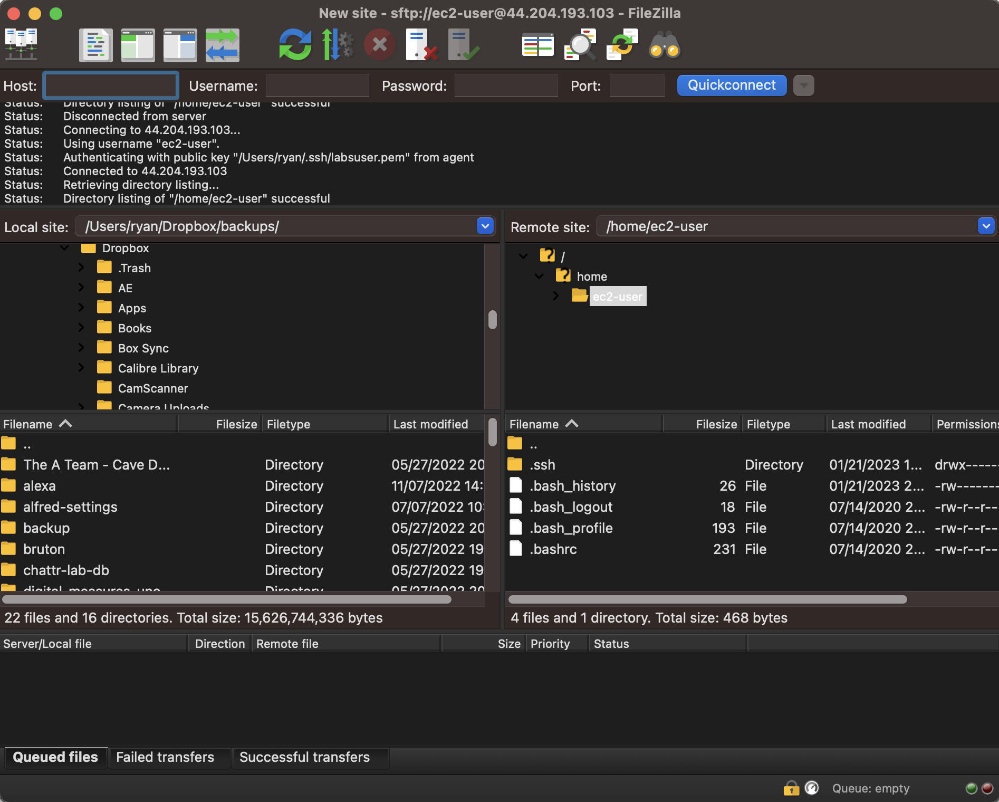

= Moving files with FileZilla over SSH
Ryan Schuetzler <ryan@schuetzler.net>
v0.2, 2023-09-28
:icons: font
:source-highlighter: rouge
:rouge-style: github
:xrefstyle: short
ifdef::env-github[]
:tip-caption: :bulb:
:note-caption: :information_source:
:important-caption: :heavy_exclamation_mark:
:caution-caption: :fire:
:warning-caption: :warning:
endif::[]
:experimental:

SSH is an awesome protocol that lets you log into a computer somewhere else and manage files, install software, and just generally mess around.
But it's more than just that!
In fact, SSH is such a well-designed protocol that some people decided to build a whole other set of protocols on top of it. 
Those protocols are called SFTP, and they're used to securely transfer files between two computers (like between your computer and an EC2 instance, for example).
There are many SFTP applications you can use, but here I'm going to teach you how to use FileZilla.

Last updated: {revdate}

== Objectives

* Transfer files from your computer to an EC2 instance with FileZilla

== Set up

* This lab assumes you have already created an EC2 instance, downloaded your EC2 keypair, and logged into your instance with the keypair.
* Download and install the FileZilla client (not the server): https://filezilla-project.org/download.php?type=client

== Using your keypair for other things

Now that we have the keypair on our own machine, we can use it to authenticate with SSH like we've done, and we can use it to authenticate with other things too. 
Another useful application for dealing with a server is FileZilla.
FileZilla is a file transfer protocol (FTP) client, designed to help you move files between different computers over the network. 
In addition to supporting the FTP protocol, it also supports SFTP, which uses the SSH protocol to transfer files.

1. Open FileZilla
2. Click the Site Manager icon in the top left
+

3. Click New Site
4. For Protocol, select SFTP
5. For Host, put the IP address of your server
6. For Logon type, select Keyfile
7. For User, type `ec2-user`
8. For keyfile, navigate and find your labsuser.pem keyfile
.. On a Mac, you may need to hit kbd:[Cmd+Shift+.] to show the hidden .ssh directory. Hit those keys with the Browse... dialog open, then click a folder and you should then be able to see your /Users/username/.ssh directory. Or you could just type `/Users/username/.ssh/labsuser.pem` in the box.
.. On Windows, find the file in your `C:\Users\username\` directory, or just put `C:\Users\username\labsuser.pem`
9. Click Connect

As long as you've got all the right stuff in all the right places, you should see something like <>.
On the left is files on your computer, you can navigate around and find whatever files you want. 
On the right is files on your server. 
By default, it starts out in the /home/ec2-user directory, and you won't see very much there.

[#img-filezilla-window]

The beauty of FTP and SFTP clients is how easy they make it to move files from your computer to a server.
All you have to do is drag a file from the left to the right and side, and it will be copied into whichever folder you select on the server.
You can even drag and drop files directly from Finder or File Explorer into the FileZilla window to move them to the server.

Download https://cdn.shibe.online/shibes/7d201deafdf95ae10f9ee7909b208a413ca71803.jpg[this picture of a dog] and copy it onto your server into the `/home/ec2-user` directory.
Then log into the server with SSH and see if you can find the file.

== Ideas for Exploration

Find a picture you want to display on your server.
Copy it to the server, then put it in the /var/www/html directory and include it in your index.html file to put it on your website.
